After the setup is complete, the material can be processed. If the following steps do not work, please check <a target="_blank" href="https://support.smartdiys.cc/hc/en-us/sections/360006255294-Problems-about-Etcher-Laser">troubleshooting.</a>

## Preparation of material
Please prepare your material. Since there is a place to input the thickness of the material later in the process, please check the thickness of the material in advance.

## Create a project and place the material
Tap on “Add Project” or the “+” icon on the bottom in the screen.

The project is created and the graphic area is displayed. Tap the menu on the top right of the app screen and tap “Return to origin”. The laser head moves to the origin (upper left).
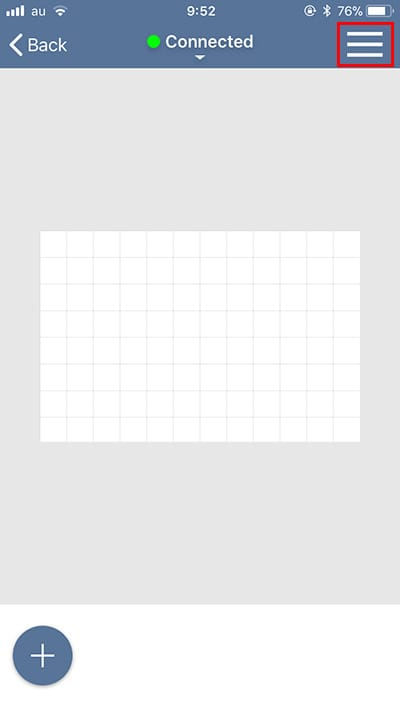

Place the material in the center of the work area. When placing the material, DO NOT cover the stickers for positioning (white and black squares) placed around the work area with the material.

Open the menu on the top right of the app screen and tap “Position”.
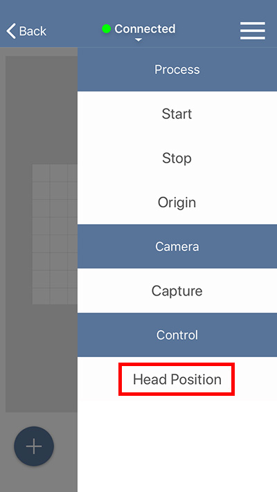

A dialog to return the laser head to the origin will appear. Tap OK to move the laser head to the origin (upper left).

The laser head will move to a certain position when you drag the image of the laser head in the screen to the position you would like to set and tap on “Move”. Use this function to move the laser head so it is above the material.

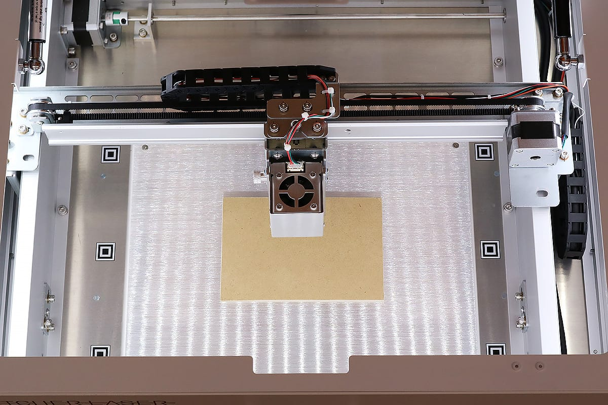

## Adjust the height of the laser
Next, adjust the height of the laser. When you process a material with the Etcher Laser, you need to adjust the height to set the focal length depending on the thickness of the material.
Take out the height adjustment jig from the box and place it on the material.

Loosen the screw for height adjustment on the laser head, and slide the laser vertically until the bottom part of the laser head touches the height adjustment jig.

To prevent the laser head from tilting, close the height adjustment screw while keeping the top of the laser head in close contact with the laser head fixing unit. If the laser head is tilted, it may cause a shift in the processing position.

After finishing the height adjustment, tap “Close” on the application screen.

## Import data and check positioning
Next, tap on the “+” icon on the bottom left in the screen to import your data.
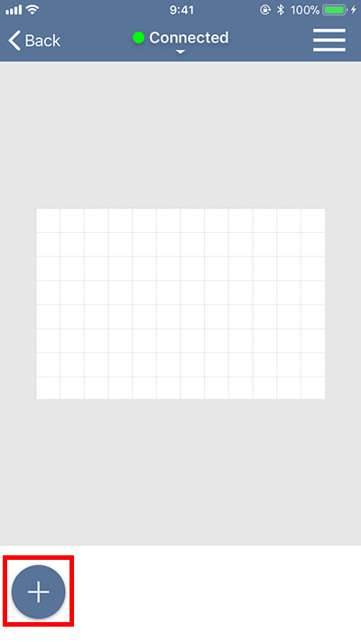

There are several ways to import data and different types of data, but for this example, tap on “From Assets” and select circle shape. Then the circle shape you selected will appear in the graphic area.

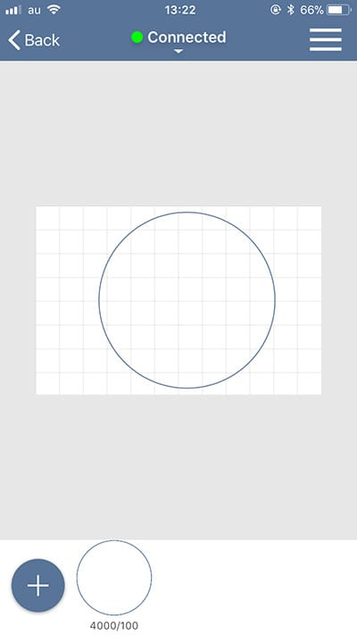

Open the menu and select “Capture”.

Dialog to enter the thickness of the material is displayed. Enter a numerical value and click OK. The material is displayed in the graphic area.
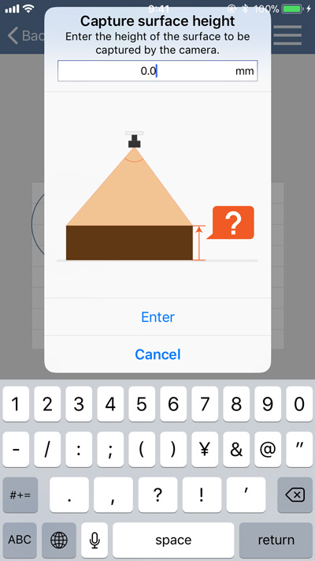
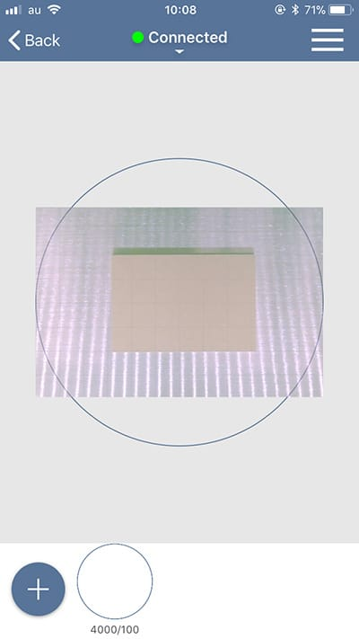

An error will be displayed if the laser head is not located at the origin or if any camera marker is hidden behind the material. For details, see “<a target="_blank" href="https://support.smartdiys.cc/hc/en-us/articles/360039256373">An error occurs when using the camera (capture)</a>”.
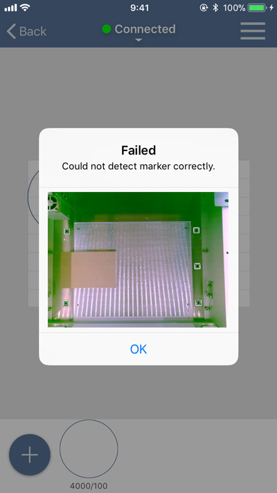

Adjust the size of the design and place it on the material. You can adjust the postion of the design when you tap on the circle shape and drag it to a position, and also you can change the size and the angle by dragging the arrow mark. Plus, you can zoom in/out the display area by pinching in/out the graphic area.
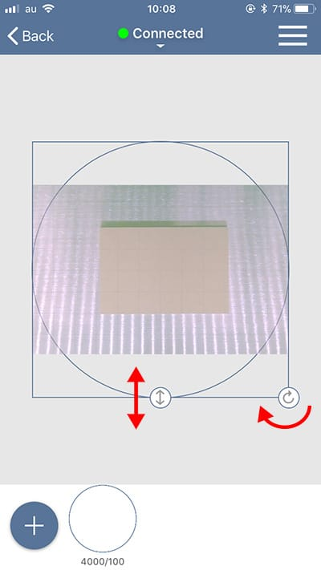
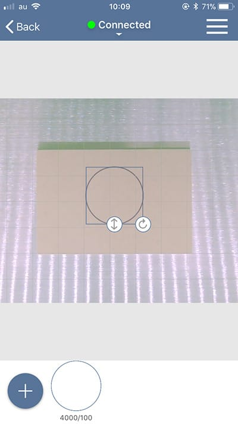

## Set parameters and start processing
Next, set the parameters for the process. Tap on the item (circle shape) in the bottom area of the screen to display the dialog for parameter setting. This time, set 1500 for the speed, 50 for the power, and 1 for the number of processing times. (Please refer to the page <a target="_blank" href="https://manual.smartdiys.cc/el-mobile-parameter-settings/">“SmartDIYs Creator ManualParameter settings” </a>for further information on the parameters.)

After that, close the lid of the Etcher Laser and tap on the “START” button. A dialog with the estimated processing time will appear, so confirm and click the “START” button to proceed.

The button on the bottom right of the lid on the device will turn to green, so press it to start processing. DO NOT leave the device while processing is in progress
*If you start processing while the lid is open, the laser head will move but the laser will not irradiate.
*Protective glasses are only required when processing with the bottom tray removed.
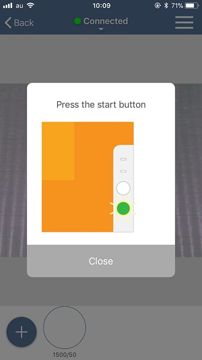
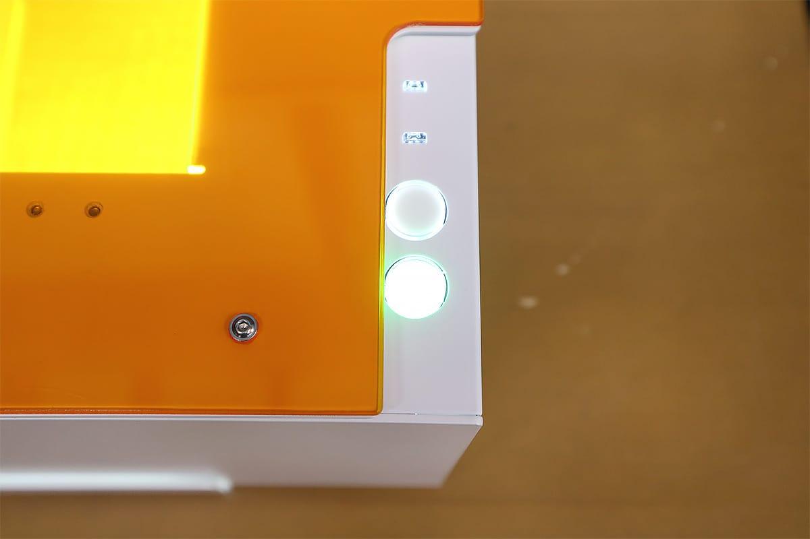

Further details on the application are in the manuals:<a target="_blank" href="https://manual.smartdiys.cc/el-mobile-product-outline/">Etcher Laser app manual</a>
