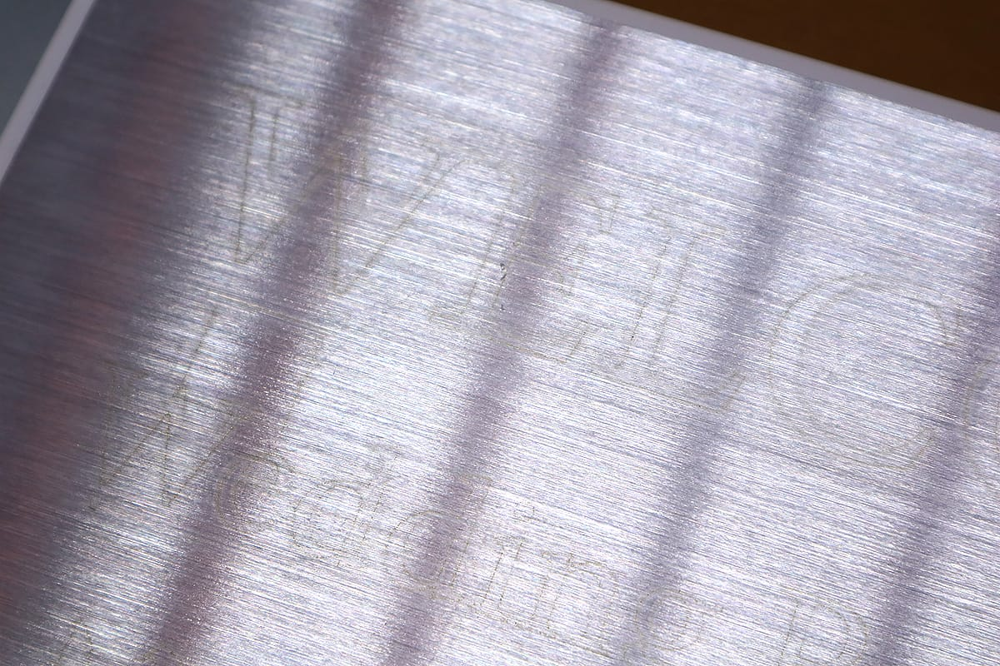

## Laser head maintenance
The lens attached to the laser head needs to be cleaned regularly because dust and dirt will adhere to it.
1. Make sure that the power is turned off, and disconnect the AC cable / USB cable from the main unit.
2. Disconnect the laser head cable. Instead of pulling the cable, remove it while firmly grasping the white connector.

3. Loosen the height adjustment screw and remove the laser head from the laser head fixing unit.

4. Use a lens cleaning cloth (such as for a camera lens) to clean the lens part of the laser head. * Use a cleaner that does not contain alcohol. Never touch the lens with your hand.

5. Use a cloth to wipe away any other dirt around the lens or on the laser head.

6. After cleaning, attach the laser head to the laser head fixing unit and connect the cable to the connector.

## Processing bed maintenance
When processing wood, paper, etc., an imprint generated from the material may adhere to the processing bed.

It can be wiped clean by using a wipe containing alcohol.

## Frame maintenance
If dirt or dust adheres to the frame, it may cause a shaft misalignment and must be cleaned regularly. Wipe the part of the X-axis frame and Y-axis frame where the wheel passes with a cloth.

## Camera and camera marker maintenance
If the camera does not capture the processing bed well, clean the camera lens and check the camera markers.

Use a camera lens cleaner to clean the camera attached to the door. * Never touch the lens with your hand.

If the camera marker is torn or damaged, attach a spare sticker over the mark. * Please attach it so the sticker is flat and not bend or curled.

