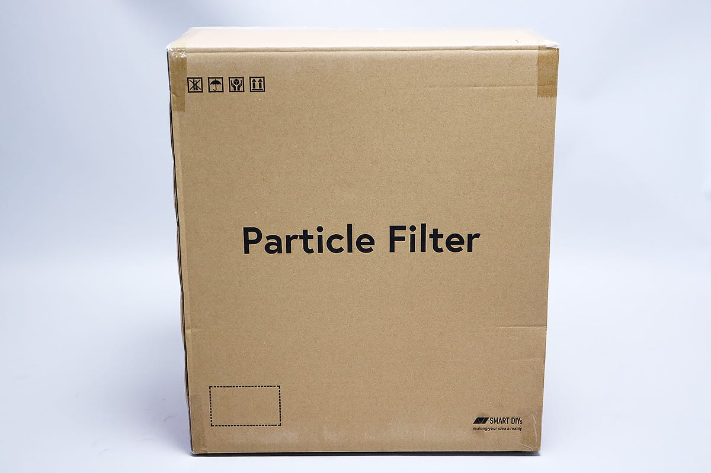
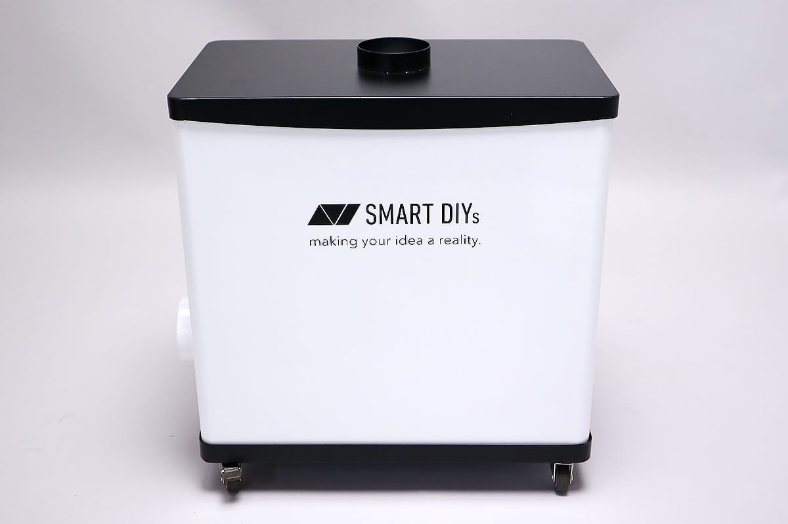
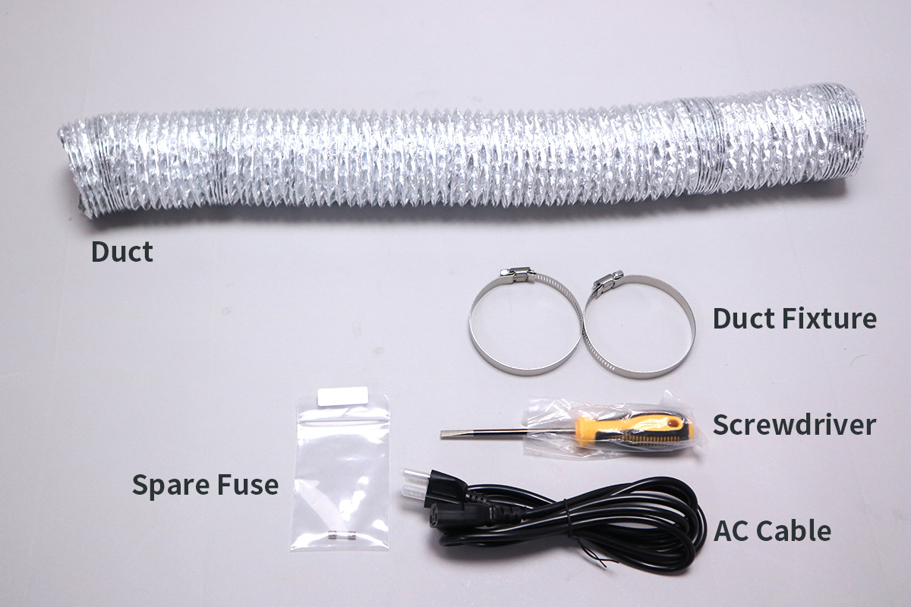
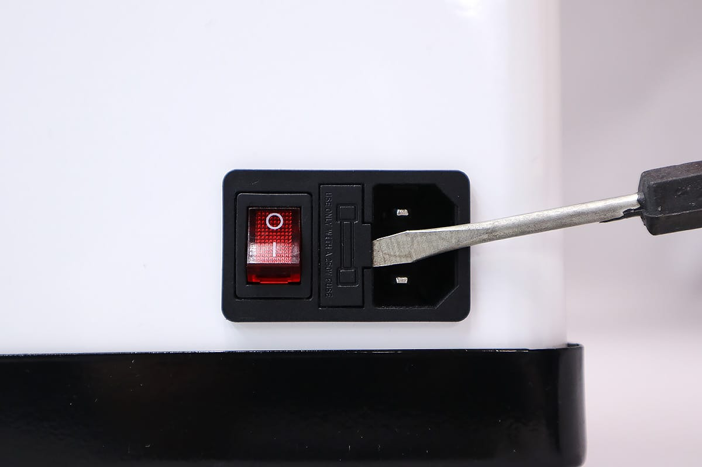
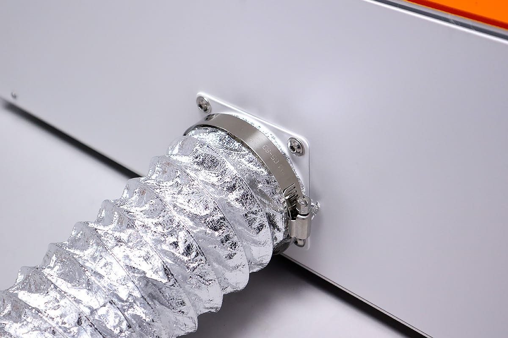
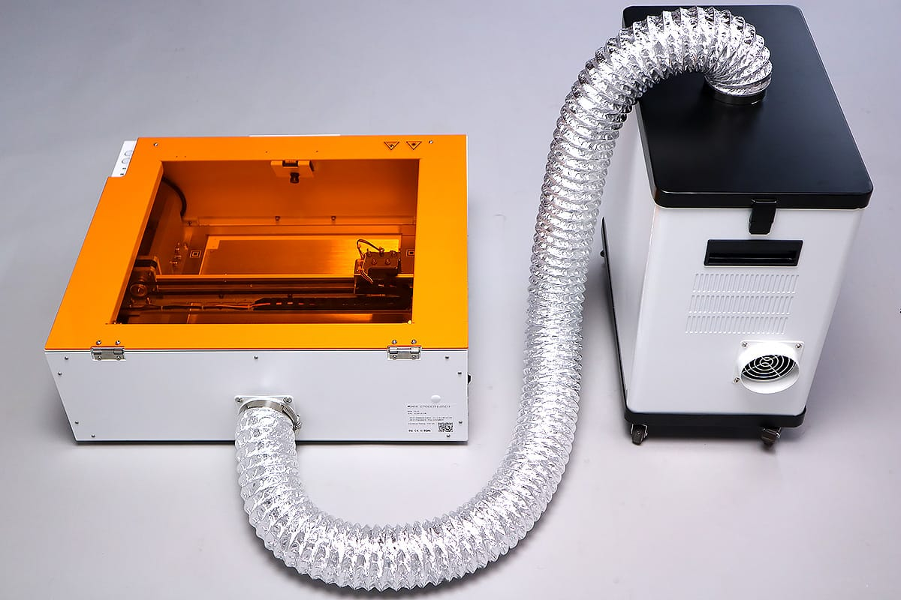
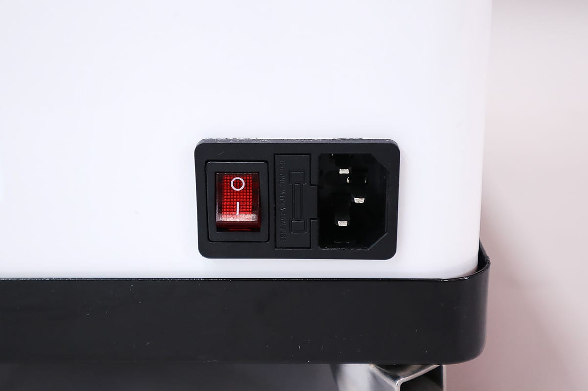
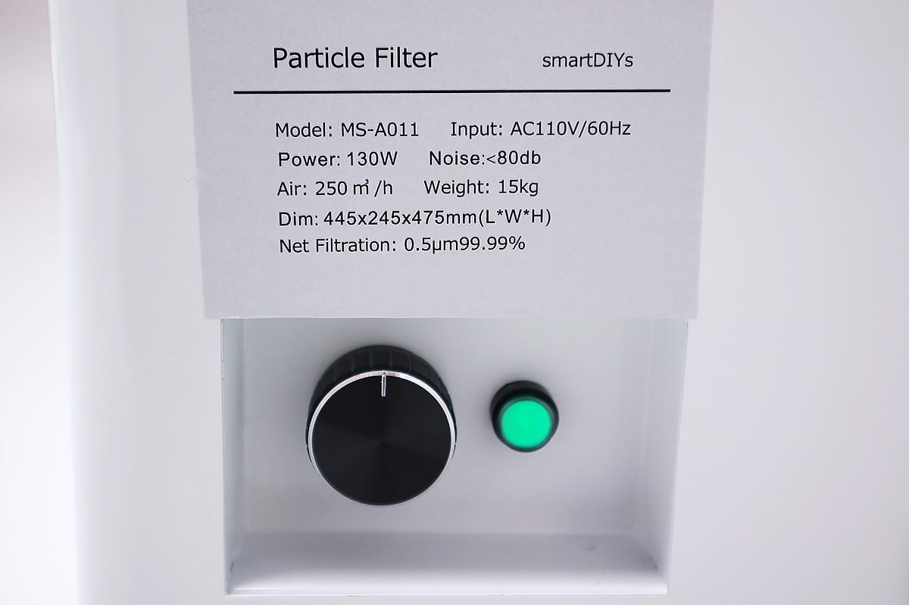

## Setup
Open the particle filter box. Take out the parts and the particle filter body.

To install a spare fuse, use a screwdriver as shown in the picture above to remove the fuse socket from the power switch on the left side of the dust collector.

The socket is originally equipped with a fuse. Store the black cylinder part with the spare fuse. If you already have a spare fuse, store this one as well. Replace the fuse socket.

Attach the duct fixture to the duct and insert it into the exhaust on the back of the Etcher Laser.

Turn the screw attached to the duct fixture to fix the duct.

Attach a duct fixture on the other end of the duct and insert it into the dust collector's inlet (upper part of the particle filter). Turn the screw attached to the duct fixture to secure the duct.

Make sure that the power switch of the particle filter is OFF (◯ is pressed), and connect the AC cable. After that, connect the AC cable to the outlet and turn on the power.

The green button should now light up. The particle filter operates by turning the knob next to the green button, and the power can be adjusted.

