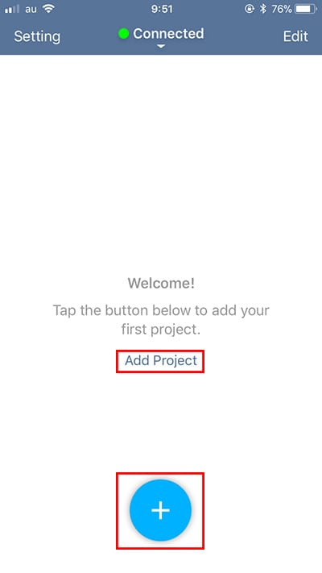
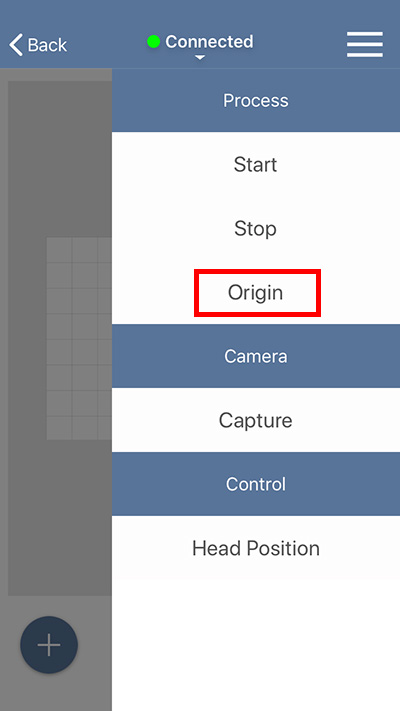
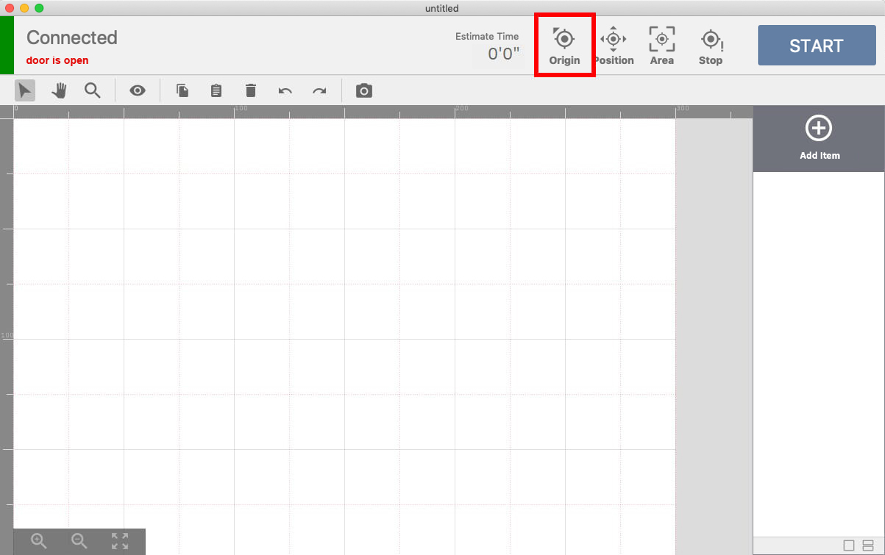
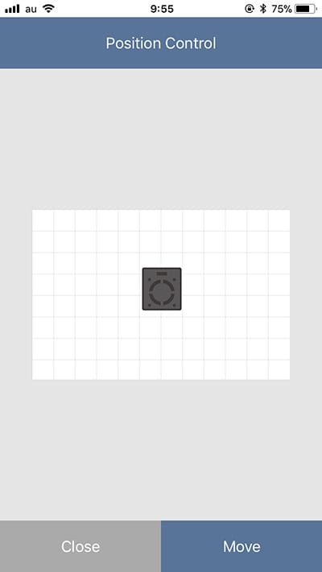
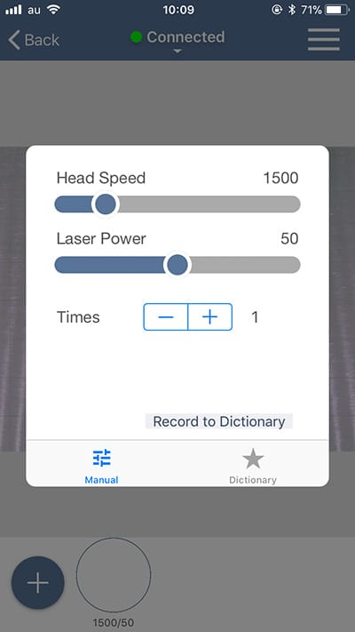

When you finish up setting up the software, you can start processing materials with the Etcher Laser. Prepare a material you would like to work on. (Measure the thickness of the material because you need to input the thickness of the material in the software later.)

## Create a project and place the material
Tap on “Add Project” or the “+” icon on the bottom in the screen.

A project will be created and it appears in the graphic area.
Tap on a menu on the top right on the screen and select “Position”. The dialog to show the laser head is going to the original position. After you click “OK”, the laser head will move to the original position (the top left side of the working area).

Place the material in the center of the work area. When placing the material, DO NOT cover the stickers for positioning (white and black squares) placed around the work area with the material.

The laser head will move to a certain position when you drag the image of the laser head in the screen to the position you would like to set and tap on “Move”. Use this function to move the laser head so it is above the material. When you finish moving the position of the laser head, tap on “Close”.

## Adjust the height of the laser head
Next, adjust the height of the laser. When you process a material with the Etcher Laser, you need to adjust the height to set the focal length depending on the thickness of the material. Take out the height adjustment jig from the box and place it on the material.

Loosen the screw for height adjustment on the laser head, and slide the laser vertically until the bottom part of the laser head touches the height adjustment jig.

Tap on a menu on the top right on the screen and tap on “Origin” to move the laser back to the original position.

## Import data and check positioning
Next, tap on the “+” icon on the bottom left in the screen to import your data. There are several ways to import data and different types of data, but for this example, tap on “From Assets” and select circle shape. Then the circle shape you selected will appear in the graphic area.

If you open the lid and click tap on a menu on the top right in the screen to select “Capture”, the dialog to input the thickness of the material will appear. After you input the number and click the “OK” button, the graphics area will display the material.
If the lid is open and/or the laser head is not positioned on the origin before this step, the material will not appear on the screen properly. The stickers for positioning should not be on the screen. If the stickers are there, redo the step to capture the material by the camera.

Adjust the size of the design and place it on the material. You can adjust the postion of the design when you tap on the circle shape and drag it to a position, and also you can change the size and the angle by dragging the arrow mark. Plus, you can zoom in/out the display area by pinching in/out the graphic area.

## Set parameters and start processing
Next, set the parameters for the process. Tap on the item (circle shape) in the bottom area of the screen to display the dialog for parameter setting. This time, set 1500 for the speed, 50 for the power, and 1 for the number of processing times. (Please refer to the page <a target="_blank" href="https://manual.smartdiys.cc/smartdiys-creator-parameter-settings/">“SmartDIYs Creator ManualParameter settings” </a>for further information on the parameters.)

After that, close the lid of the Etcher Laser and tap on the “START” button. A dialog with the estimated processing time will appear, so confirm and click the “OK” button to proceed.

The button on the bottom right of the lid on the device will turn to green, so press it to start processing. DO NOT leave the device while processing is in progress
*If you start processing while the lid is open, the laser head will move but the laser will not irradiate.

Further details on the software are in the manuals:<a target="_blank" href="https://manual.smartdiys.cc/smartdiys-creator-product-outline/">SmartDIYs Creator</a>
