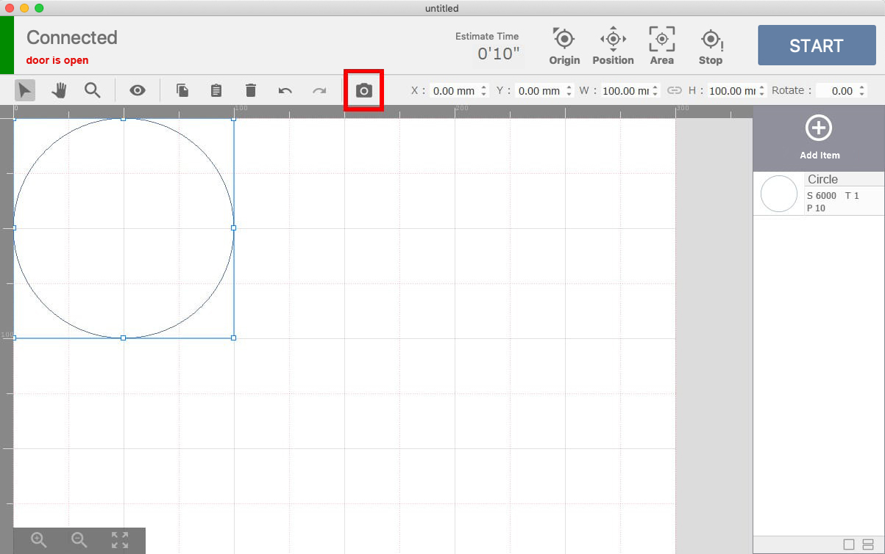

When the setup is done, you can start processing materials. Prepare a material you would like to work on. (Measure the thickness of the material because you need to input the thickness of the material in the software later.)
Check that the Etcher Laser’s power is on.

## Connecting the Etcher Laser to PC
Use the USB cable enclosed with the device to connect the Etcher Laser to your PC. DO NOT use a USB hub and directly connect the devices.

## Launch the software and place the material
Launch the software and start. When you launch the software for the first time, follow the instructions on the application window to fill in the settings.
When the Etcher Laser and PC are properly connected, the software will show “Connected” on the top left side of the screen.

Click the “Origin” on the top of the screen, and the laser head will move to the origin (top left in the work area, default position before it starts processing.)

Place the material in the center of the work area. When placing the material, DO NOT cover the stickers for positioning (white and black squares) placed around the work area with the material.

Click the “position check” button, and the graphic area of the software will show the image of the laser head. By dragging the image to a spot, you can move the laser head. Use this function to move the laser head so it is above the material.

## Adjust the height of the laser
Next, adjust the height of the laser. When you process a material with the Etcher Laser, you need to adjust the height to set the focal length depending on the thickness of the material.
Take out the height adjustment jig from the box and place it on the material.

Loosen the screw for height adjustment on the laser head, and slide the laser vertically until the bottom part of the laser head touches the height adjustment jig.

When the height is adjusted, tighten the screw to set the position of the laser head. After that, click the “position check” button again to cancel the position check mode, and click the “Origin” button again to move the laser head to the original position.

## Import data and check the positioning
Click the “Add Item” button to import your data. There are several ways to import data and different types of data, but for this example, select the asset data we provide for users. Click “Asset” on the right, select the “shape” tab, and select a circle. Click the “Import” button to place the shape in the graphic area of the software.

Click the camera icon, the dialog to input the thickness of the material will appear. After you input the number and click the “OK” button, the graphics area will display the material.
If the lid is closed and/or the laser head is not positioned on the origin before this step, the material will not appear on the screen properly. The stickers for positioning should not be on the screen. If the stickers are there, redo the step to capture the material by the camera.

Adjust the size of the design and place it on the material.

## Set parameters and start processing
Next, set the parameters for the process. Click the item (circle) on the right side of the screen to display the dialog for parameter setting. This time, set 1500 for the speed, 50 for the power, and 1 for the number of processing times. (Please refer to the page <a target="_blank" href="https://manual.smartdiys.cc/smartdiys-creator-parameter-settings/">SmartDIYs Creator ManualParameter settings</a> for further information on the parameters.)

After that, close the lid of the Etcher Laser and click the “START” button. A dialog with precautions will appear, so confirm and click the “OK” button to proceed.
DO NOT leave the device while processing is in progress.
*If you start processing while the lid is open, the laser head will move but the laser will not irradiate.

Further details on the software are in the manuals:<a target="_blank" href="https://manual.smartdiys.cc/smartdiys-creator-product-outline/">SmartDIYs Creator</a>
