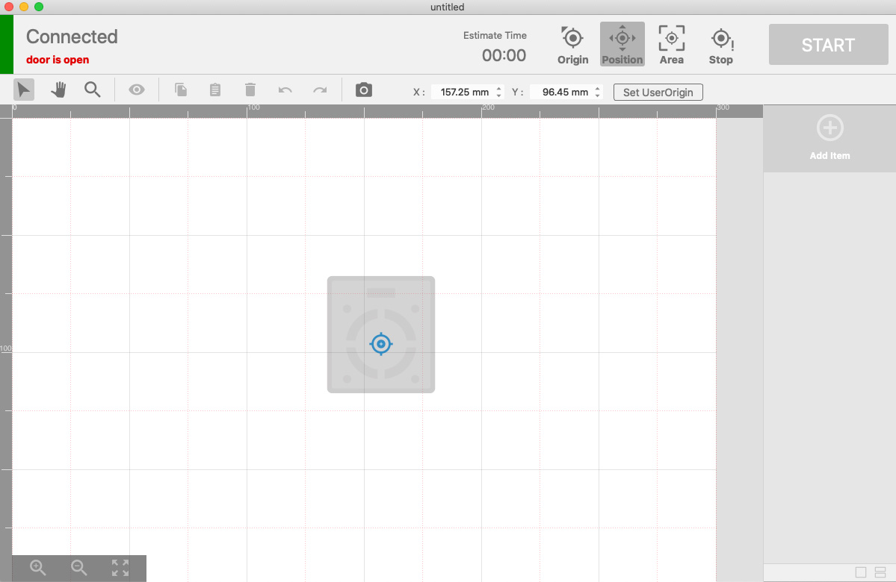
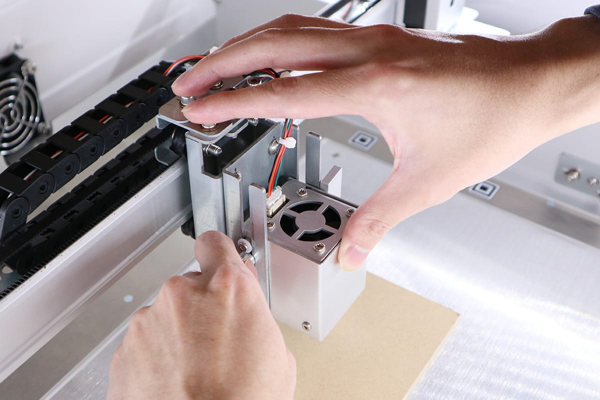
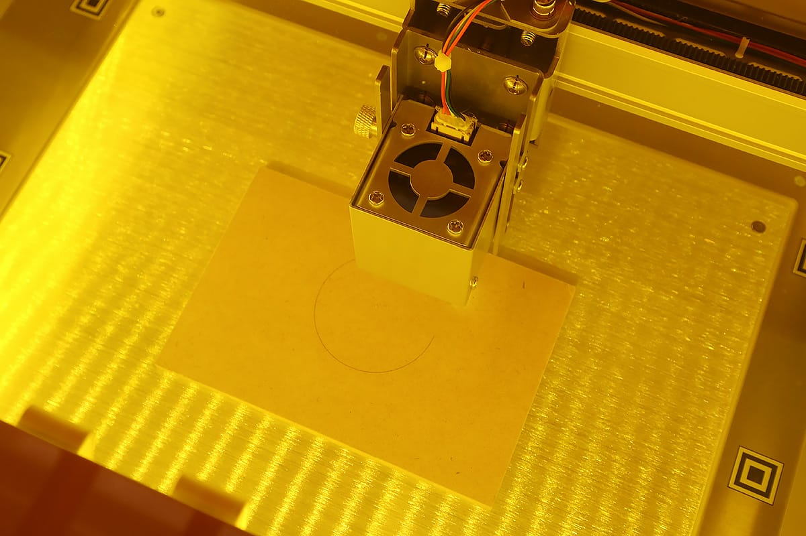

After the setup is complete, the material can be processed. If the following steps do not work, please check <a target="_blank" href="https://support.smartdiys.cc/hc/en-us/sections/360006255294-Problems-about-Etcher-Laser">troubleshooting.</a>

## Preparation of material
Please prepare your material. Since there is a place to input the thickness of the material later in the process, please check the thickness of the material in advance.

## Connecting the Etcher Laser to PC
Use the USB cable enclosed with the device to connect the Etcher Laser to your PC. DO NOT use a USB hub and directly connect the devices.

## Launch the software and place the material
Check that the Etcher Laser is turned on and launch the software. When you start the application for the first time, follow the on-screen instructions to configure the main unit. If you have already set it up, check that it is set to Settings-> User Settings-> Model Name Etcher Laser, and check the laser type.

When the Etcher Laser and PC are properly connected, the software will show “Connected” on the top left side of the screen.
Click the “Origin” on the top of the screen, and the laser head will move to the origin (top left in the work area, default position before it starts processing.)

Place the material in the center of the work area. When placing the material, DO NOT cover the stickers for positioning (white and black squares) placed around the work area with the material.

Click the “position check” button, and the graphic area of the software will show the image of the laser head. By dragging the image to a spot, you can move the laser head. Use this function to move the laser head so it is above the material.

## Adjust the height of the laser
Next, adjust the height of the laser. When you process a material with the Etcher Laser, you need to adjust the height to set the focal length depending on the thickness of the material.
Take out the height adjustment jig from the box and place it on the material.

Loosen the screw for height adjustment on the laser head, and slide the laser vertically until the bottom part of the laser head touches the height adjustment jig.

To prevent the laser head from tilting, close the height adjustment screw while keeping the top of the laser head in close contact with the laser head fixing unit. If the laser head is tilted, it may cause a shift in the processing position.

Click “Position” to cancel the position check. Click “Origin” to move the laser head to the origin.

## Import data and check the positioning
Click the “Add Item” button to import your data. There are several ways to import data and different types of data, but for this example, select the asset data we provide for users. Click “Asset” on the right, select the “shape” tab, and select a circle. Click the “Import” button to place the shape in the graphic area of the software.

Clicking on the camera icon will bring up a dialog where you can enter the thickness of the material (you cannot click on the camera icon if the Etcher Laser door is closed. Be sure to open the door completely). Enter a numerical value and click OK. The material is then displayed in the software.

An error will be displayed if the laser head is not located at the origin or if any camera marker is hidden behind the material. For details, see “<a target="_blank" href="https://support.smartdiys.cc/hc/en-us/articles/360039256373">An error occurs when using the camera (capture)</a>”.

Adjust the size of the design and place it on the material.

## Set parameters and start processing
Next, set the parameters for the process. Click the item (circle) on the right side of the screen to display the dialog for parameter setting. This time, set 1500 for the speed, 50 for the power, and 1 for the number of processing times. (Please refer to the page <a target="_blank" href="https://manual.smartdiys.cc/smartdiys-creator-parameter-settings/">SmartDIYs Creator ManualParameter settings</a> for further information on the parameters.)

After that, close the lid of the Etcher Laser and click the “START” button. A dialog with precautions will appear, so confirm and click the “OK” button to proceed. DO NOT leave the device while processing is in progress.
*If you start processing while the lid is open, the laser head will move but the laser will not irradiate.
*When processing without removing the bottom, it is not necessary to use protective glasses.

Further details on the software are in the manuals:<a target="_blank" href="https://manual.smartdiys.cc/smartdiys-creator-product-outline/">SmartDIYs Creator</a>
