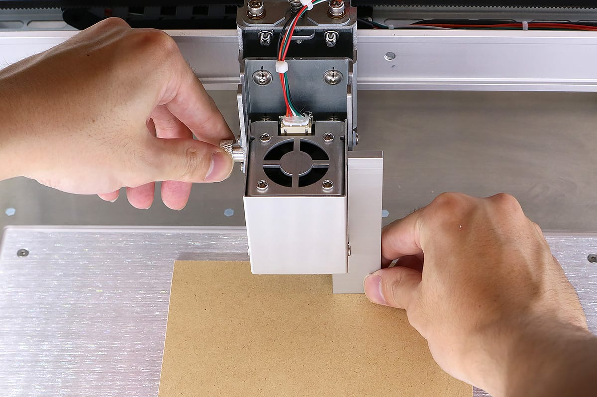

セットアップが終了したら素材の加工に入ります。素材を用意してください（後工程で素材の厚みを入力する箇所があるので、あらかじめ素材の厚みをご確認ください）Etcher Laser の電源が入っているか、Etcher Laser とPCがUSBケーブルで接続されているか確認してください。

## ソフトウェア立ち上げ、素材の配置
ソフトウェアを立ち上げます。 初めてアプリケーションを立ち上げた場合は本体設定などを行うので、画面の指示にしたがってください

正常に接続されている場合、ソフトウェア左上に「接続済み」と表示されます。

ソフトウェア画面上部の「原点復帰」をクリックします。すると、レーザーヘッドが原点（左上）に移動します。

ベッドの中央に素材を置きます。このとき、ベッドの周辺にあるカメラの位置調整用のマーク（白黒の四角）を隠さないようにご注意ください。

「位置確認」をクリックします。ソフトウェアのグラフィックエリアにレーザーヘッドのイラストが表示され、このイラストをドラッグすることで、レーザーヘッドを任意の位置に移動させることができます。この機能を使い、レーザーヘッドを素材の真上に移動させます。

## レーザーヘッドの高さ調整
レーザーヘッドの高さ調整を行います。Etcher Laserで加工を行う際、レンズの焦点距離と素材の位置を合わせる必要があるため高さ調整を行わなくてはなりません。
梱包材から高さ調整用治具を取り出し素材の上に配置します。

高さ調整用ネジを緩めレーザーヘッドを上下にスライドさせ、高さ調整用治具と接触させます。

高さ調整用ネジを締め、固定します。「位置確認」をもう一度クリックし解除、「原点復帰」をクリックしレーザーヘッドを原点に移動させてください。

## データの読み込み、位置合わせ
「アイテムを追加」をクリックし、データの読み込みを行います。
データの読み込み方法や種類はいくつかありますが、今回はアセットカタログ → shape → 円を選択し、インポートをクリックしてください。グラフィックエリアに円が配置されます。

カメラアイコンをクリックすると、素材の厚みを入力するダイアログが表示されます。数値を入力しOKをクリックすると、グラフィックエリアに素材が表示されます。ドアが閉まっていたりレーザーヘッドが原点に配置されていない場合は正しく表示されません（カメラの位置合わせ用のシールが画面に写っていない場合が正常です）。

デザインを任意の大きさに調整し、素材の上に配置します。

## パラメータ設定、加工開始
パラメータの設定をします。ソフトウェア画面右のアイテム（円）をクリックすると、パラメータ設定ダイアログが表示されます。今回は、スピードを1500、パワーを50、回数を1に設定します（パラメータの詳しい説明は、[SmartDIYs Creator マニュアル パラメータ設定](https://www.smartdiys.com/manual/smartdiys-creator-parameter/)をご覧ください）。

Etcher Laserのドアをしめ、スタートをクリックします。表示された注意内容を確認後、OKをクリックしてください。加工が開始されます。加工中は必ずEtcher Laserのそばから離れないでください。
※ドアが開いている状態で加工が開始された場合、レーザーヘッドは動きますが、レーザーは照射されません。

ソフトウェアの詳しい説明は、[SmartDIYs Creator マニュアル](https://www.smartdiys.com/manual/smartdiys-creator-about/)をご覧ください。
