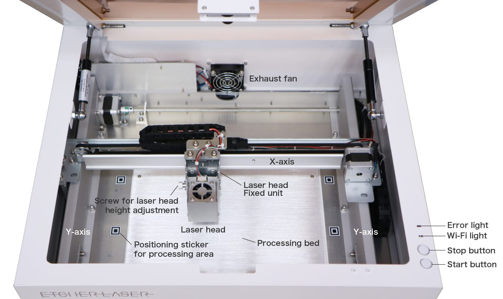
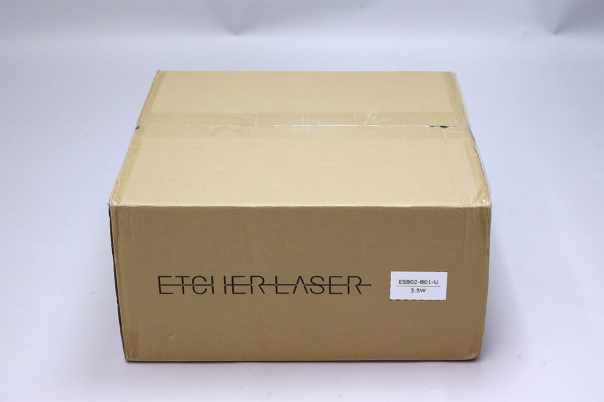
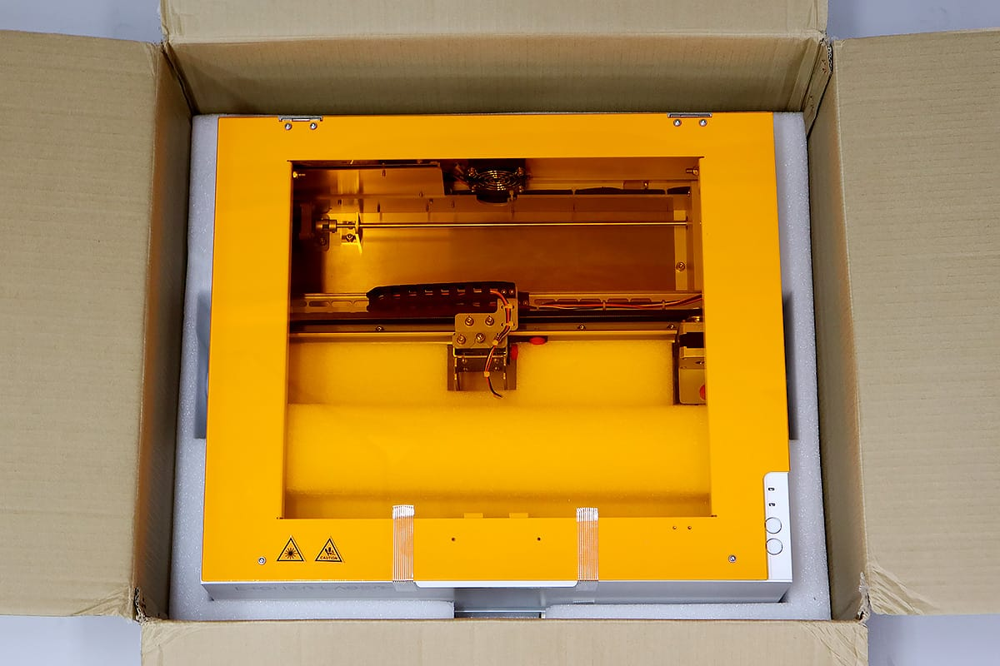
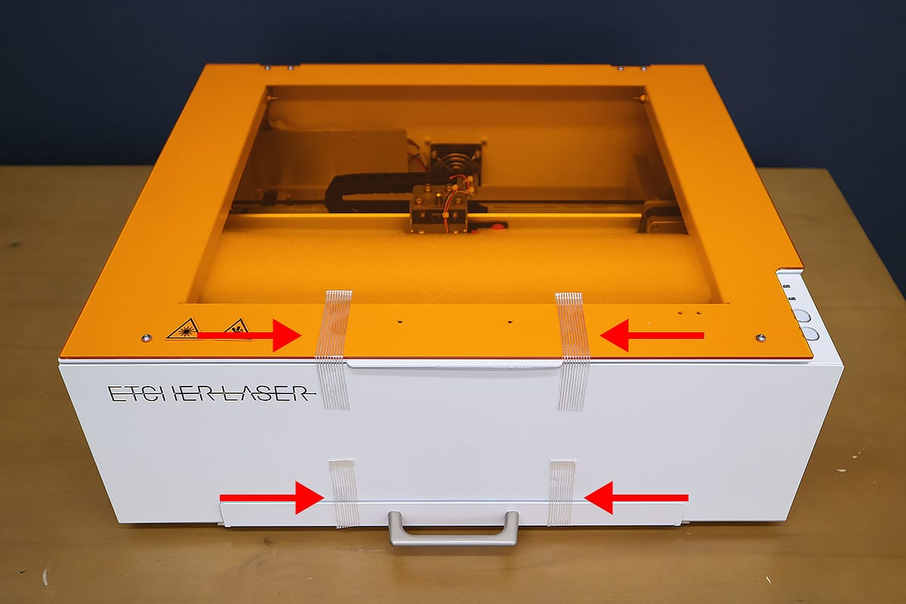

Let’s start setting up your Etcher Laser. Please refer to the pictures below for the name of each part.

**Error light**: Lights up in red when an error occurs in the machine body.

**Wi-Fi light**: Lights when Wi-Fi is connected to EtcherLaser in STA mode. * Please refer to <a href="https://manual.smartdiys.cc/el-mobile-connection-to-machine/">this page</a> for Connect to EtcherLaser via Wi-Fi router.

**Stop button**: Used to stop the operation of the main unit. Lights red when the button operation is valid. Press and hold this button to stop the processing machine. * Operation can also be stopped from software.

**Start button**: Used when operating from a smartphone application. Lights up green when the button is enabled. Lights when processing data is sent to the processing machine. Pressing and holding this button starts processing.

## Unpacking and setting up the device
There will be one box for the main device and 1 - 3 boxes for accessories (optional).

Open the box of the Etcher Laser’s main device. Remove the packing material on top and you will see the main unit.

Carefully remove the device from the box and place it on a flat and level surface. Please make sure that nothing is blocking the exhaust fan on the back side of the device and keep the main unit at least 7inch away from anything behind the device (walls, etc.).

Take out the AC Cable, USB Cable, and AC Adapter from the bottom packing material in the box.

Remove the tape that is sealing the lid and the bottom cover of the Etcher Laser (4 pieces).

Open the lid of the Etcher Laser and remove all the packing material inside the device. Please be careful to not damage the parts inside the packing material.

Remove the screws and plate that are holding the frames in place. There are 2 red screws on the X-axis (on the black plate) and 2 red screws on the Y-axis (right and left sides).

Take out the laser head from the packing material. DO NOT touch the lens on the bottom of the laser head when taking it out.

Loosen the screw for laser head height adjustment located on the left side of the laser head. Loosen it until the distance between the laser head and the screw is approximately 2mm.

Slide the laser head from the top to the bottom of the Laser Head Fixing Unit on the X-axis, and set the position firmly by tightening the screw for height adjustment.

Connect the connector part of the laser head fixing unit to the terminal part of the laser head. Insert the connector firmly.

For any occasion that you need to send your device to smartDIYs Inc. to get warranty service from us, please keep all the items sent together with the devices (boxes, packing materials, screws, plates, etc).

## Connecting the power supply
After confirming that the power of the Etcher Laser is switched off (the power switch’s ◯ part is pressed), connect the AC cable and AC adapter. After that, connect each end of the cable to the Etcher Laser and an electrical outlet.

Turn on the Etcher Laser’s power switch. When it is properly turned on, the light will turn on and the exhaust fan on the backside of the device will start to run.

