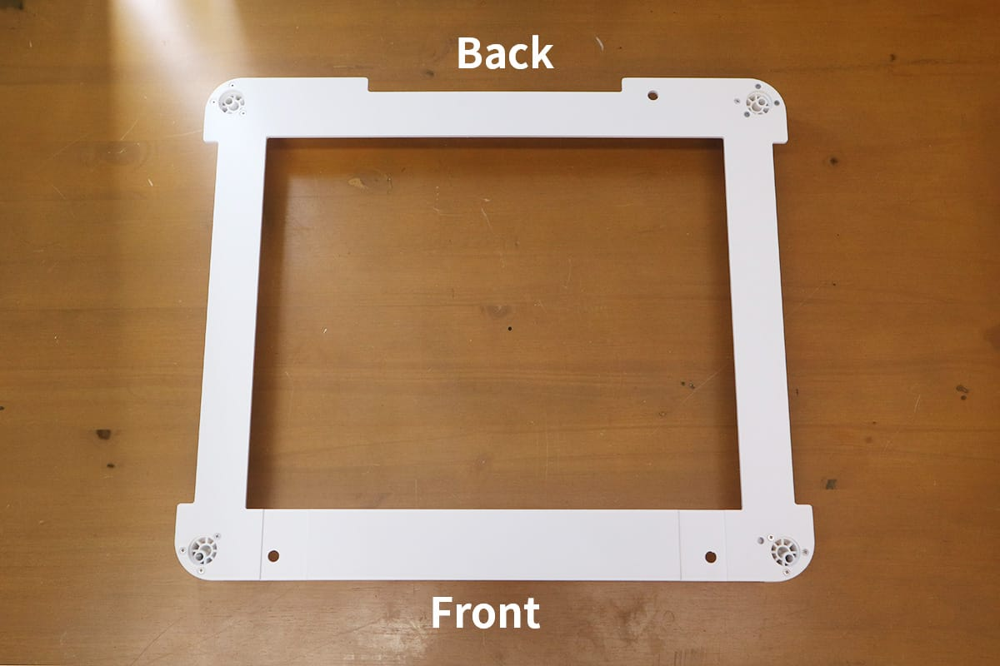

## How to use the removable bottom
Remove the bottom tray from the Etcher Laser. Prepare a protective plate or covering so that the work table is not damaged by the laser. It is recommended to use a non-combustible material (dark color that is difficult to reflect laser light) such as an iron plate or stainless steel plate for protection. Also, when removing the bottom, be sure to always wear the included protective glasses for processing.

If the material does not reach the bottom of the Etcher Laser, the value set when capturing with the camera is not the thickness of the material. Measure the value from the bottom of the Etcher Laser to the surface of the material and enter minus 〇mm.

## How to use the pedestal
Open the pedestal box and take out the pedestal.

Place the pedestal on a flat and level surface. The pedestal is thin, so please use caution while handling.

Set the Etcher Laser's legs so that they fit into the holes in the four corners of the pedestal.

Remove the bottom tray of the Etcher Laser, and you’re ready for processing.

