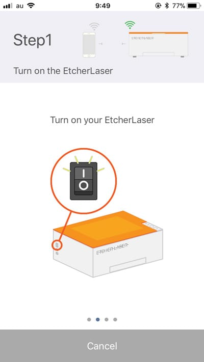

Firstly, download the application (Etcher Laser). Click the link below to download it.

- [Etcher Laser Installation (App store)](https://www.smartdiys.com)

Next, tap the icon of the app “Etcher Laser”.

Connect the Etcher Laser app to your smartphone or your tablet.
Tap the “Setting” icon on the top left of the screen, and select “Connection Guide” to proceed.

Step1: Make sure the Etcher Laser device’s power is turned on.

Step2: Select “Scan QR Code” and scan the QR code on the backside of the Etcher Laser device.

Step3:  Tap “Connect” and connect the Etcher Laser device to the smartphone/ tablet.

