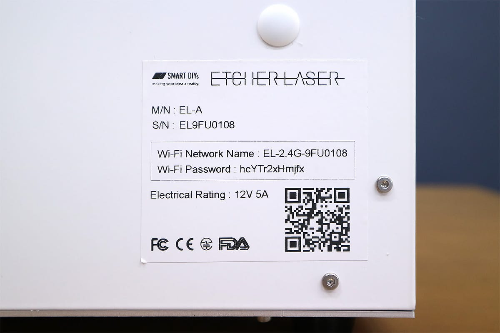

Download the application and connect with Etcher Laser. You cannot connect to the Internet while EtcherLaser is connected.

## Application Download
Firstly, download the application (Etcher Laser). Click the link below to download it.

- [Etcher Laser Installation (App store)](https://www.smartdiys.com)

## Etcher Laser and smartphone connection
Next, tap the icon of the app “Etcher Laser”.

Connect the Etcher Laser app to your smartphone or your tablet.
Tap the “Setting” icon on the top left of the screen, and select “Connection Guide” to proceed.

Make sure the Etcher Laser device’s power is turned on. (Swipe left to go to the next step)

Select “Scan QR Code” and scan the QR code on the backside of the Etcher Laser device.

Please follow the instructions on the app screen.

Tap "Connect" and select a processing machine to connect Etcher Laser to your smartphone.

## Connect to EtcherLaser via Wi-Fi router
If you have a Wi-Fi router in your environment, you can connect to EtcherLaser via this router. See “Connection to machine” for the setting method.
