## Installing the software
This section explains how to install the software (SmartDIYs Creator). Click the link below and download the installer for your OS.
*Skip this step if you have already installed the software.

- <a target="_blank" href="https://www.smartdiys.com/smartdiys-creator/">SmartDIYs Creator</a>

Click the installer and activate.

When the window for setup appears, click the “Next” button to start the installation.

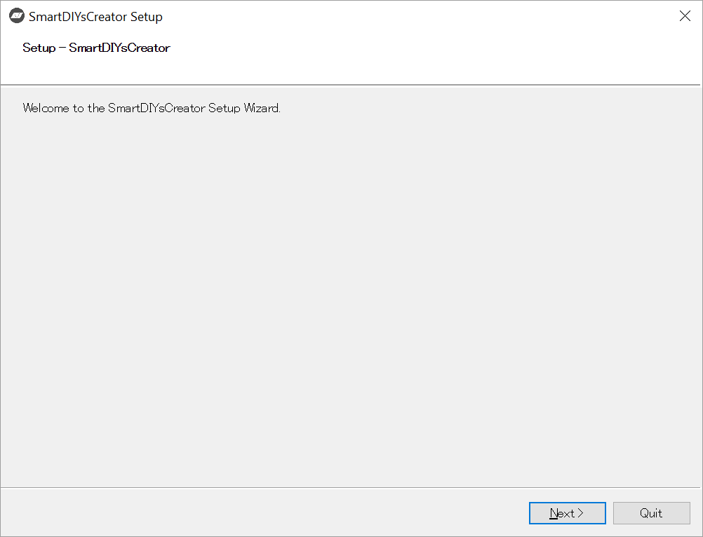

The installer will check whether SmartDIYs Creator is already installed. If it is already installed, it will automatically uninstall.

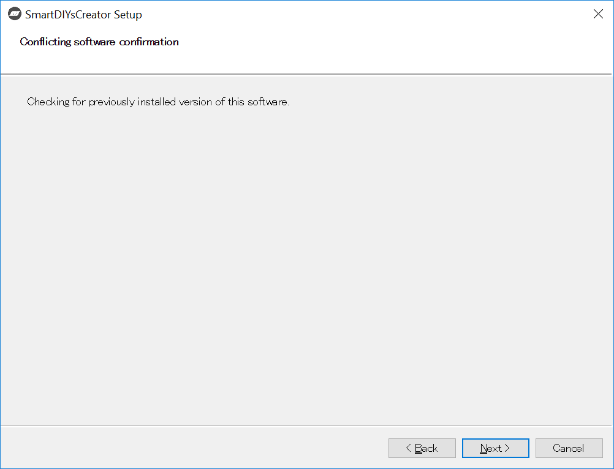

When it has finished checking, click “Next” to move on.

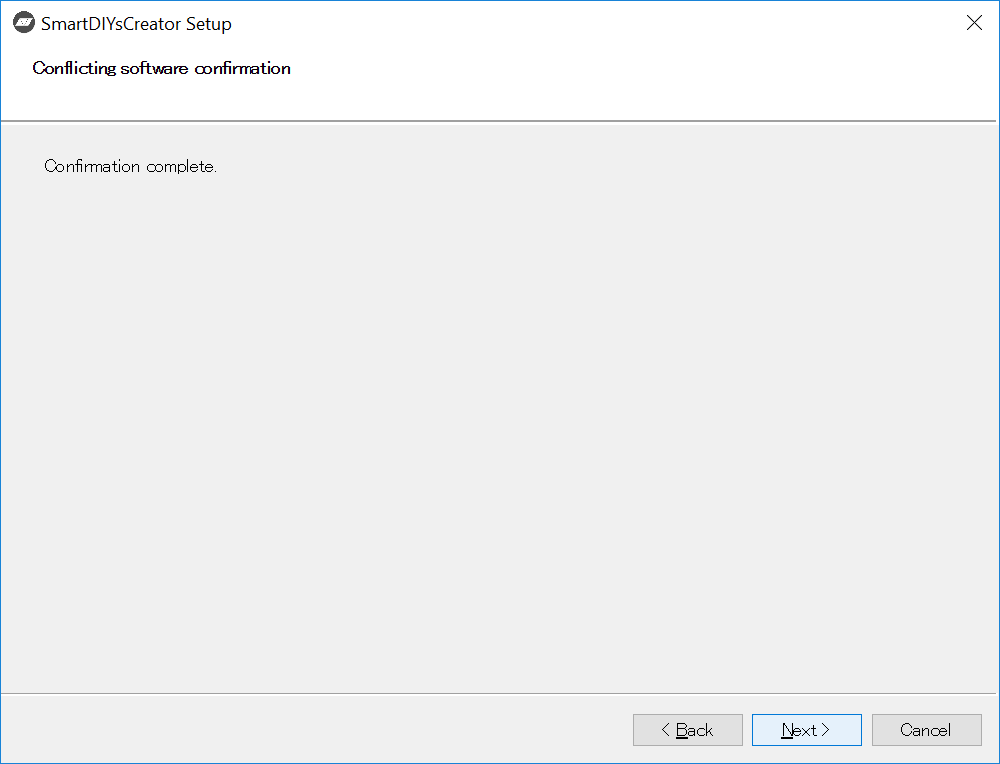

Select the folder to install the software. If you don’t need or want to change the folder from the default, click “Next” to move on.

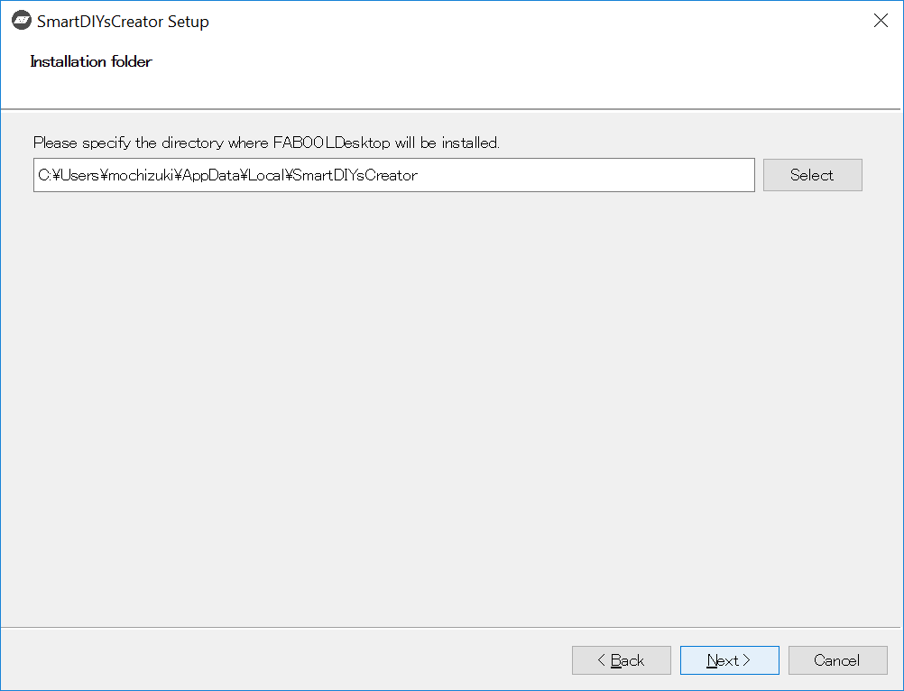

The installer will check the status of the installation.
*It might take time to check depending on your PC.

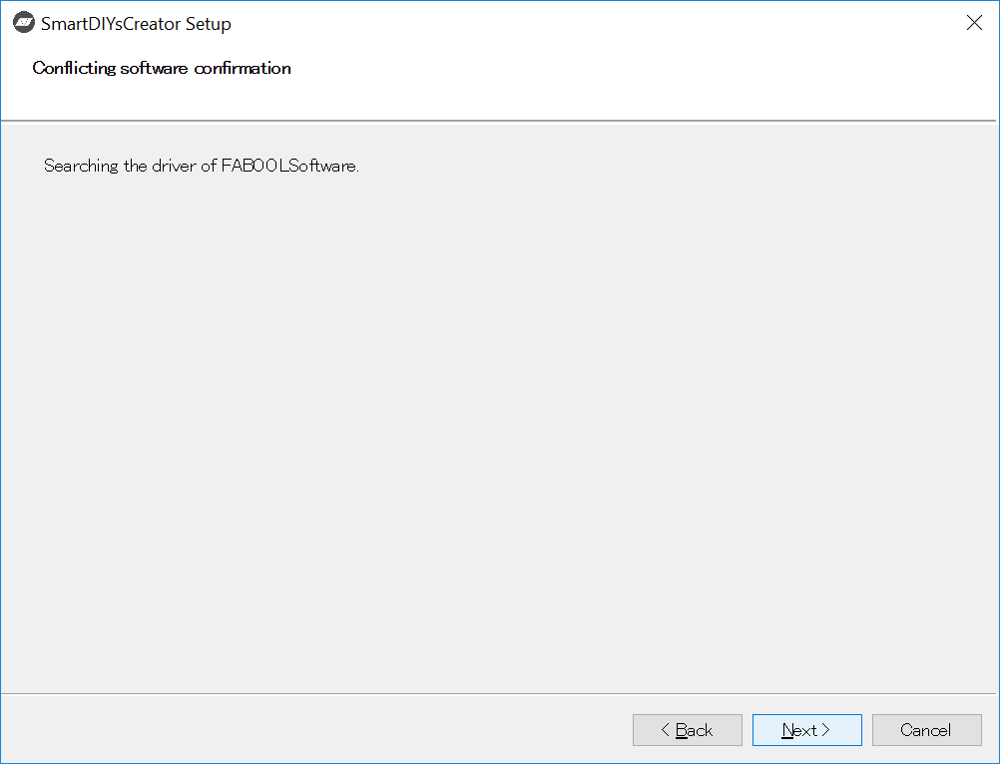

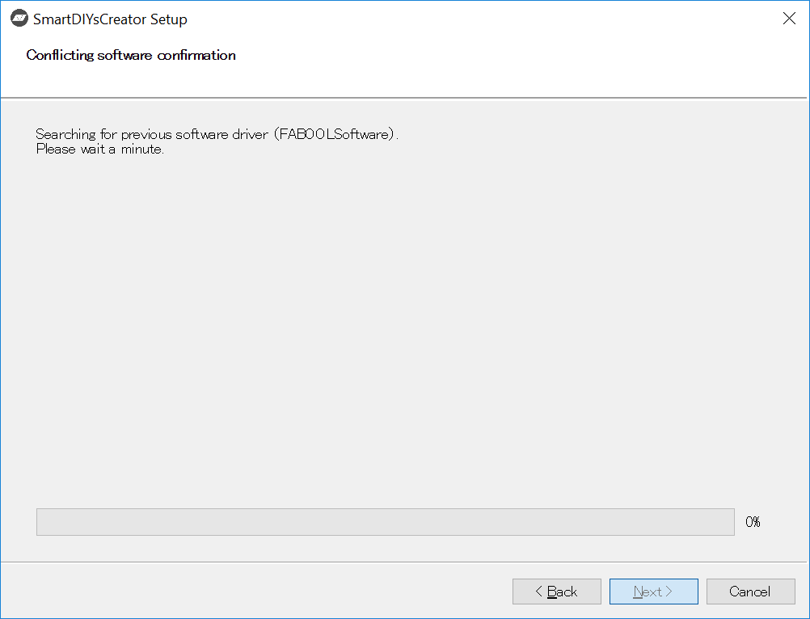

When the checking is complete, click “Next” to move on.

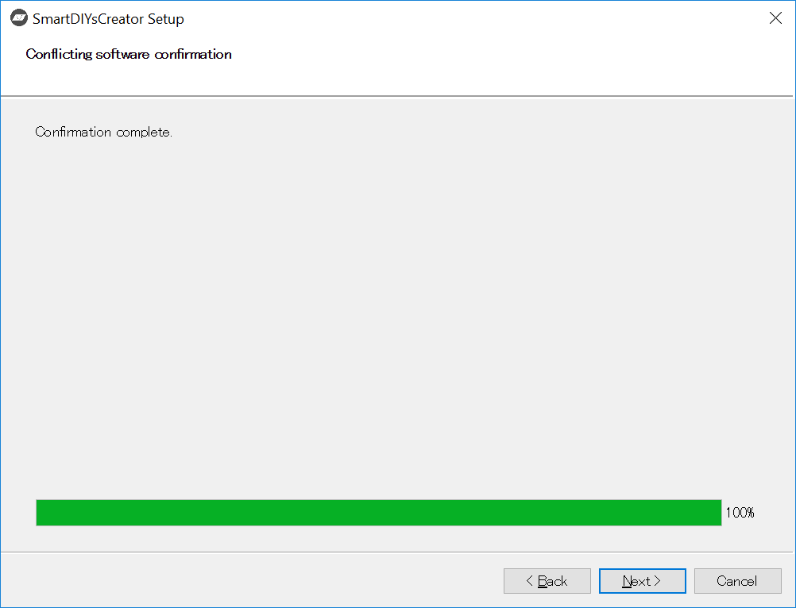

The window will show the components that are going to be installed. Make sure all the checkboxes are ticked, and click “Next” to proceed.

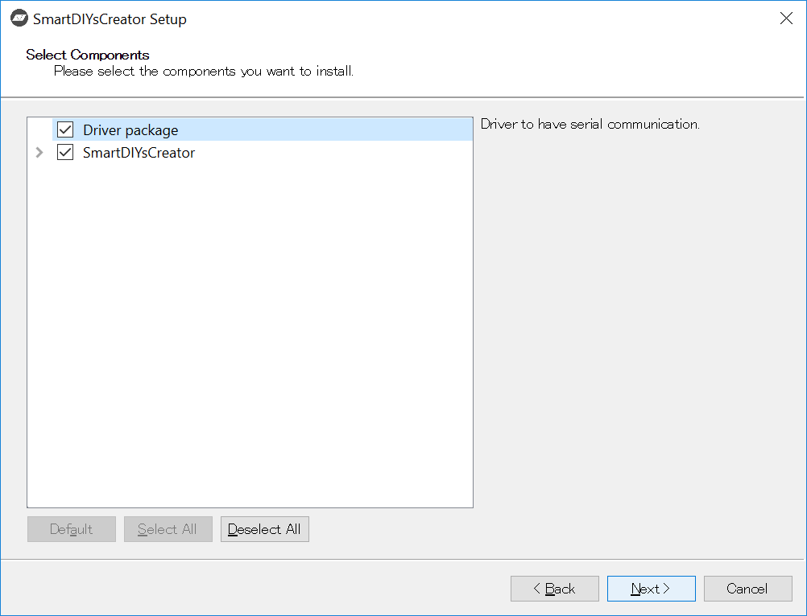

Confirm the displayed license terms, and if you agree, check "I accept the license" and click "Next" to proceed.
*If you do not accept the license, you can not complete the installation.

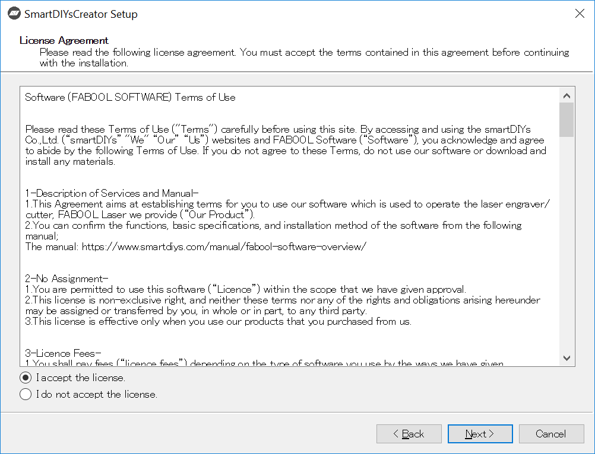

Click the Install button to begin the installation.

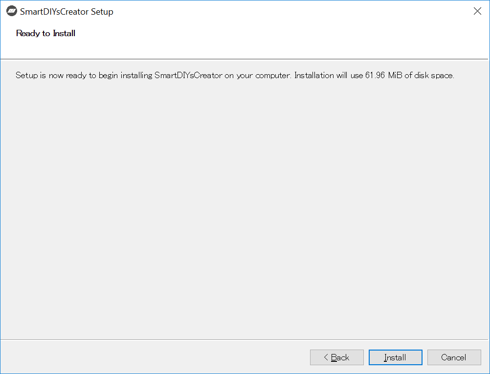

If you are using Windows, the installation of the device driver will start during installation, so click “Next” to install.

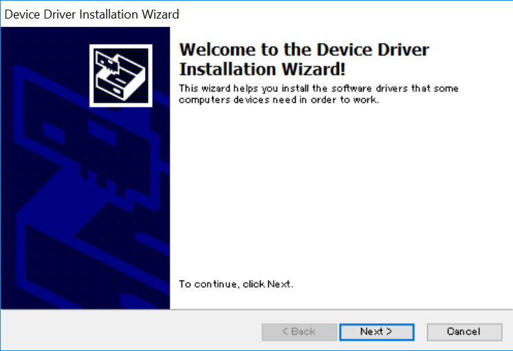

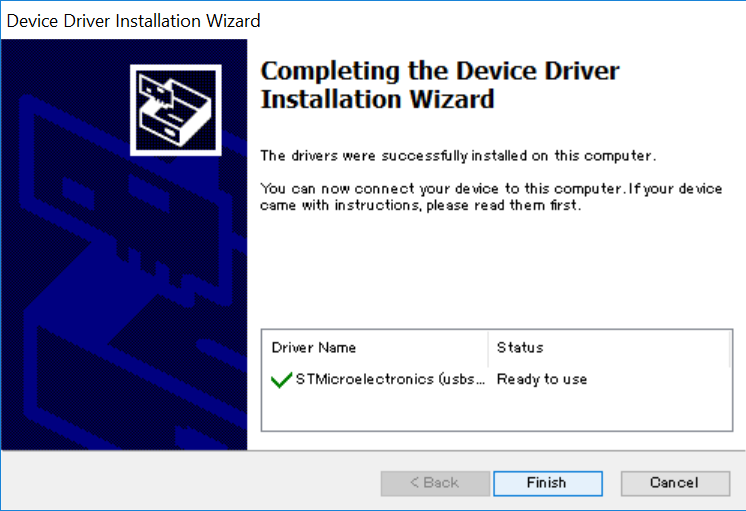

When the device driver installation is complete, click "Finish”.

The window will show the installation is complete, so click "Finish". If "Run Application" is checked at this time, SmartDIYs Creator will open automatically.

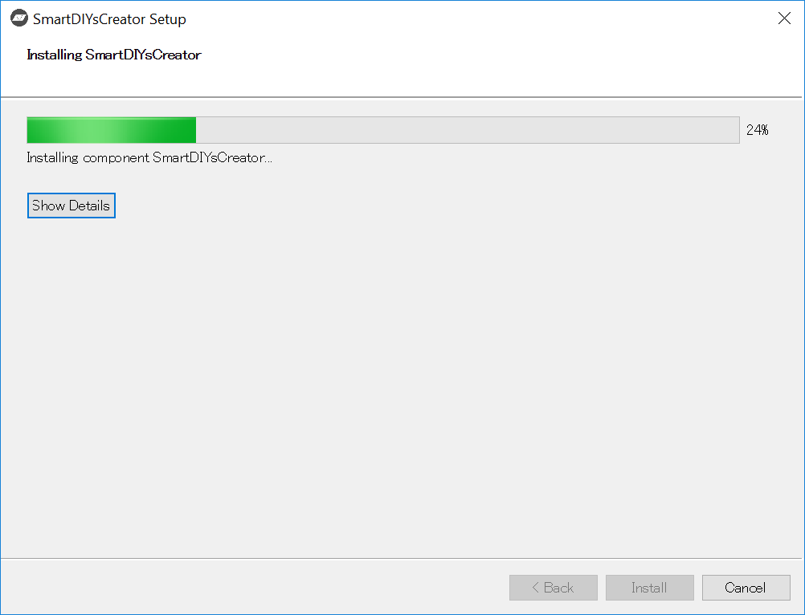

 

 

 

 

 
