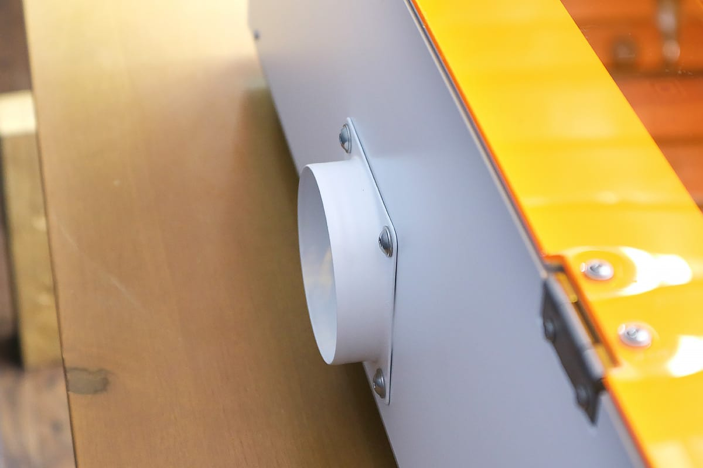
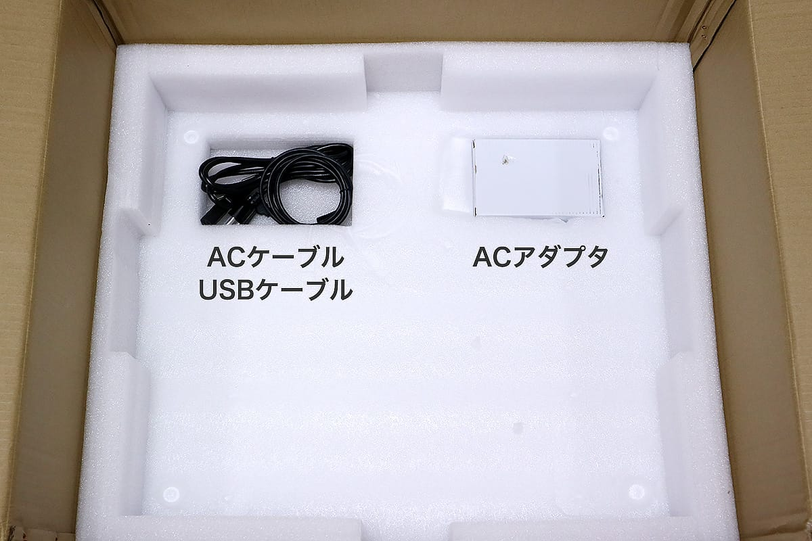
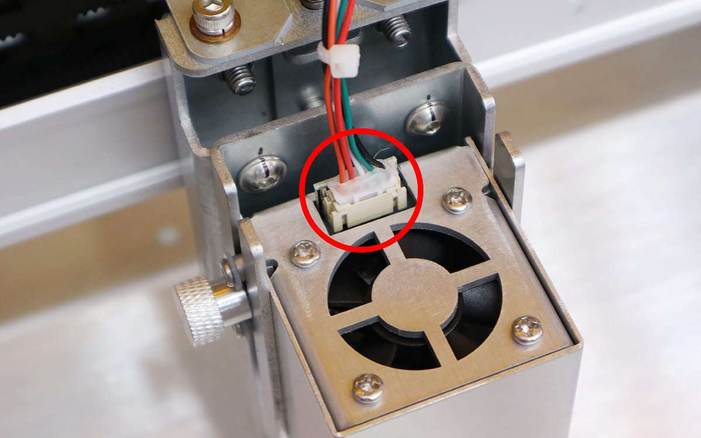
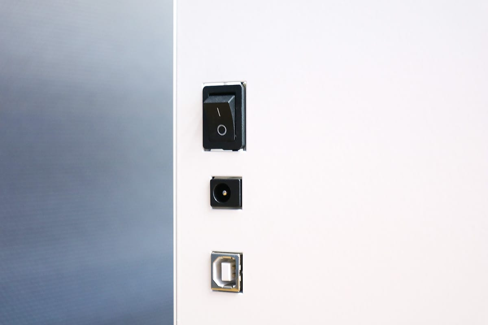

まず安全上の注意をよく読み、セットアップを始めてください。ほんの数分でレーザーカッターを使えるようになりますが、途中で躓いた場合はお気軽にて[お問い合わせ](https://support.smartdiys.com/hc/ja/requests/new)ください。

## 開梱と装置の準備
荷物はオプションも含め1〜3箱で到着します。はじめに、Etcher Laser 本体の箱を水平で安定した場所におきます。

ダンボールを開けます。一番上の梱包材を取り出すとEtcher Laser本体が入っています。

ダンボールから慎重にEtcher Laserを取り出し、平で水平な場所に設置します。このとき、Etcher Laserの背面の排気口を塞がないように注意してください。

箱の一番下の梱包材にACケーブル、USBケーブル、ACアダプタが入っているので取り出してください。

Etcher Laserの上部のフタと引き出しを固定しているテープ（4箇所）を取り外しします。

Etcher Laserのフタを開け、内部の梱包材をすべて取り出します。

フレームを固定しているネジ/プレートを取り外します。X軸の2つの赤ネジと黒色のプレート、左右のY軸の赤ネジを取り外してください。

レーザーヘッドを取り付けます。梱包材からレーザーヘッドを取り出してください。この時、レーザーヘッド底部のレンズには絶対に触らないでください。

レーザーヘッドの左側についている高さ調整用ネジを緩めます（ネジとレーザーヘッドの隙間が2mmほどあく程度）。

X軸に設置してあるレーザーヘッド固定ユニットに、レーザーヘッドを上からスライドさせ高さ調整用ネジを締めてしっかりと固定します。

レーザーヘッド固定ユニットのケーブルをレーザーヘッドの端子部に接続します。奥までしっかりと差し込んでください。

フタに取り付いているカメラのカバーを外します。カメラレンズには絶対に触らないてください。

保証サービス時の発送のために、梱包材/ネジ/プレートなどすべて保管してください。

## 電源接続
Etcher Laserの電源スイッチがOFFになっている（◯が押されている）ことを確認し、ACケーブルとACアダプタを接続、製品とコンセントに接続します。

Etcher Laserの電源スイッチを入れてください。ライトが点灯し、製品後方のファンが回転します。

