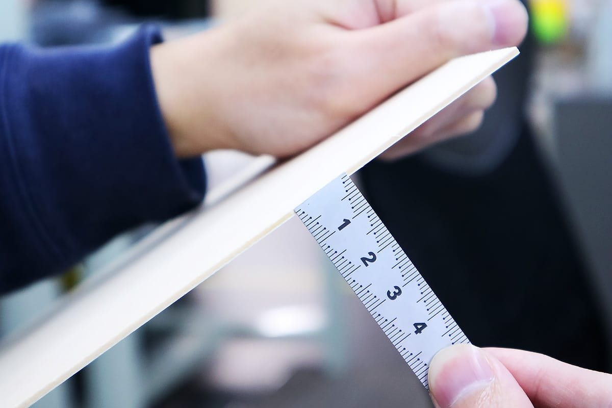
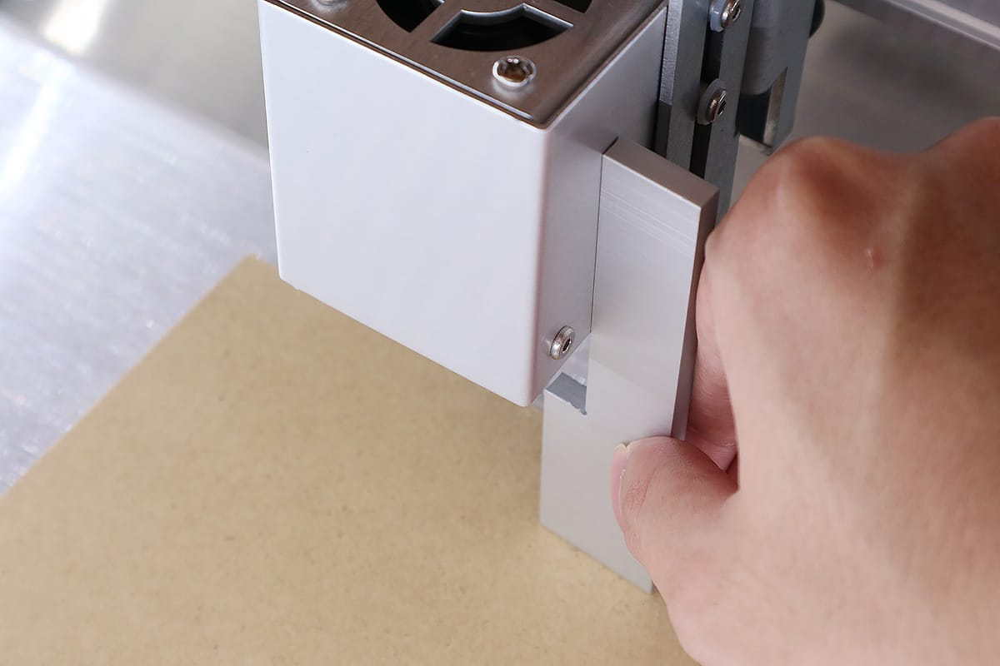

セットアップが終了したら素材の加工に入ります。
下記手順が上手くいかない場合は<a target="_blank" href="https://www.smartdiys.com/support/product/el-trouble/">トラブルシューティング</a>をご確認ください。

<iframe width="560" height="315" src="https://www.youtube.com/embed/rd3ESCfDGqQ" frameborder="0" allow="accelerometer; autoplay; encrypted-media; gyroscope; picture-in-picture" allowfullscreen></iframe>

## 素材の用意
素材を用意してください。後工程で素材の厚みを入力する箇所があるので、あらかじめ素材の厚みをご確認ください。

## プロジェクトの作成・素材の配置
アプリ画面の「プロジェクトを追加」か画面下部の+アイコンをタップしてください。

プロジェクトが作成され、グラフィックエリアが表示されます。
アプリ画面右上のメニューをタップし「原点復帰」をタップしてください。
レーザーヘッドが原点（左上）に移動します。

加工ベッドの中央に素材を置きます。このとき、ベッドの周辺にあるカメラの位置調整用のマーク（白黒の四角）を隠さないようにご注意ください。

アプリ画面右上のメニューをタップし「位置確認」をタップしてください。

レーザーヘッドを原点に戻すダイアログが表示れます。OKをタップすると、レーザーヘッドが原点（左上）に移動します。

アプリ画面のレーザーヘッドのアイコンをドラッグし「移動」をタップすることで、レーザーヘッドを任意の位置に移動させることができます。この機能を使い、レーザーヘッドを素材の真上に移動させます。

## レーザーヘッドの高さ調整
レーザーヘッドの高さ調整を行います。Etcher Laserで加工を行う際、レンズの焦点距離と素材の位置を合わせる必要があるため高さ調整を行わなくてはなりません。
梱包材から高さ調整用治具を取り出し素材の上に配置します。

レーザーヘッドの左右に取り付いている高さ調整用ネジを緩めレーザーヘッドを上下にスライドさせ、高さ調整用治具と接触させます。

レーザヘッドが傾かないよう、レーザヘッドの上部をレーザヘッド固定ユニットに密着させながら高さ調整ネジを閉めてください。レーザヘッドに傾きがある場合、加工位置のズレの原因となります。

高さ調整が終了後、アプリ画面の「閉じる」をタップしてください。

## データの読み込み、位置合わせ
データの読み込みを行います。アプリ画面左下の+をタップしてください。

データの読み込み方法や種類はいくつかありますが、今回は アセット → 丸を選択ししてください。グラフィックエリアに丸が配置されます。

メニューをタップし、「キャプチャ」をタップしてください。

素材の厚みを入力するダイアログが表示されます。数値を入力しOKをクリックすると、グラフィックエリアに素材が表示されます。

レーザーヘッドが原点に配置されていない場合やカメラマーカーが素材で隠れている場合は、エラーが表示されます。詳しくは<a target="_blank" href="https://www.smartdiys.com/support/product/el-trouble/camera-3/">カメラ使用（キャプチャ）時にエラーがでる</a>をご覧ください。

デザインを任意の大きさに調整し、素材の上に配置します。丸をタップしドラッグすることで位置の調整ができ、矢印マークをドラッグすることで大きさ・角度が調整できます。また、グラフィックエリアをピンチイン・ピンチアウトすることで表示の拡大・縮小が行なえます。

## パラメータ設定、加工開始
パラメータの設定をします。アプリ画面下部のアイテム（丸）をタップすると、パラメータ設定ダイアログが表示されます。今回は、スピードを1500、パワーを50、回数を1に設定します（パラメータの詳しい説明は、[SmartDIYs Creator マニュアル パラメータ設定](https://www.smartdiys.com/manual/el-mobile-parameter/)をご覧ください）。

Etcher Laserのドアをしめ、メニューをタップし、「スタート」をタップします。おおよその加工時間が表示されるので、「加工開始」をタップしてください。

Etcher Laserの右下、ボタンが緑色に点滅します。そのボタンを長押しすることで加工が開始されます。
※ドアが開いている状態で加工が開始された場合、レーザーヘッドは動きますが、レーザーは照射されません。
※底部取り外しモデルをご使用の方で、底部を取り外さずに加工する場合は保護メガネを使用する必要はありません。

アプリケーションの詳しい説明は、[Etcher Laserアプリ マニュアル](https://www.smartdiys.com/manual/el-mobile-about/)をご覧ください。
