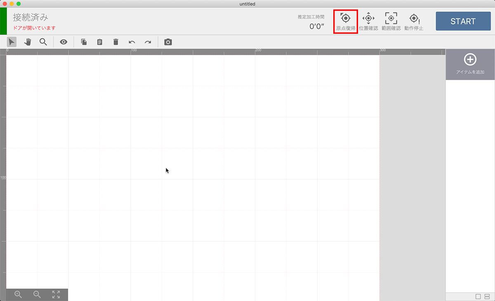
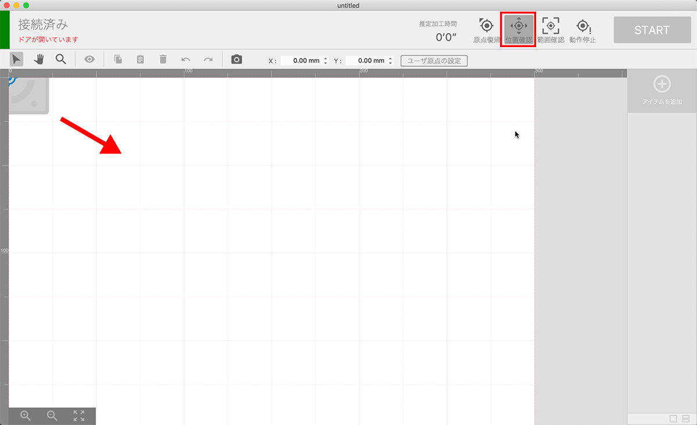
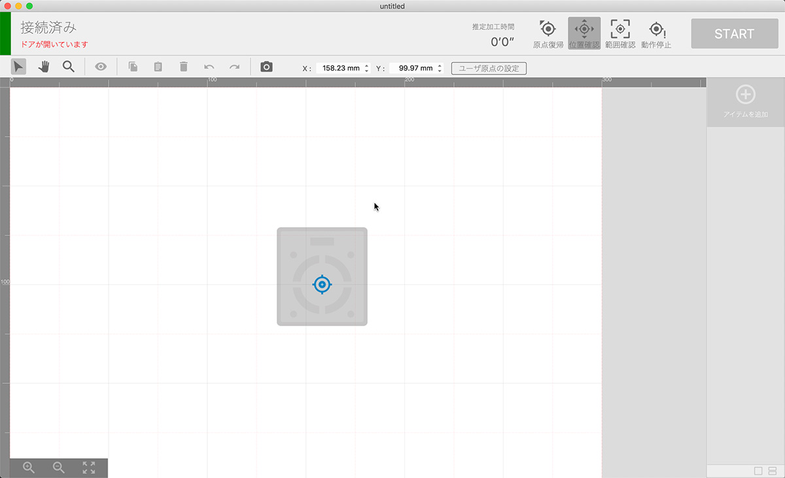
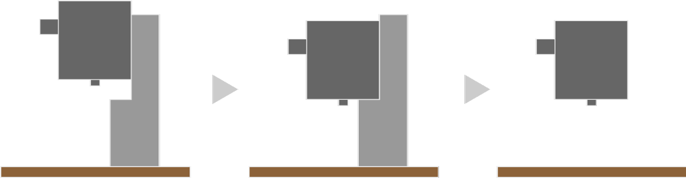
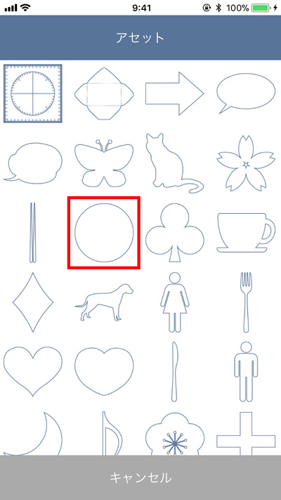
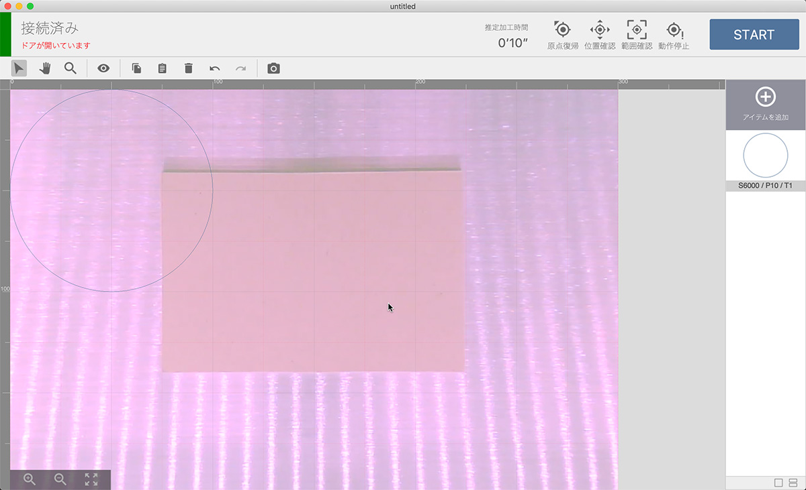

セットアップが終了したら素材の加工に入ります。素材を用意してください（後工程で素材の厚みを入力する箇所があるので、あらかじめ素材の厚みをご確認ください）。

## プロジェクトの作成・素材の配置
アプリの「Add Project」か画面下部の+アイコンをタップしてください。

プロジェクトが作成され、グラフィックエリアが表示されます。
アプリ画面右上のメニューをタップし「Position」をタップしてください。レーザーヘッドを原点に戻すダイアログが表示れます。OKをタップすると、レーザーヘッドが原点（左上）に移動します。

加工ベッドの中央に素材を置きます。このとき、ベッドの周辺にあるカメラの位置調整用のマーク（白黒の四角）を隠さないようにご注意ください。

アプリ画面のレーザーヘッドのアイコンをドラッグし「Move」をタップすることで、レーザーヘッドを任意の位置に移動させることができます。この機能を使い、レーザーヘッドを素材の真上に移動させます。位置の調整が終了したら「Close」をタップしてください。

## レーザーヘッドの高さ調整
レーザーヘッドの高さ調整を行います。Etcher Laserで加工を行う際、レンズの焦点距離と素材の位置を合わせる必要があるため高さ調整を行わなくてはなりません。
梱包材から高さ調整用治具を取り出し素材の上に配置します。

高さ調整用ネジを緩めレーザーヘッドを上下にスライドさせ、高さ調整用治具と接触させます。

アプリ画面のメニューをタップ、「Origin」をタップしレーザーヘッドを原点に移動させてください。

## データの読み込み、位置合わせ
データの読み込みを行います。画面左下の+をタップしてください。
データの読み込み方法や種類はいくつかありますが、今回は From Assets → 丸を選択ししてください。グラフィックエリアに丸が配置されます。

メニューをタップし、「Capture」をタップしてください。素材の厚みを入力するダイアログが表示されます。数値を入力しOKをクリックすると、グラフィックエリアに素材が表示されます。ドアが閉まっていたりレーザーヘッドが原点に配置されていない場合は正しく表示されません（カメラの位置合わせ用のシールが画面に写っていない場合が正常です）。

デザインを任意の大きさに調整し、素材の上に配置します。丸をタップしドラッグすることで位置の調整ができ、矢印マークをドラッグすることで大きさ・角度が調整できます。また、グラフィックエリアをピンチイン・ピンチアウトすることで表示の拡大・縮小が行なえます。

## パラメータ設定、加工開始
パラメータの設定をします。アプリ画面下部のアイテム（丸）をタップすると、パラメータ設定ダイアログが表示されます。今回は、スピードを1500、パワーを50、回数を1に設定します（パラメータの詳しい説明は、[SmartDIYs Creator マニュアル パラメータ設定](https://www.smartdiys.com/manual/smartdiys-creator-parameter/)をご覧ください）。

Etcher Laserのドアをしめ、画面右上のメニューをタップし、「Start」をタップします。加工時間が表示されるので、「Start」をタップしてください。

Etcher Laserの右下、ボタンが緑色に点滅します。そのボタンを押すことで加工が開始されます。
※ドアが開いている状態で加工が開始された場合、レーザーヘッドは動きますが、レーザーは照射されません。

ソフトウェアの詳しい説明は、[SmartDIYs Creator マニュアル](https://www.smartdiys.com/manual/smartdiys-creator-about/)をご覧ください。
