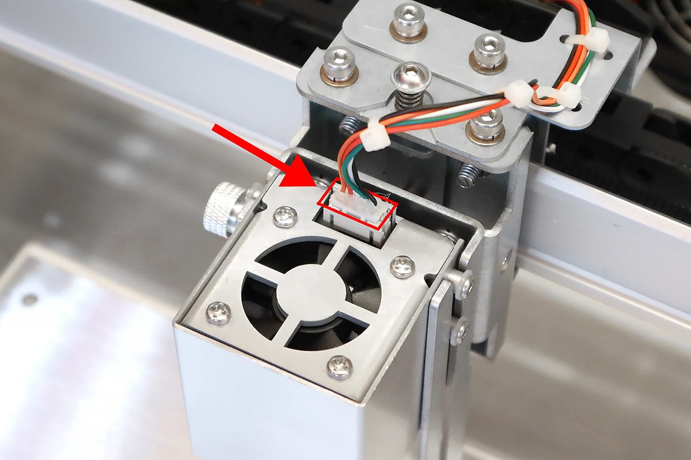
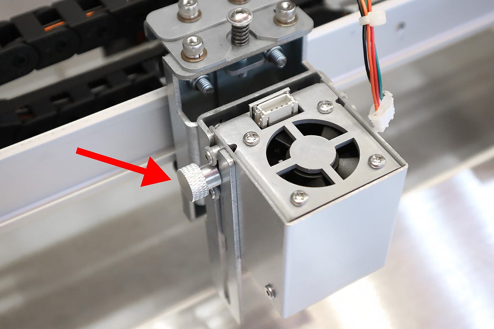
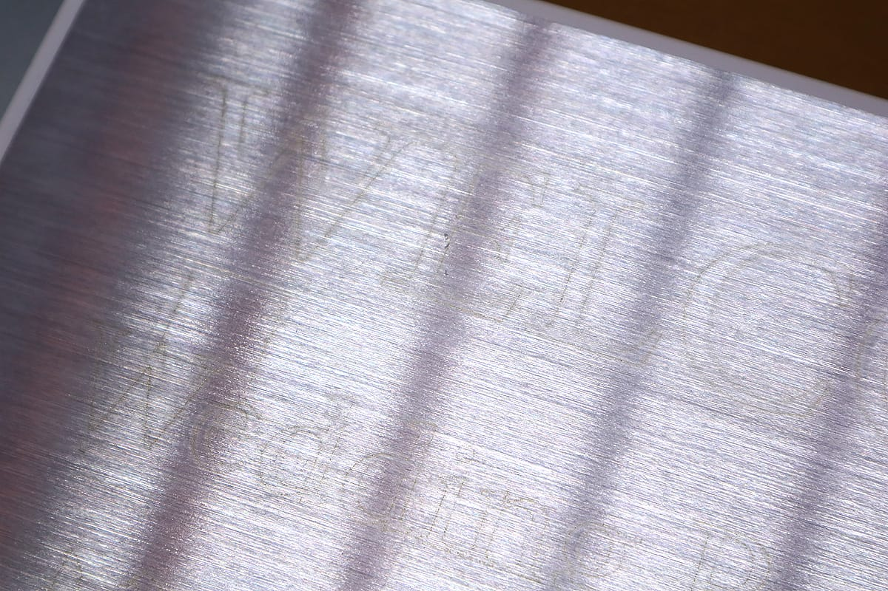
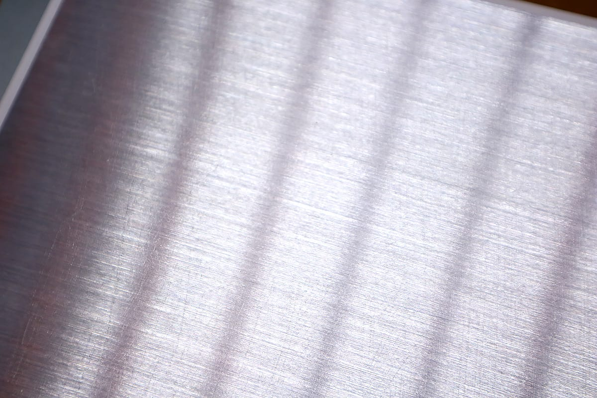
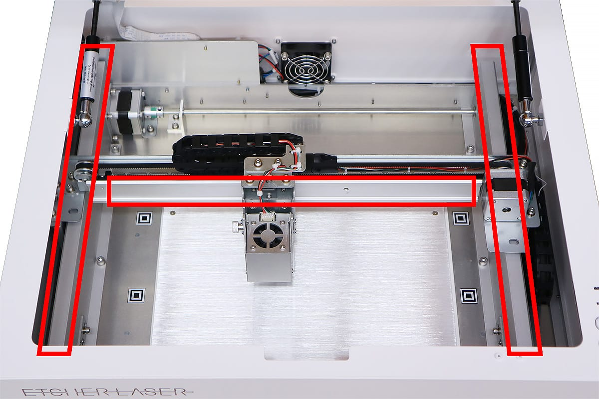
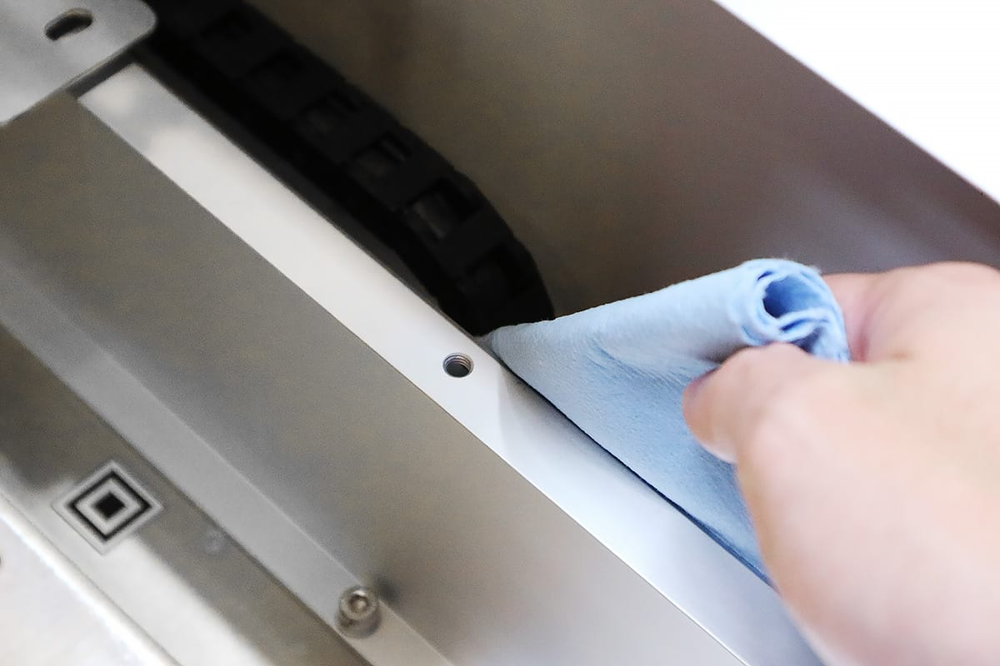
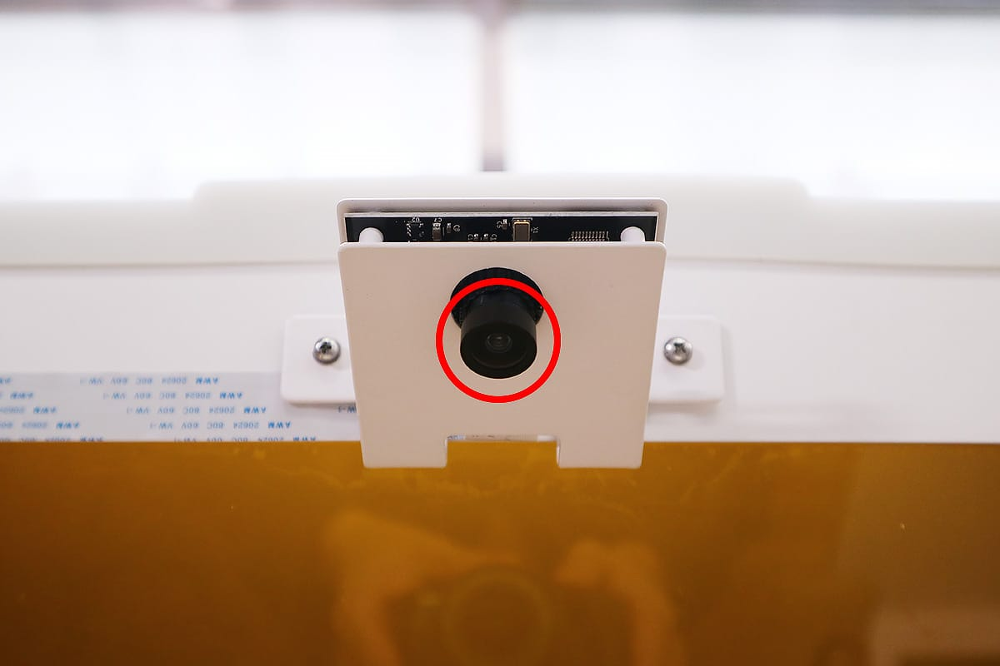
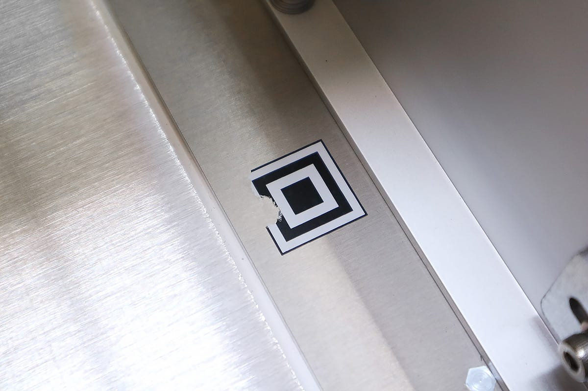

## レーザーヘッドのメンテナンス
レーザーヘッドのに取り付いてるレンズは、ホコリやヤニ汚れが付着するため定期的なクリーニングが必要です。

1.電源がOFFになっているのを確認し、ACケーブル・USBケーブルを本体から抜いてください。

2.レーザーヘッドのケーブルを外します。ケーブルを引っ張るのではなく、白いコネクタ部分をしっかりと掴みながら外してください。

3.高さ調整用ネジを緩め、レーザーヘッドをレーザーヘッド固定ユニットから外します。

4.レーザーヘッドのレンズ部分は、カメラ用レンズクリーナーなどを使用してクリーニングをしてください。
※クリーナーはアルコールを含まないものをご使用ください。また絶対にレンズには手で触らないでください

5.レンズ以外の汚れた部分は、布等で拭き取ってください。

6.クリーニング終了後、レーザーヘッドをレーザーヘッド固定ユニットに取り付け、ケーブルをコネクタに接続します。

## 加工ベッドのメンテナンス
木材や紙などを加工した際、素材から発生するヤニが加工ベッドに付着することがあります。

アルコールを含んだウェットティッシュ等を使用することによりキレイに拭き取ることができます。

## フレームのメンテナンス
フレームに汚れやホコリが付着していると、軸ずれの原因となるため定期的なクリーニングが必要です。
X軸フレーム、Y軸フレームのホイールが通る部分を、布などで拭いてください。

## カメラ・位置調整用マークのメンテナンス
カメラがうまく加工ベッドを撮影できない場合、カメラレンズのクリーニング及び、位置調整用マークの確認が必要です。

ドアに取り付いているカメラを、カメラ用レンズクリーナーなどを使用してクリーニングをしてください。
※絶対にレンズには手で触らないでください。

位置調整用マークが削れている場合、予備のシールをマークの上から貼り付けてください。
※シールが曲がらないように貼り付けてください

