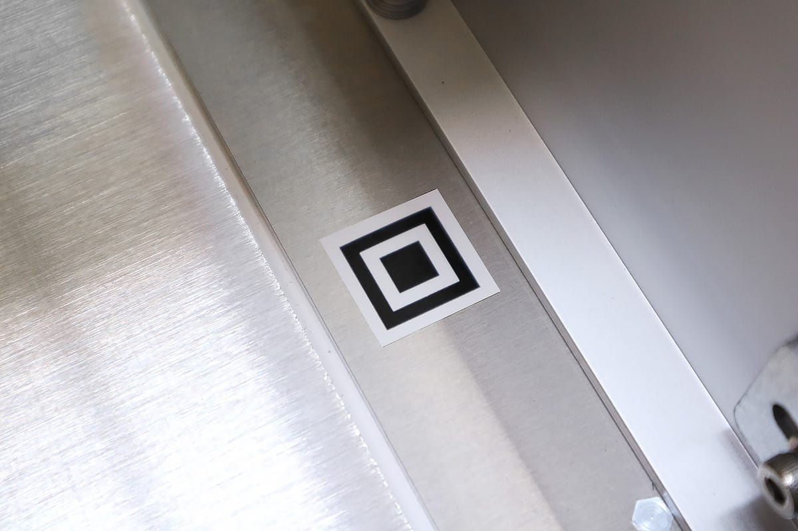

## レーザーヘッドのメンテナンス
レーザーヘッドに取り付いてるレンズは、ホコリやヤニ汚れが付着するため定期的なクリーニングが必要です。

1.電源がOFFになっているのを確認し、ACケーブル・USBケーブルを本体から抜いてください。

2.レーザーヘッドのケーブルを外します。ケーブルを引っ張るのではなく、白いコネクタ部分をしっかりと掴みながら外してください。

3.高さ調整用ネジを緩め、レーザーヘッドをレーザーヘッド固定ユニットから外します。

4.レーザーヘッドのレンズ部分は、カメラ用レンズクリーナーなどを使用してクリーニングをしてください。
ヤニなどは落ちにくいため、レンズに傷が付かないように気を付けながら、何度も拭いて落としてください。
※絶対にレンズには手で触らないよう、取り扱いについては十分注意してください

    <iframe width="560" height="315" src="https://www.youtube-nocookie.com/embed/UZlDxzRyJNw" frameborder="0" allow="accelerometer; autoplay; encrypted-media; gyroscope; picture-in-picture" allowfullscreen></iframe>

5.レンズ以外の汚れた部分は、布等で拭き取ってください。

6.クリーニング終了後、レーザーヘッドをレーザーヘッド固定ユニットに取り付け、ケーブルをコネクタに接続してください。

## 加工ベッドのメンテナンス
木材や紙などを加工した際、素材から発生するヤニが加工ベッドに付着することがあります。

アルコールを含んだウェットティッシュ等を使用することによりキレイに拭き取ることができます。

## フレームのメンテナンス
フレームに汚れやホコリが付着していると、軸ずれの原因となるため定期的なクリーニングが必要です。
X軸フレーム、Y軸フレームのホイールが通る部分を、布などで拭いてください。

## カメラ・カメラマーカーのメンテナンス
カメラがうまく加工ベッドを撮影できない場合、カメラレンズのクリーニング及び、カメラマーカーの確認を行います。

ドアに取り付いているカメラを、カメラ用レンズクリーナーなどを使用してクリーニングをしてください。
※絶対にレンズには手で触らないでください。

カメラマーカーが削れている場合、予備のシールをマークの上から貼り付けてください。
※シールが曲がらないように貼り付けてください

## リミットスイッチのメンテナンス
「リミットスイッチが接触しています」とエラーがでる場合、リミットスイッチに汚れが付着している可能性があるためクリーニングが必要です。

リミットスイッチはX軸の左側と本体右奥に取り付いています。右奥のリミットスイッチは通常だと見えないので、鏡を使用して確認してください。

綿棒などでリミットスイッチのコの字部分を清掃してください。

