## セットアップ
集塵機の箱を開けます。部品並びに集塵機本体を取り出してください。
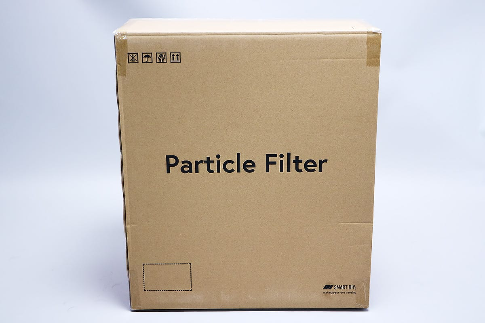
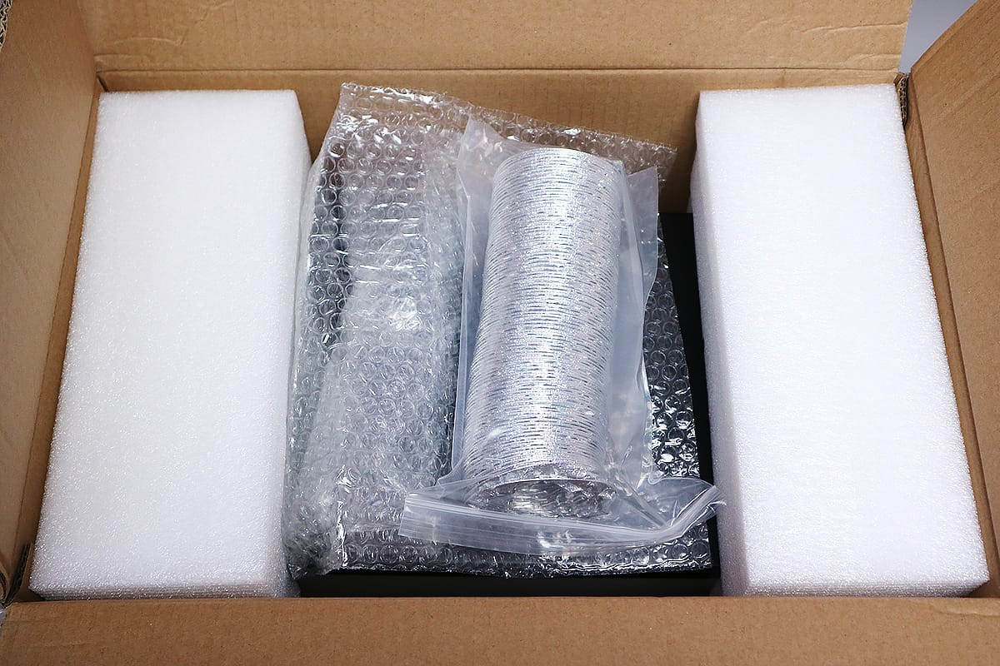
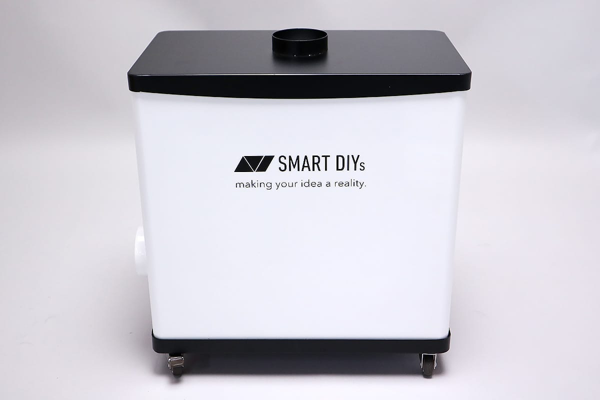
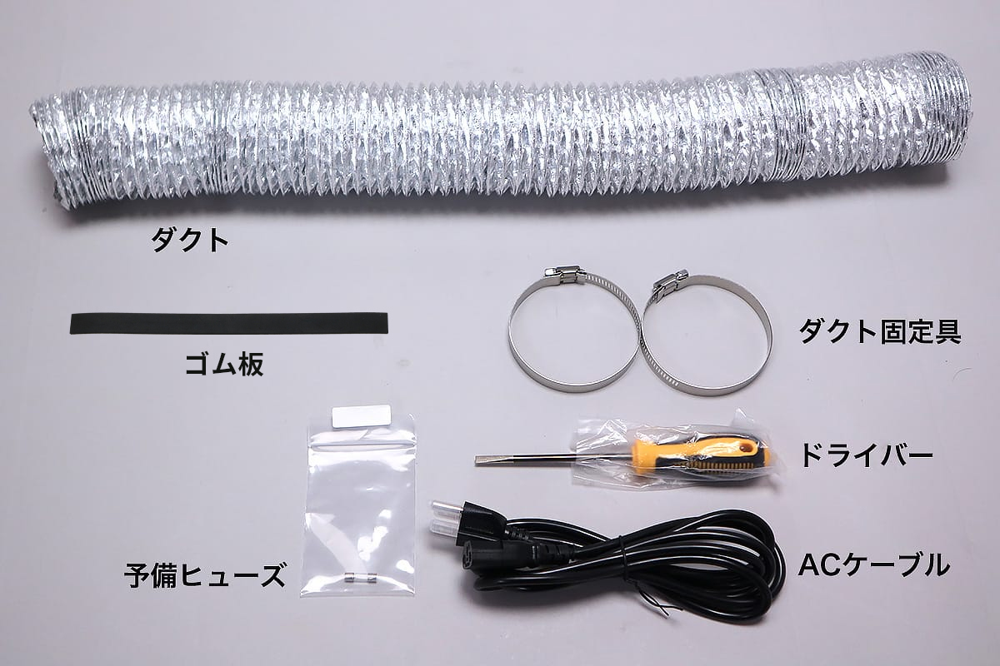
予備のヒューズを取り付けます。写真のようにドライバーを使い、集塵機左側下部の電源スイッチ部分からヒューズソケットを取り外します。
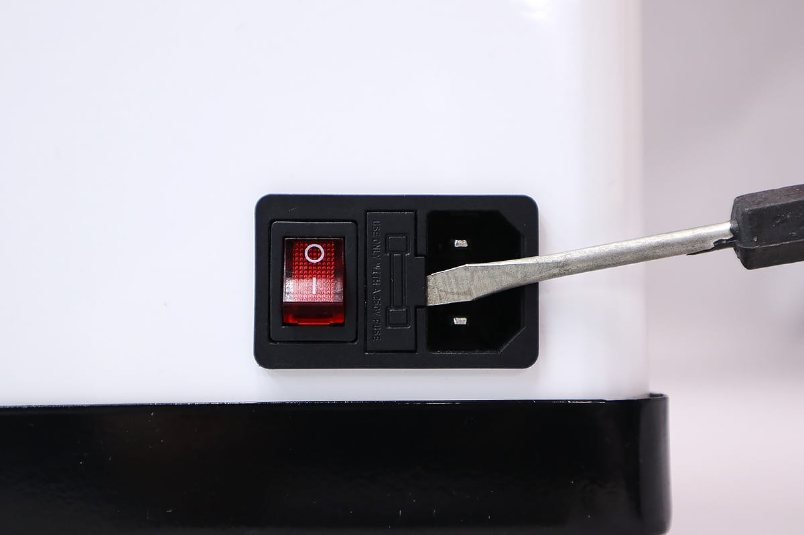

ソケットにはもともとヒューズが取り付いています。予備のヒューズを黒い筒部分を収納してください。※予備のヒューズもすでに取り付いている方はご自身で保管してください。
ヒューズソケットをもとに戻します。

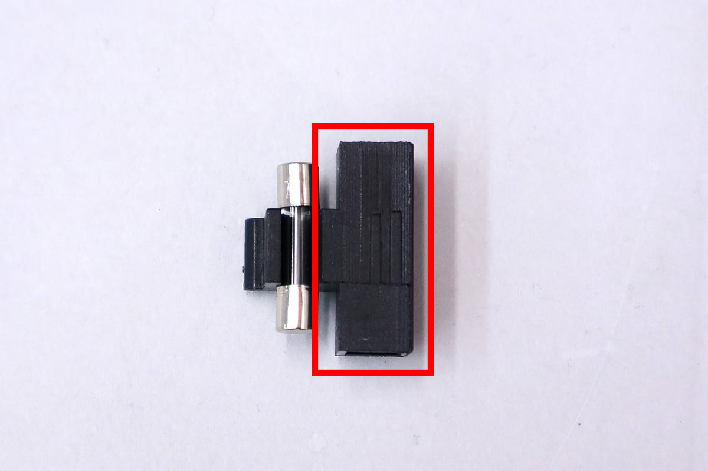

ダクト固定具をダクトに取り付け、Etcher Laser背面の排気口に差し込みます。
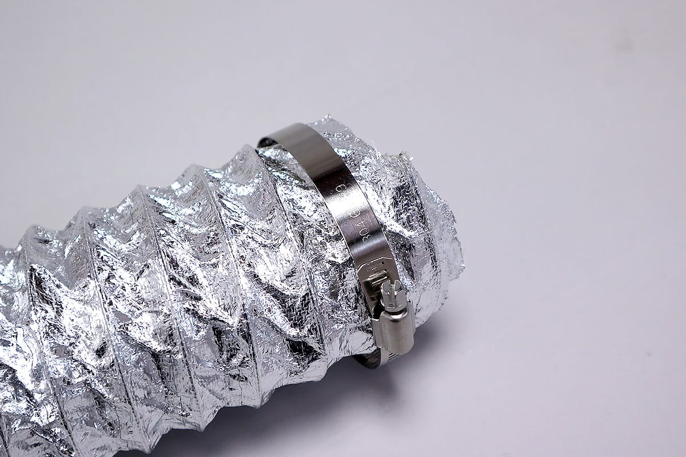
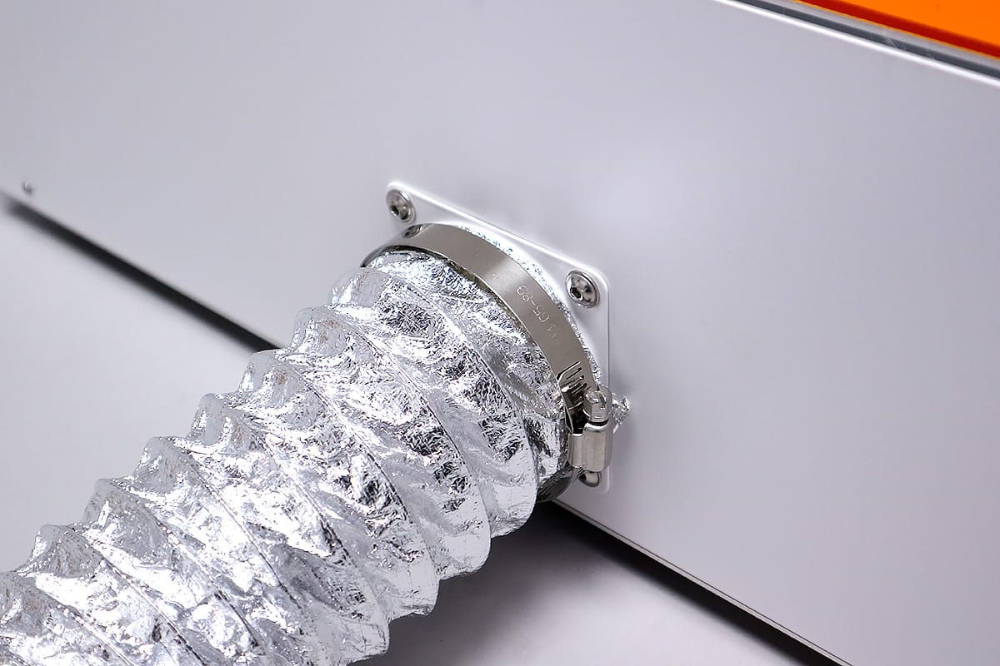

ダクト固定具に取り付いているネジを回し、ダクトを固定してください。
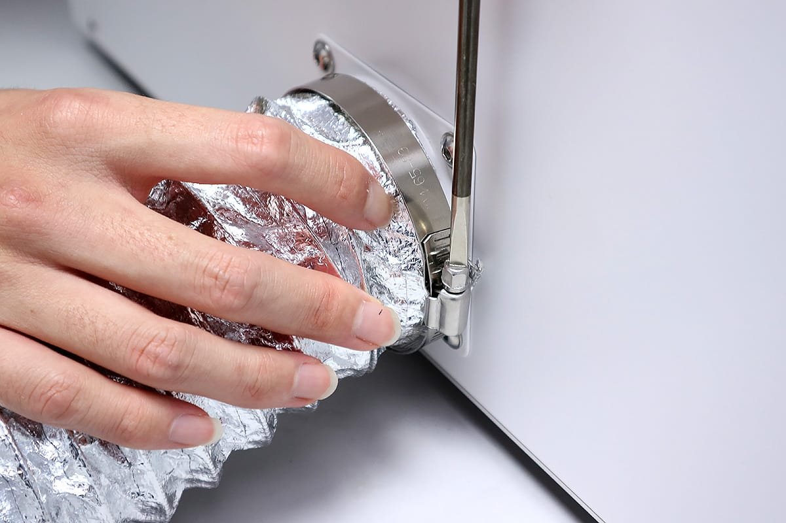

ダクトの反対側にもダクト固定具を取り付け、集塵機の吸気口（集塵機上部）に差し込みます。
ダクト固定具に取り付いているネジを回し、ダクトを固定してください。
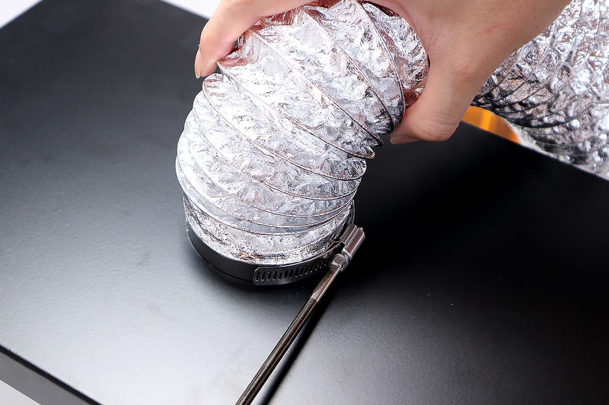
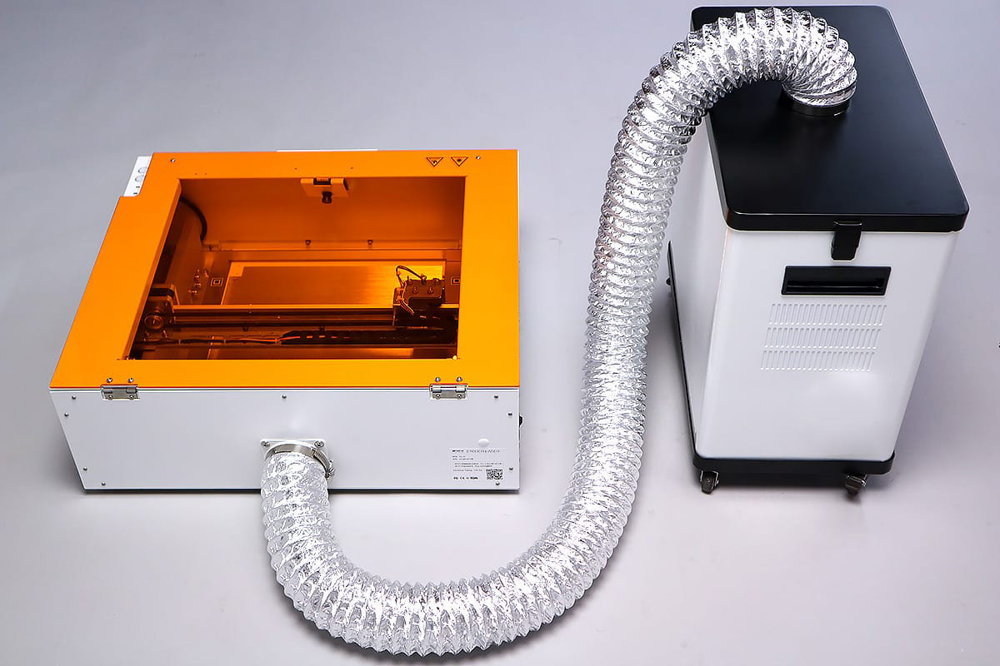

集塵機の電源スイッチがOFFになっている（◯が押されている）ことを確認し、ACケーブルを接続してください。その後コンセントにACケーブルを接続し、電源を入れてください。

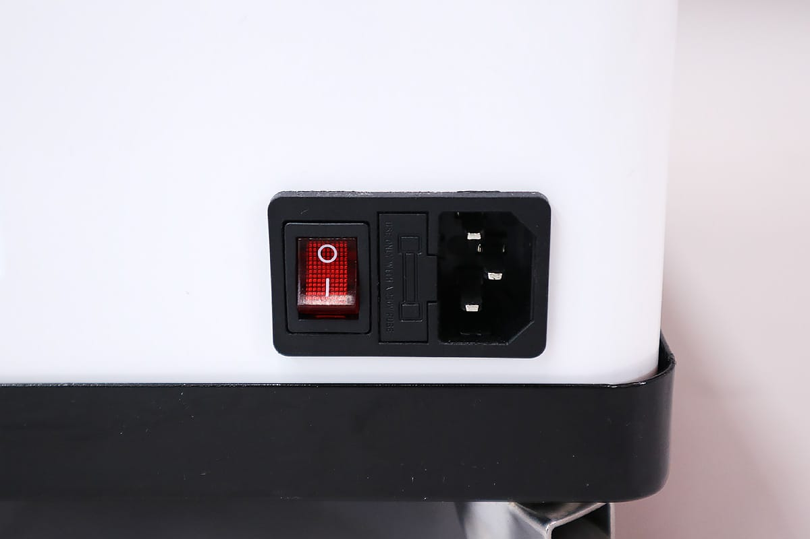

緑色のランプが点灯します。ランプ隣のつまみを回すことで集塵機が作動し、パワーを調節できます。

