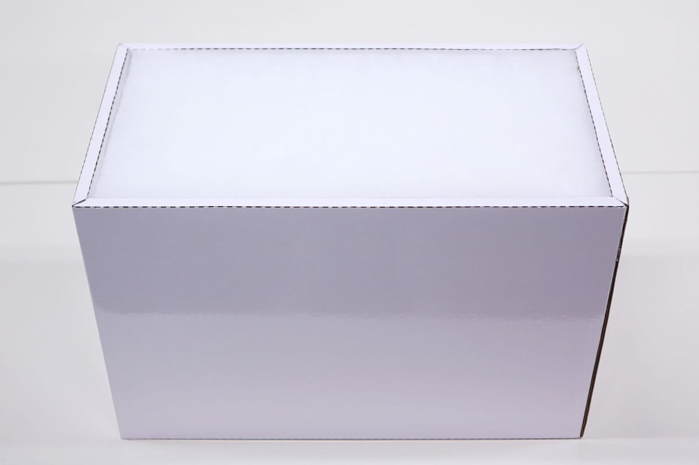
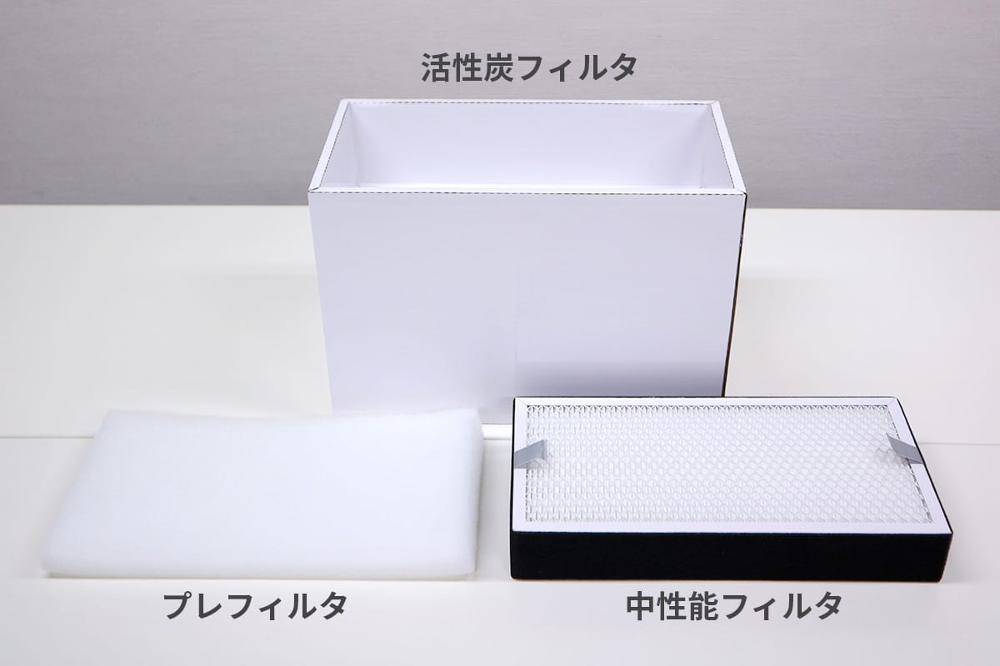

## セットアップ
集塵機の箱を開けます。部品並びに集塵機本体を取り出してください。

予備のヒューズを取り付けます。写真のようにドライバーを使い、集塵機左側下部の電源スイッチ部分からヒューズソケットを取り外します。

ソケットにはもともとヒューズが取り付いています。予備のヒューズを黒い筒部分を収納してください。※予備のヒューズもすでに取り付いている方はご自身で保管してください。
ヒューズソケットをもとに戻します。

ダクト固定具をダクトに取り付け、Etcher Laser背面の排気口に差し込みます。

ダクト固定具に取り付いているネジを回し、ダクトを固定してください。

ダクトの反対側にもダクト固定具を取り付け、集塵機の吸気口（集塵機上部）に差し込みます。
ダクト固定具に取り付いているネジを回し、ダクトを固定してください。

集塵機の電源スイッチがOFFになっている（◯が押されている）ことを確認し、ACケーブルを接続してください。その後コンセントにACケーブルを接続し、電源を入れてください。

緑色のランプが点灯します。ランプ隣のつまみを回すことで集塵機が作動し、パワーを調節できます。

## フィルタ交換
ダクトを取り外し、集塵機の上蓋を外します。

写真の赤枠示す部分がフィルタです。フィルタを上に引き上げ、集塵機本体から外します。

このフィルタは3つのフィルタを組み合わせたものです。上から順にフィルタを外すことができます（上から、プレフィルタ、中性能フィルタ、活性炭フィルタ）。汚れたフィルタを外し交換してください。

プレフィルタは水洗いすることができます。水洗い後、日陰で乾かしてください。

フィルタを組み合わせ、集塵機に取り付けし、上蓋を取り付けます。
