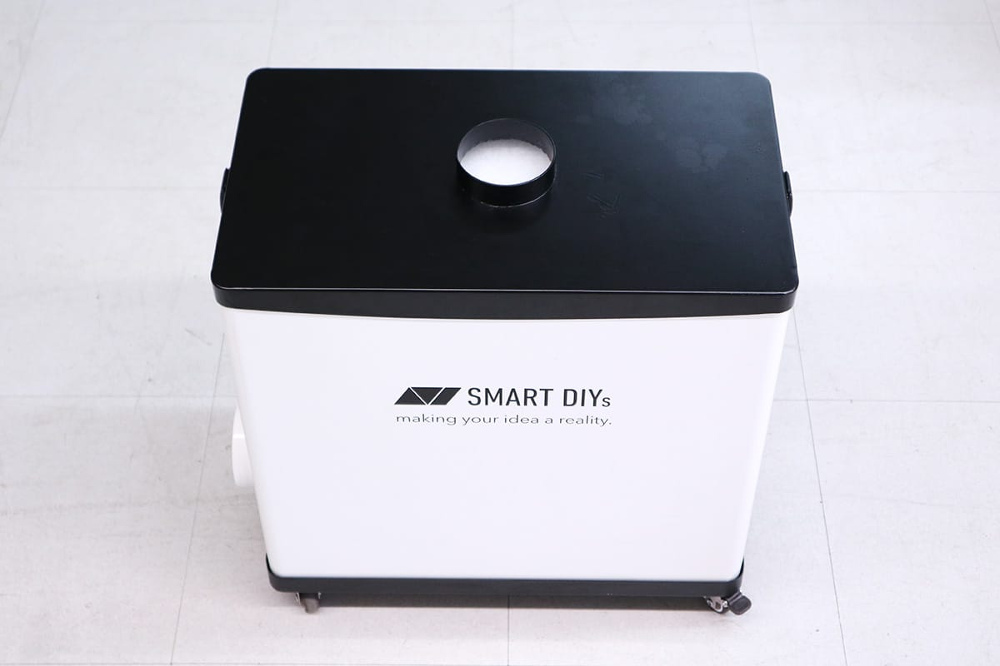
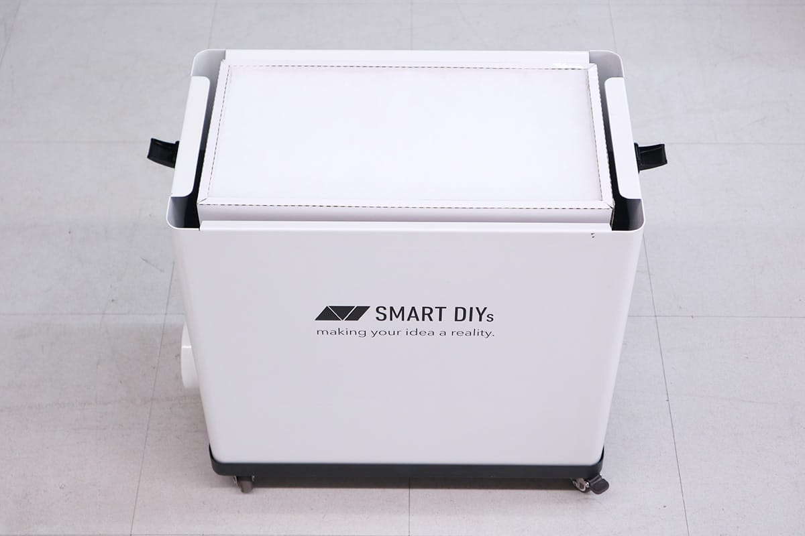
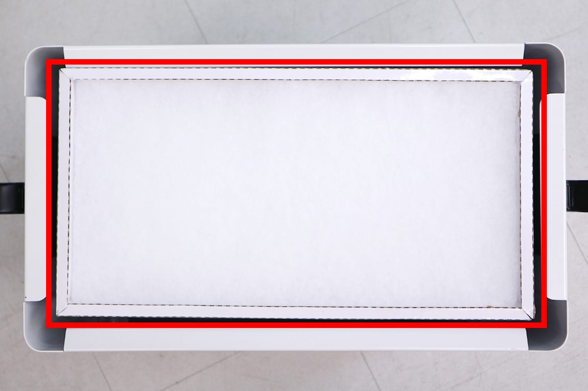
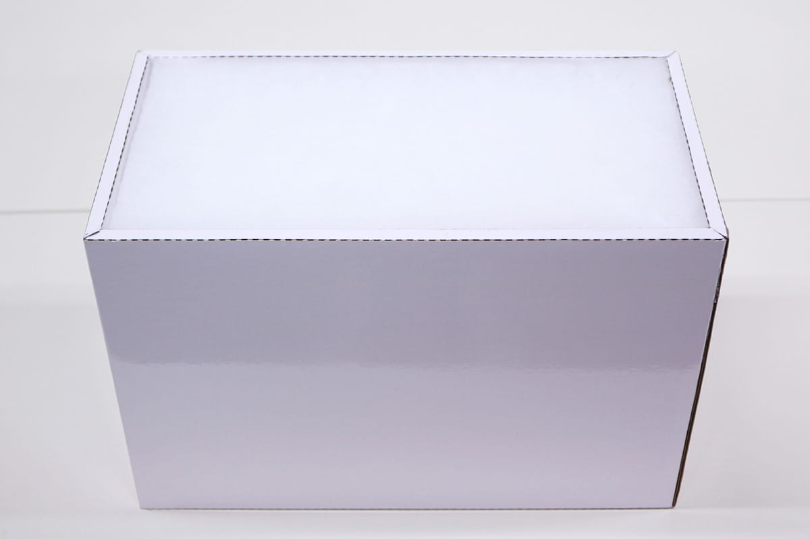
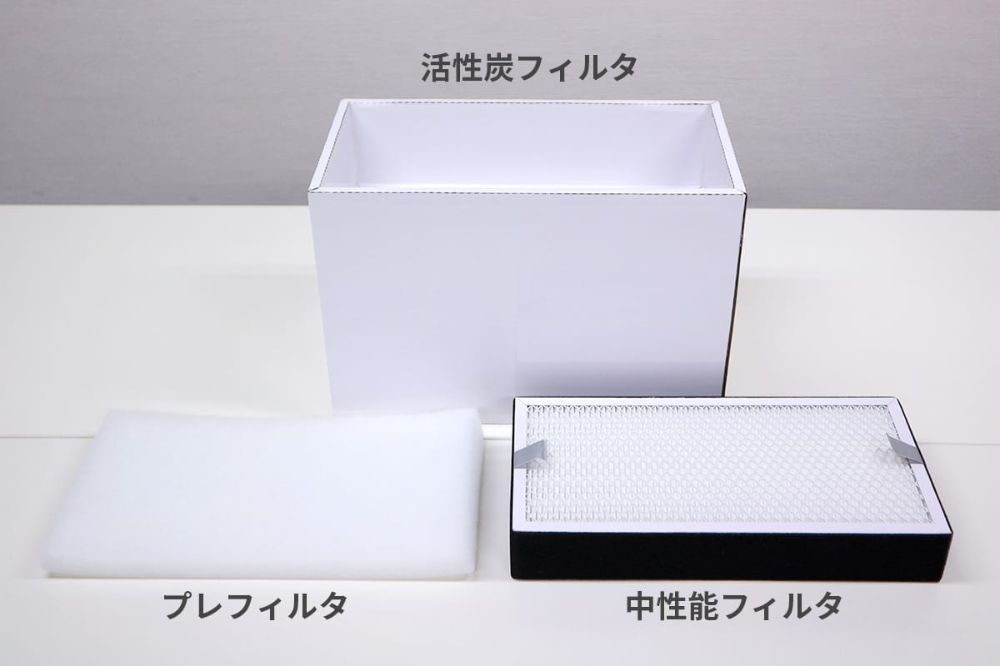

## フィルタ交換
ダクトを取り外し、集塵機の上蓋を外します。

写真の赤枠示す部分がフィルタです。フィルタを上に引き上げ、集塵機本体から外します。

このフィルタは3つのフィルタを組み合わせたものです。上から順にフィルタを外すことができます（上から、プレフィルタ、中性能フィルタ、活性炭フィルタ）。

以下、各フィルタのメンテナンス方法です。推奨試用期間は1日8時間使用した場合のものです。
### プレフィルタ
7日間ほど使用し汚れているか確認します。汚れている場合、水で洗って自然乾燥してから装置に入れてください。水洗いで綺麗に洗浄できない場合は中性洗剤使用してください。洗浄回数は3回までをお勧めします。

### 中性能フィルタ
1ヶ月ごとに、装置から外してほこりが落ちるまでエアーブロー、あるいは手で軽くたたきます。推奨試用期間は3ヶ月です。

### 活性炭フィルタ
推奨試用期間は6ヶ月です。素材及び稼働時間により、6ヶ月以内に脱臭効果が無くなることがありますので、その場合は交換する必要があります。

フィルタのメンテナンス終了後、フィルタを組み合わせ、集塵機に取り付けてください。
