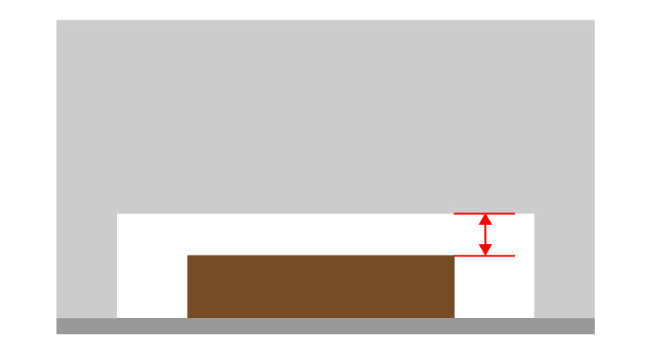
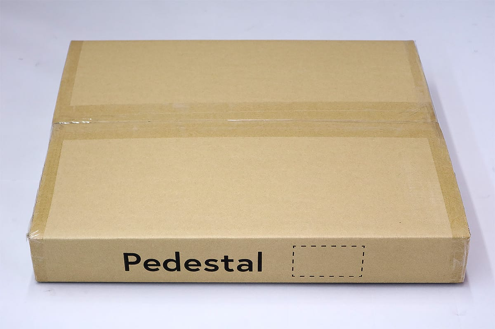
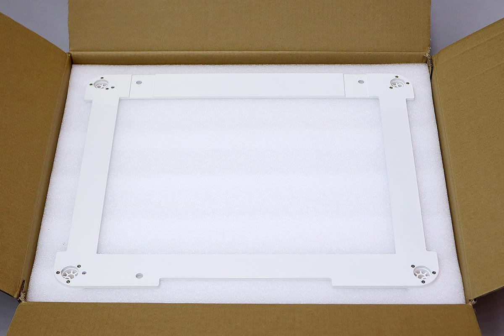
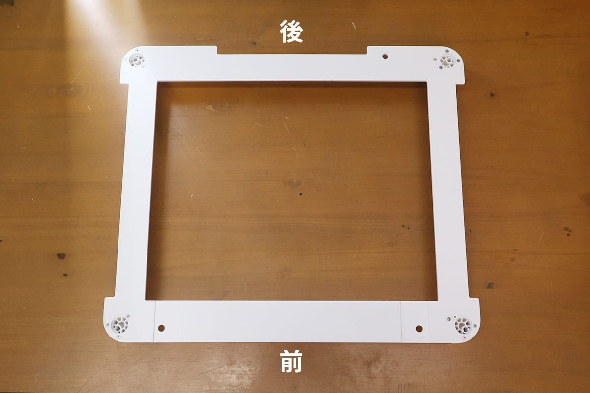
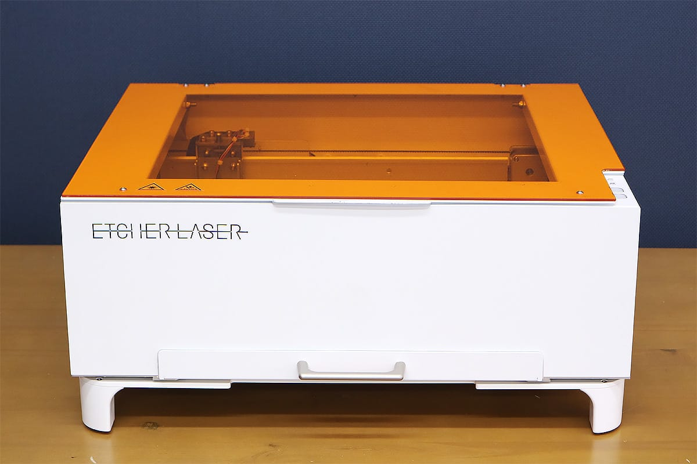
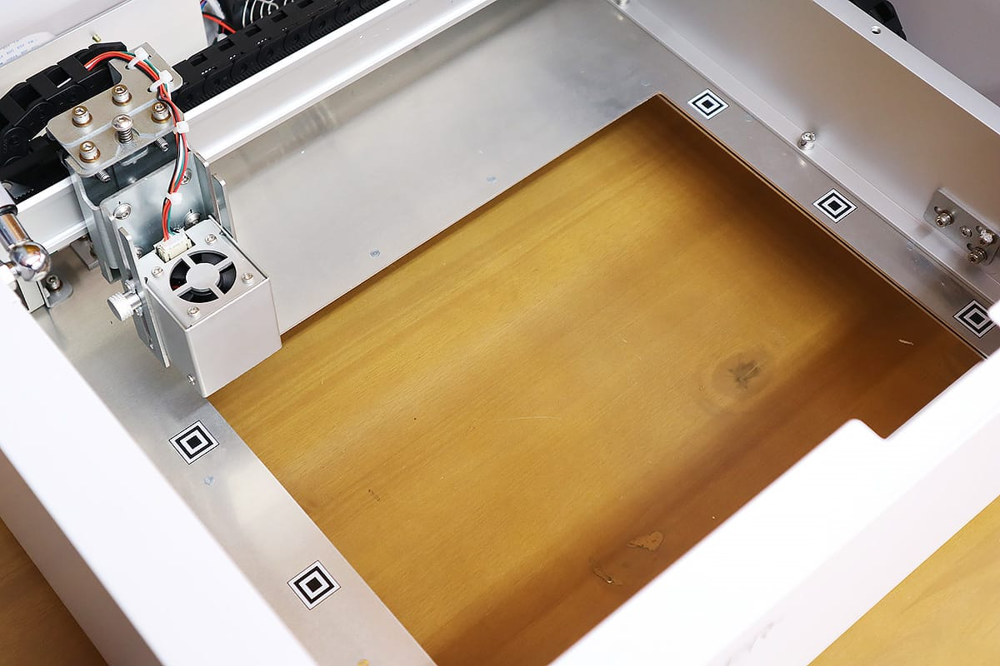
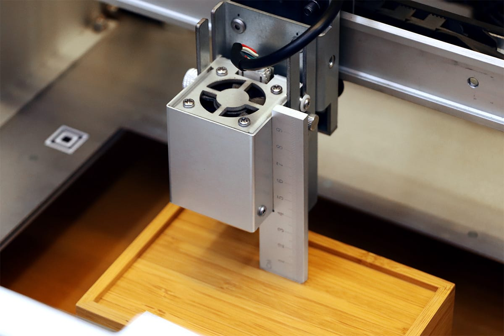

## 底部取り外しモデルの使用方法
Etcher Laserの底を取り外します。
レーザーで作業台を傷つけないよう、保護する板をご用意ください。保護する板は鉄板、ステンレス板などの不燃素材（レーザー光が反射しにくい暗い色のもの）の使用を推奨します。
また、底を取り外した場合は必ず付属の保護メガネを着用し、加工を行ってください。

※素材がEtcher Laserの底部に届かない場合、カメラのキャプチャ時に設定する数値が素材の厚さではありません。Etcher Laserの底から素材の表面までの数値を測り、マイナス〇〇mmと入力してください。

## 台座の使用方法
台座の箱を開け、台座を取り出してください。

台座を平で水平な場所に設置します。台座の前後に注意してください。

Etcher Laserの足を台座の四隅のくぼみに合わせて設置してください。

Etcher Laserの底を取り外します。

底を取り外した場合でも、通常と同じ手順で高さ調整を行います。

