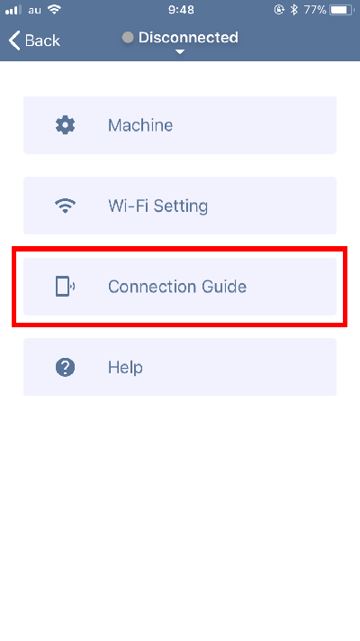

アプリケーション（Etcher Laser）をダウンロードします。下記リンクからダウンロードをしてください。

- [Etcher Laser インストール (App store)](https://www.smartdiys.com)

Etcher Laserのアイコンをタップします。

Etcher Laserとスマートフォンを接続します。
画面左上の「Setting」をタップし、「Connection Guide」をタップしてください。

ステップ1：Etcher Laserの電源が入っているか確認してください。

ステップ2：「Scan QR Code」をタップし、Etcher Laserの背面に記載してあるQRコードをスキャンします。

ステップ3：「Connect」をタップするとEtcher Laserとスマートフォンが接続されます。
