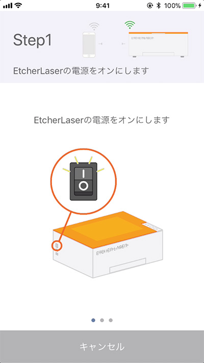
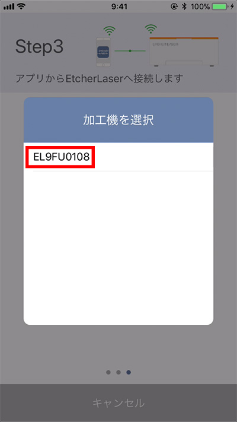

アプリケーションをダウンロードし、Etcher Laserと接続します。

<iframe width="560" height="315" src="https://www.youtube.com/embed/jC2mrObYGyA" frameborder="0" allow="accelerometer; autoplay; encrypted-media; gyroscope; picture-in-picture" allowfullscreen></iframe>

## アプリケーションダウンロード
下記リンクからダウンロードをしてください。

Etcher Laser インストール (App store)　11月11〜15日リリース予定

## Etcher Laserとスマートフォンの接続
Etcher Laserのアイコンをタップします。

画面左上の「Setting」をタップし、「Connection Guide」をタップしてください。

ステップ1：Etcher Laserの電源が入っているか確認してください。

ステップ2：「Scan QR Code」をタップし、Etcher Laserの背面に記載してあるQRコードをスキャンします。

ステップ3：「Connect」をタップするとEtcher Laserとスマートフォンが接続されます。

