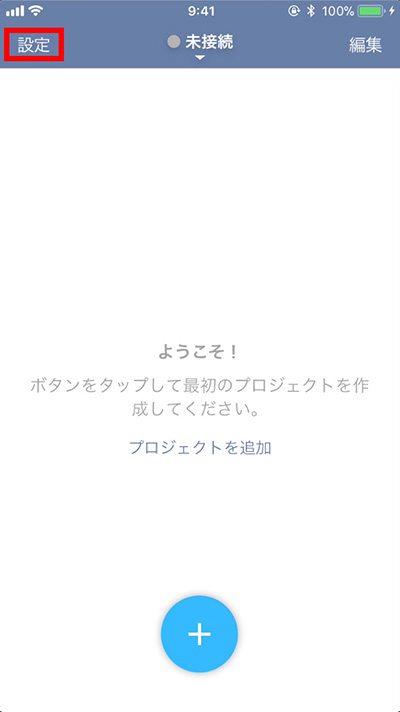
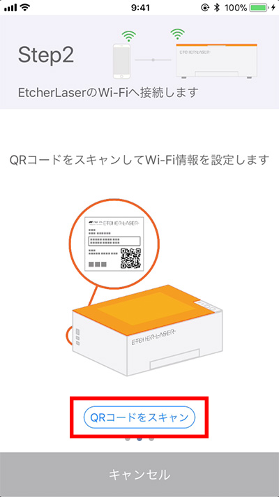
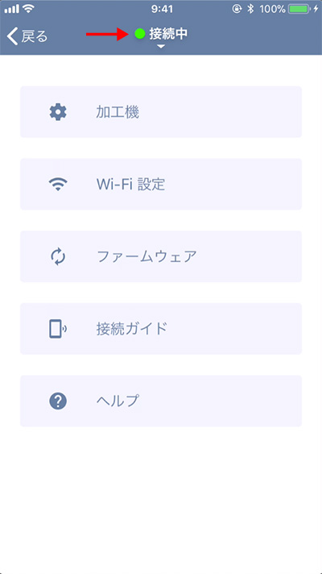

アプリケーションをダウンロードし、Etcher Laserと接続します。EtcherLaserを接続している間はインターネットに接続できません。

<iframe width="560" height="315" src="https://www.youtube.com/embed/jC2mrObYGyA" frameborder="0" allow="accelerometer; autoplay; encrypted-media; gyroscope; picture-in-picture" allowfullscreen></iframe>

## アプリケーションダウンロード
下記リンクからダウンロードをしてください。

[EtcherLaser ダウンロード (iOS)](https://apps.apple.com/jp/app/etcherlaser/id1465876344)

[EtcherLaser ダウンロード (Android)](https://play.google.com/store/apps/details?id=com.smartdiys.etcherlaser)

## Etcher Laserとスマートフォンの接続
Etcher Laserのアイコンをタップします。

アプリ画面左上の「設定」をタップし、「接続ガイド」をタップしてください。

Etcher Laserの電源をオンにします。
（左にスワイプして次の手順に進みます）

「QRコードをスキャン」をタップし、Etcher Laserの背面に記載してあるQRコードをスキャンします。

アプリ画面の指示に従い進めてください。

「接続」をタップし、加工機を選択するとEtcher Laserとスマートフォンが接続されます。

## STAモードでの接続
ここから説明する設定は基本的には必要ありませんが、Wi-Fiルータを導入している方はEtcherLaserにLAN経由でアクセスすることができます（STAモード）。

- EtcherLaserの操作中もインターネットに接続したい
- 直接接続だとEtcherLaserとの接続が不安定

といった場合に、設定してください。

### Wi-Fiルータについて
EtcherLaserは2.4GHzのみ対応しております。ルータに接続する場合は2.4GHzに接続してください（多くの場合、SSIDに"G"や"2G"などの文字が入ります）。

### 設定方法

1. EtcherLaserと接続し、設定画面の「Wi-Fi」をクリックします。
2. お使いのルータのWi-FiのSSIDおよびパスワードを設定します。お間違いのないよう注意してください。
3. 「書き込み」をクリックします。

4. EtcherLaserを再起動します。
5. STAモードでの接続が正常に完了すると、本体のWi-Fiランプが点灯します。

