## ソフトウェアインストール
ソフトウェア（SmartDIYs Creator）のインストールを行います。<a target="_blank" href="https://www.smartdiys.com/smartdiys-creator/">SmartDIYs Creator</a>のページからお使いのOSのインストーラをダウンロードしてください。※Etcher Laserに対応したソフトウェアのバージョンは1.1.0以上のバージョンです。※すでにソフトウェアをインストール済みの方はこの章をスキップして、<a target="_blank" href="https://www.smartdiys.com/manual/el-first-processing-pc/">初めての加工</a>にお進みください。

ダウンロードしたインストーラをクリックして実行します。

インストール画面が表示されるので、「次へ」ボタンをクリックします。

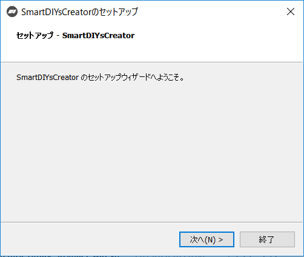

SmartDIYs Creatorが既にインストールされているか確認します。既にインストールされている場合はアンインストールされます。

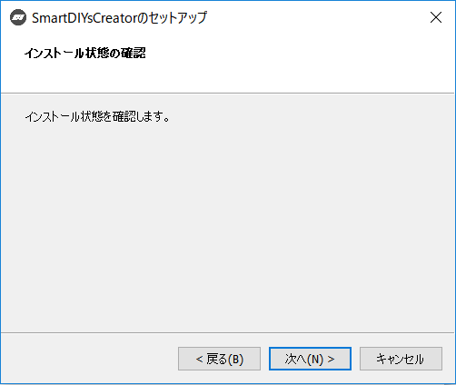

チェックが完了したら、「次へ」ボタンをクリックします。

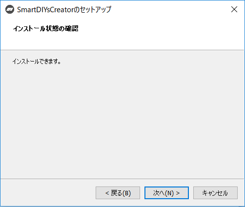

インストール先フォルダを指定します。特に変更がなければそのまま「次へ」ボタンをクリックします。

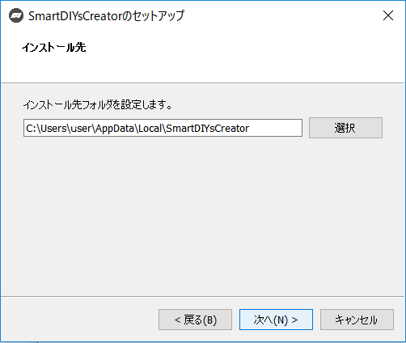

ドライバのインストール状況を確認します。※PC環境によっては少し時間がかかる場合があります。

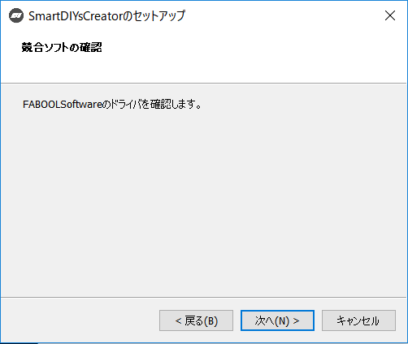

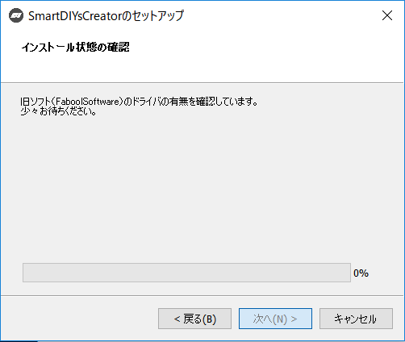

チェックが完了したら、「次へ」ボタンをクリックします。

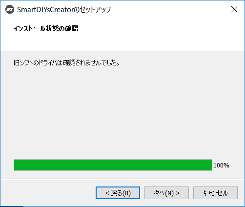

インストールするコンポーネントが表示されます。全てにチェックが入っていることを確認し、「次へ」ボタンをクリックします。

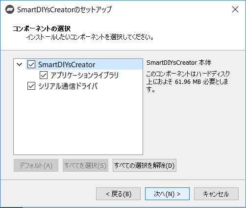

表示されるライセンス条項をご確認頂き、同意される場合は「ライセンスに同意する」にチェックを入れ、「次へ」ボタンをクリックします。※ライセンスに同意されない場合はインストールを完了することはできません。

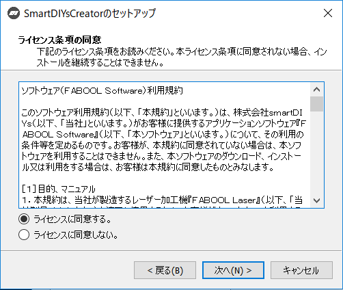

インストールボタンをクリックすると、インストールが始まります。

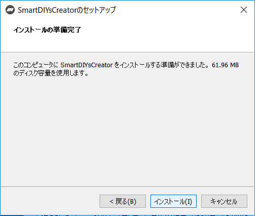

Windowsをお使いの場合、インストール中にデバイスドライバのインストールが開始されますので、「次へ」をクリックしてインストールを行います。

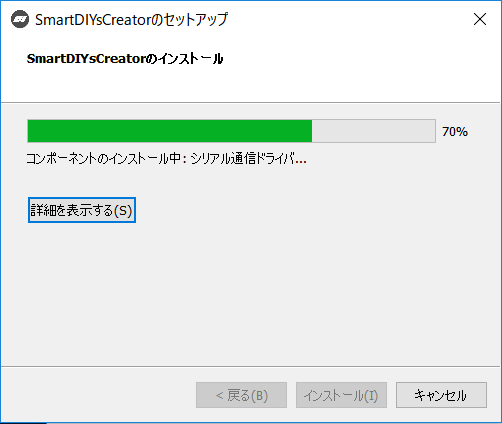

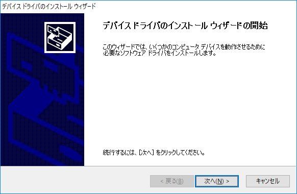

デバイスドライバのインストールが完了したら、「完了」ボタンをクリックします。

インストール完了画面が表示されるので、「完了」ボタンをクリックします。このとき「Run Application」にチェックが入っている場合は、自動的にソフトウェアが起動します。

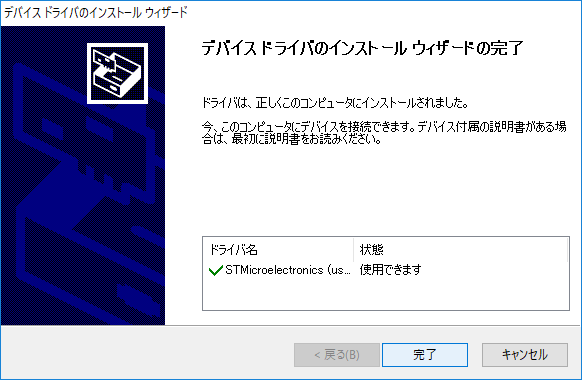

 

 

 

 

 
