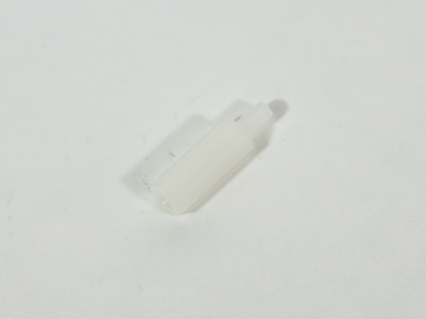

<table class="packing-list">
    <tbody>
        <tr>
            <td>No.</td>
            <td>部品名</td>
            <td>備考</td>
            <td class="packing-img">画像</td>
            <td>個数</td>
        </tr>
        <tr>
            <td>126</td>
            <td>Inner acrylic</td>
            <td>アクリル</td>
            <td></td>
            <td>1</td>
        </tr>
        <tr>
            <td>40</td>
            <td>中継基板</td>
            <td></td>
            <td></td>
            <td>1</td>
        </tr>
        <tr>
            <td>36</td>
            <td>スイッチング電源</td>
            <td></td>
            <td></td>
            <td>1</td>
        </tr>
        <tr>
            <td>43</td>
            <td>端子台</td>
            <td></td>
            <td></td>
            <td>1</td>
        </tr>
        <tr>
            <td>19</td>
            <td>座付ソケット</td>
            <td></td>
            <td></td>
            <td>1</td>
        </tr>
        <tr>
            <td>88</td>
            <td>六角スペーサー（ネジ）</td>
            <td></td>
            <td></td>
            <td>4</td>
        </tr>
        <tr>
            <td>102</td>
            <td>M4x10六角穴付皿ボルト</td>
            <td></td>
            <td></td>
            <td>6</td>
        </tr>
        <tr>
            <td>113</td>
            <td>M3x5ナイロンネジ</td>
            <td></td>
            <td></td>
            <td>4</td>
        </tr>
        <tr>
            <td>98</td>
            <td>M3x8六角穴付ボルト</td>
            <td></td>
            <td></td>
            <td>2</td>
        </tr>
    </tbody>
</table>

## 工程手順

### Inner acrylic機器取り付け
Inner acrylicに六角スペーサー（ネジ）4個を取り付けます。

取り付けた六角スペーサーに、中継基板をM3x5ナイロンネジ4個で取り付けます。

スイッチング電源をM3x8六角穴付ボルト2個で取り付けます。

端子台をM4x10六角穴付皿ボルト2個で取り付けます。

座付ソケットをM4x10六角穴付皿ボルト4個で取り付けます。

Inner acrylicには通す向きがあるので注意して下さい。

