<table class="packing-list">
    <tbody>
        <tr>
            <td>No.</td>
            <td>部品名</td>
            <td>備考</td>
            <td class="packing-img">画像</td>
            <td>個数</td>
        </tr>
        <tr>
            <td></td>
            <td>XY軸ユニット</td>
            <td></td>
            <td></td>
            <td>1</td>
        </tr>
        <tr>
            <td>4</td>
            <td>アルミフレーム20mm角 860mm</td>
            <td></td>
            <td>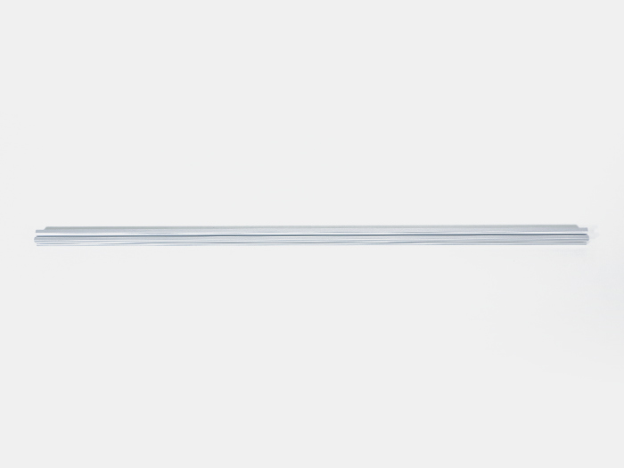</td>
            <td>2</td>
        </tr>
        <tr>
            <td>10</td>
            <td>アルミフレーム20mm角 295mm</td>
            <td></td>
            <td></td>
            <td>2</td>
        </tr>
        <tr>
            <td>29</td>
            <td>直角ブラケット</td>
            <td></td>
            <td></td>
            <td>10</td>
        </tr>
        <tr>
            <td>48</td>
            <td>薄型ブラケット</td>
            <td></td>
            <td>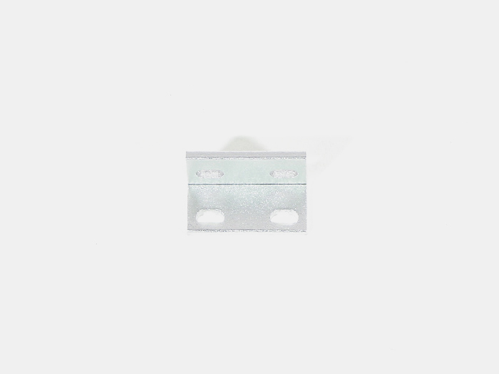</td>
            <td>1</td>
        </tr>
        <tr>
            <td>30</td>
            <td>M5Tナット</td>
            <td></td>
            <td></td>
            <td>50</td>
        </tr>
        <tr>
            <td>85</td>
            <td>M5x8低頭ボルト</td>
            <td></td>
            <td></td>
            <td>2</td>
        </tr>
        <tr>
            <td>31</td>
            <td>M5x8六角穴付ボルト</td>
            <td></td>
            <td></td>
            <td>20</td>
        </tr>
    </tbody>
</table>

## 工程手順

### XY軸ユニット調整
「[XY軸ユニット組み立て](https://www.smartdiys.com/)」で組み立てたX軸ユニットを写真の位置に差し込みます。水平器でX軸ユニットが傾いていないことを確認してください。なるべくX軸ユニットの奥側で確認して下さい。
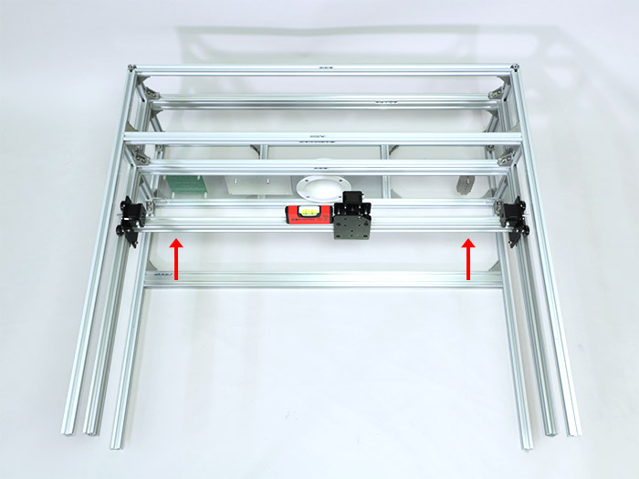

傾いている場合はV-slot 780mmの高さの調整を行ってください。

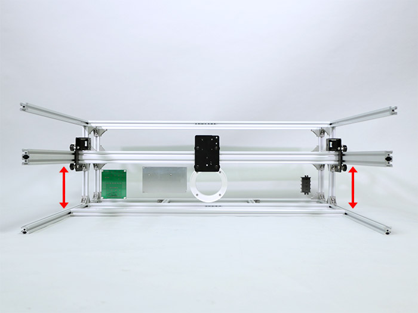

Y軸方向の歪みは、ホイールプレートX軸/Y軸の回転方向の調整を行って下さい。水平器をX軸ユニットに対して垂直に置いて確認します。
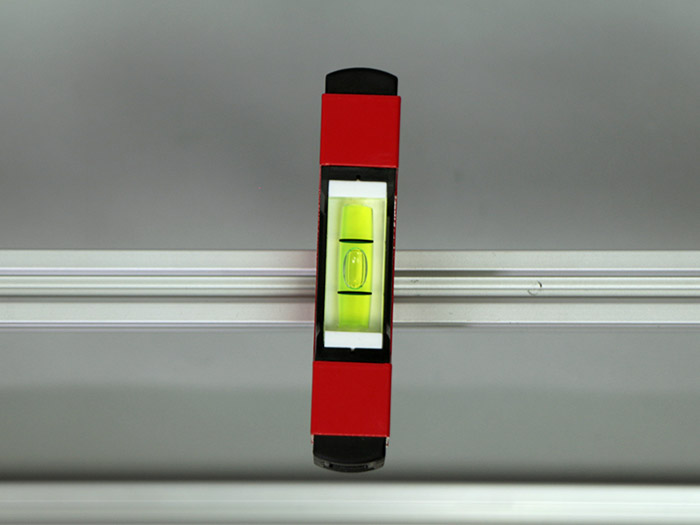

傾いている場合は、ホイールプレートY軸とV-slot 848mmを固定しているM5x10低頭ボルトを緩めて調整してください。

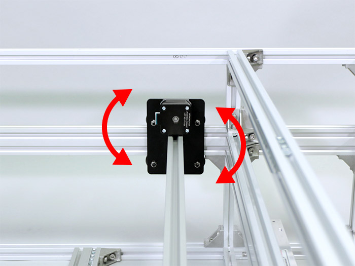

### 上段部分組み立て
M5Tナット合計12個を写真の位置に入れます。
下段のアルミフレーム20mm角 780mmに3個入れます。
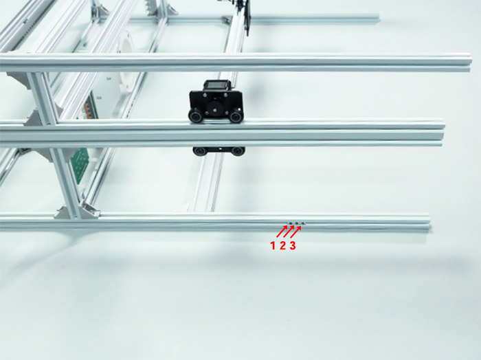

上段のアルミフレーム20mm角 800mmに1個入れます。

反対側にも、下段のアルミフレーム20mm角 780mmに3個入れます。
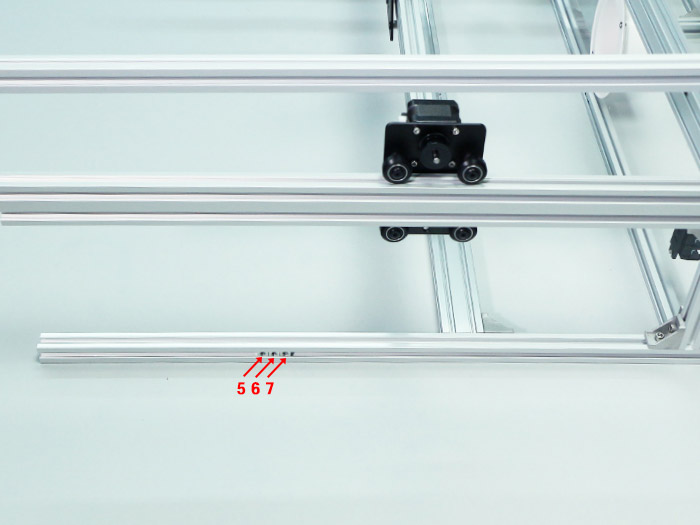

上段のアルミフレーム20mm角 800mmに2個、中段のV-slot 780mmに上下に1個ずつ入れます。
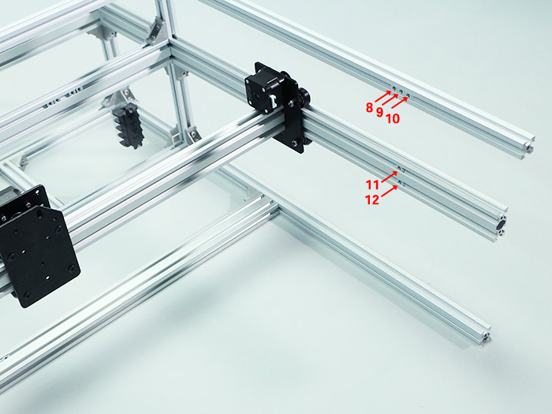

アルミフレーム20mm角 295mmに直角ブラケット3個を、写真の向きでM5Tナット3個とM5x8六角穴付ボルト3個で取り付けます。2セット組み立てます。
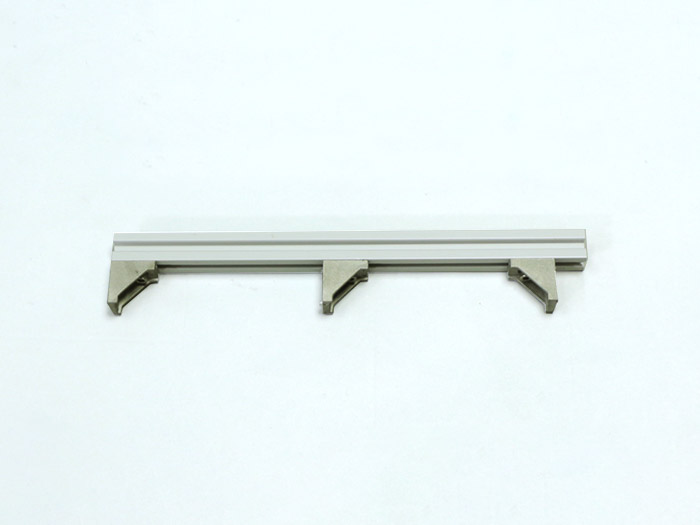
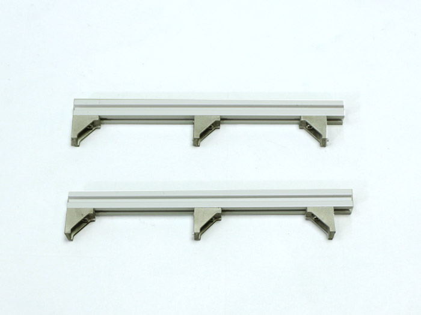

前工程で直角ブラケットを取り付けたアルミフレーム20mm角 295mmを写真を参考に本体フレームに取り付けます。
矢印位置にM5Tナットを1個ずつ、計3個を入れて、M5x8六角穴付ボルト3個で取り付けます。
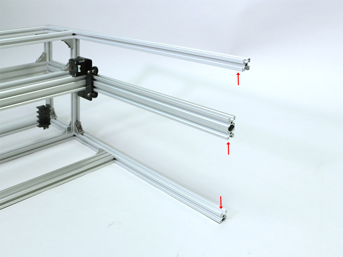
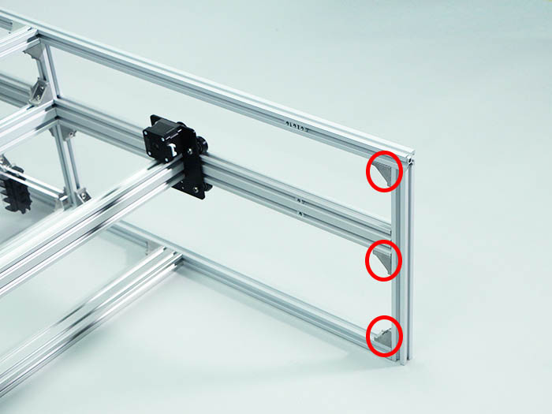

V-slot 780mmと下段のアルミフレーム20mm角 780mmの距離が145mmとなるようにしてください。
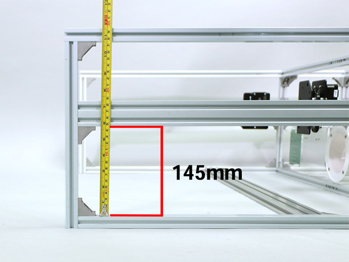

反対側も同様にアルミフレーム20mm角 295mmを取り付けます。
矢印位置にM5Tナットを1個ずつ、計3個を入れて、M5x8六角穴付ボルト3個で取り付けます。
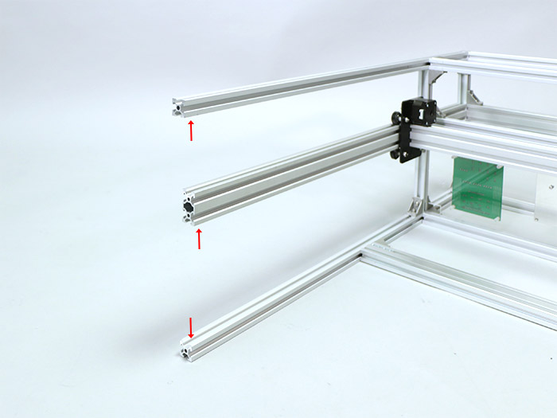
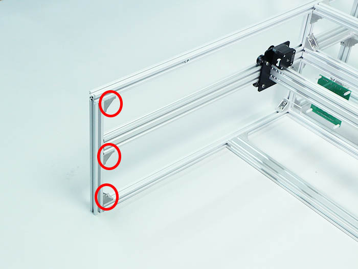

V-slot 780mmと下段のアルミフレーム20mm角 780mmの距離が145mmとなるようにしてください。
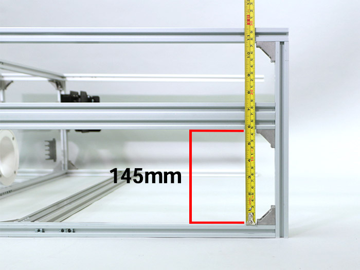

写真の位置に直角ブラケット4個をM5Tナット4個とM5x8六角穴付ボルト4個で取り付けます。
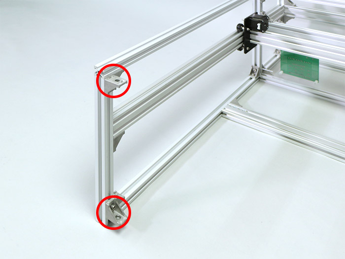
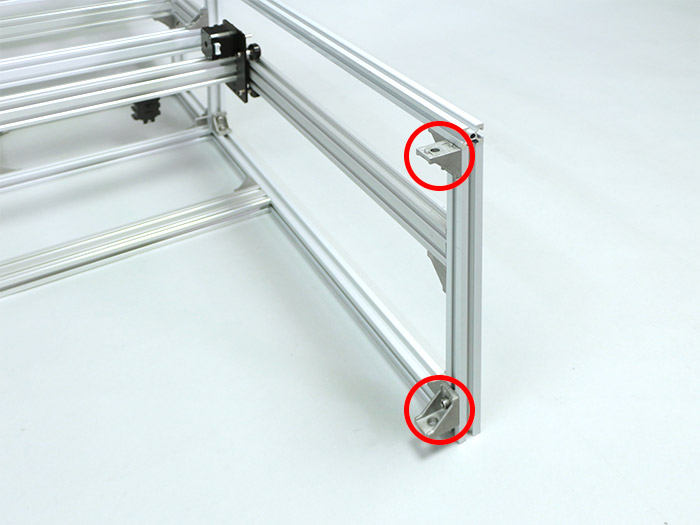

アルミフレーム20mm角 860mmにM5Tナットを合計14個入れます。正面に4個・背面に5個・天面に2個・底面に3個入れます。
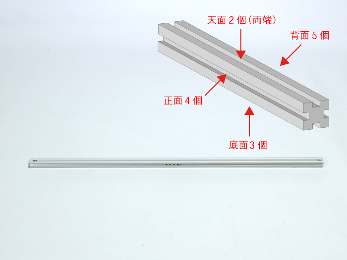

写真を参考に正面が4個・天面が2個になるように、天面に入れたM5Tナット2個とM5x8六角穴付ボルト2個で取り付けます。
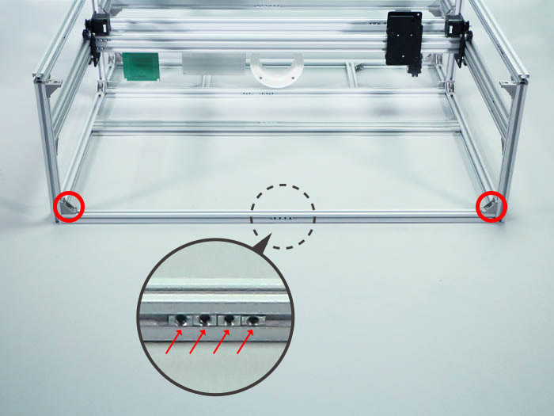

アルミフレーム20mm角 860mmにM5Tナットを合計8個入れます。正面に4個・背面に2個・底面に2個入れます。
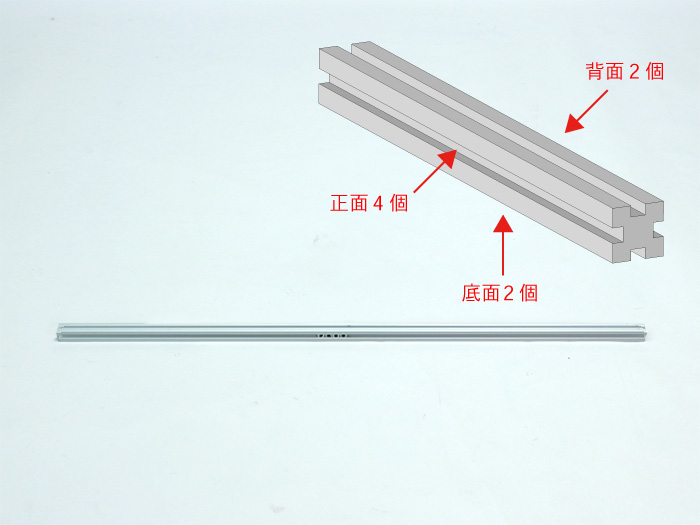

写真を参考に正面が4個・底面が2個になるように、底面に入れたM5Tナット2個とM5x8六角穴付ボルト2個で取り付けます。
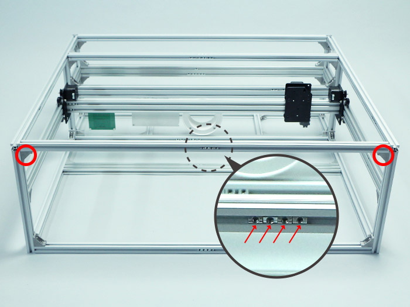

前工程で取り付けたアルミフレーム20mm角 860mmに薄型ブラケットを取り付けます。入れておいたM5Tナット2個とM5x8低頭ボルト2個で取り付けます。固定位置は真ん中に取り付けて下さい。
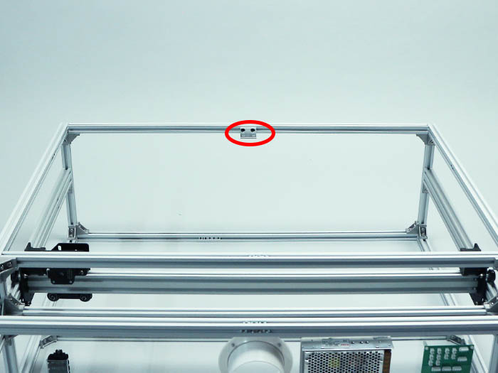
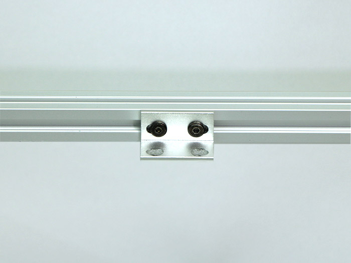