<table class="packing-list">
    <tbody>
        <tr>
            <td>No.</td>
            <td>部品名</td>
            <td>備考</td>
            <td class="packing-img">画像</td>
            <td>個数</td>
        </tr>
        <tr>
            <td>18</td>
            <td>レーザー電源</td>
            <td></td>
            <td>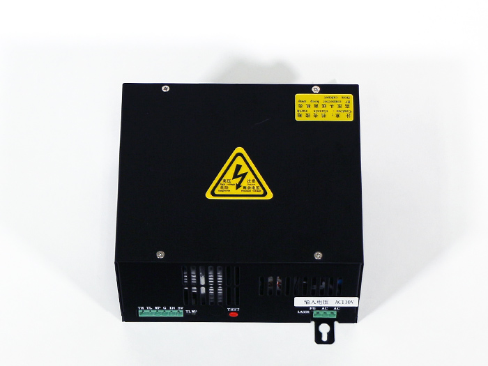</td>
            <td>1</td>
        </tr>
        <tr>
            <td>25</td>
            <td>水冷ポンプ</td>
            <td></td>
            <td></td>
            <td>1</td>
        </tr>
        <tr>
            <td>20</td>
            <td>ラジエーターユニット</td>
            <td></td>
            <td>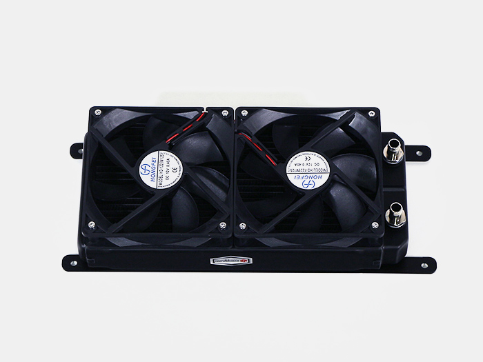</td>
            <td>1</td>
        </tr>
        <tr>
            <td>84</td>
            <td>M5x6低頭ボルト</td>
            <td></td>
            <td></td>
            <td>4</td>
        </tr>
        <tr>
            <td>135</td>
            <td>タッピングネジ</td>
            <td></td>
            <td>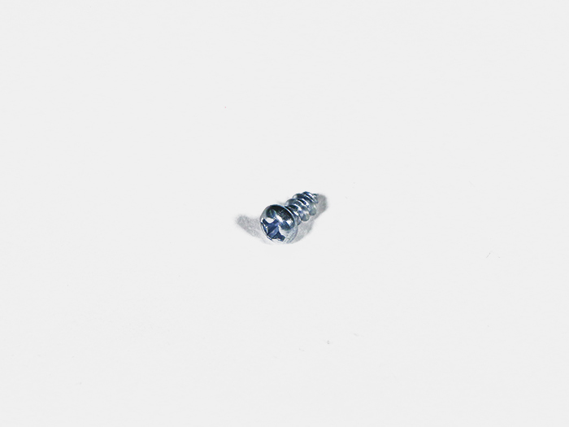</td>
            <td>4</td>
        </tr>
        <tr>
            <td>101</td>
            <td>M4x6六角穴付ボルト</td>
            <td></td>
            <td>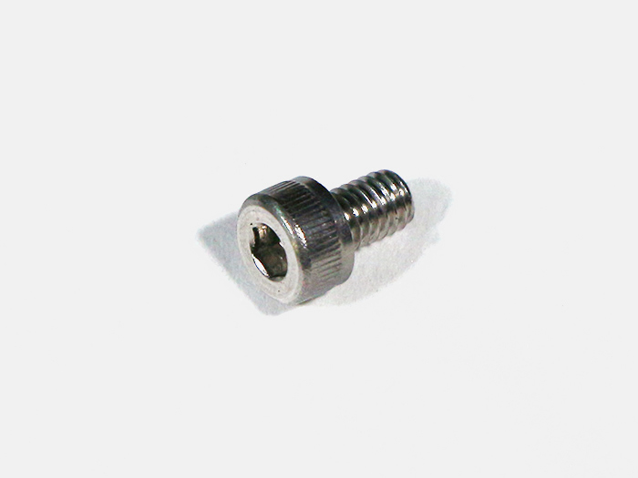</td>
            <td>7</td>
        </tr>
        <tr>
            <td>90</td>
            <td>M4後入ナット</td>
            <td></td>
            <td>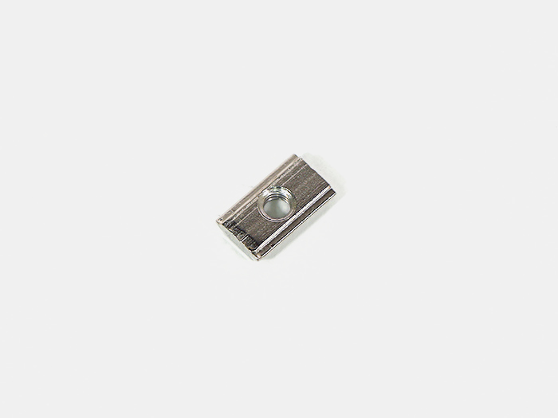</td>
            <td>3</td>
        </tr>
        <tr>
            <td>117</td>
            <td>M5ワッシャー</td>
            <td></td>
            <td></td>
            <td>1</td>
        </tr>
        <tr>
            <td>91</td>
            <td>M5後入ナット</td>
            <td></td>
            <td></td>
            <td>1</td>
        </tr>
        <tr>
            <td>111</td>
            <td>歯付きワッシャー</td>
            <td></td>
            <td></td>
            <td>1</td>
        </tr>
        <tr>
            <td>31</td>
            <td>M5x8 六角穴付ボルト</td>
            <td></td>
            <td></td>
            <td>1</td>
        </tr>
    </tbody>
</table>

## 工程手順

### 水冷ポンプ 取り付け
タッピングネジ4個で水冷ポンプに付属しているゴムの台座を取り付けます。
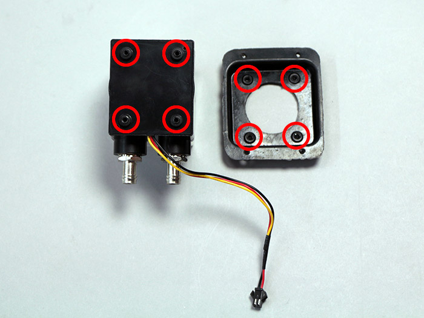
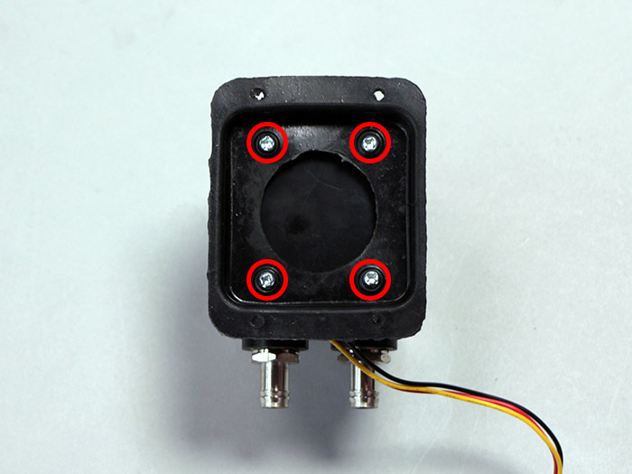
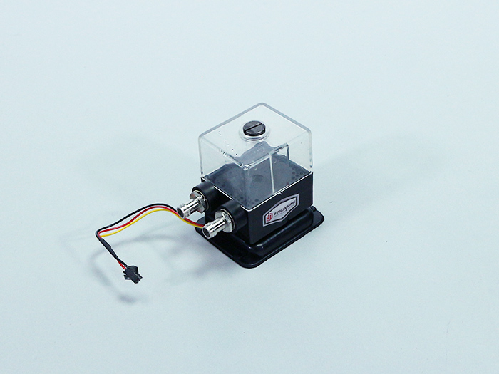

Cover bottom backに水冷ポンプをM4x6六角穴付ボルト4個で取り付けます。
水冷ポンプには取り付ける向きがあるので注意して下さい。
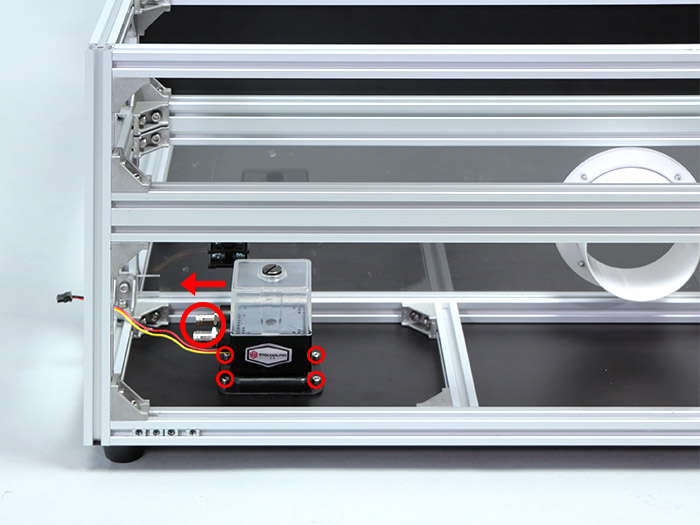

### レーザー電源取り付け
アルミフレーム 20mm角 170mm2本の上面にM4後入ナットを左1個、右2個の合計3個を入れます。
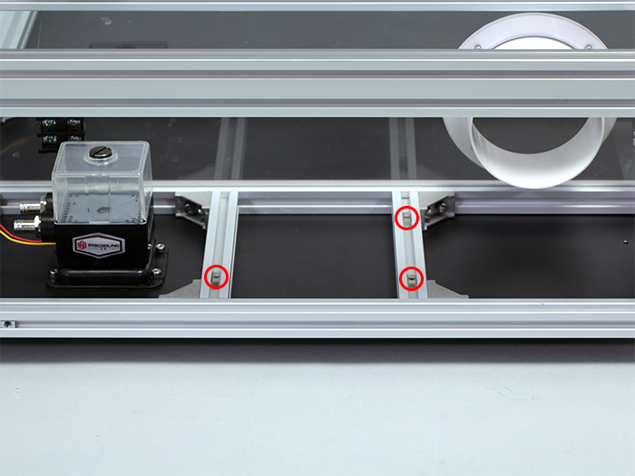

レーザー電源をM4x6六角穴付ボルト3個で取り付けます。
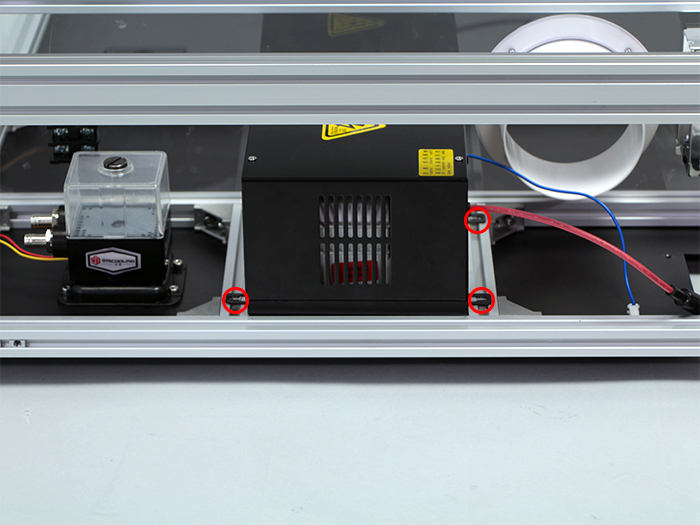

写真を参考に、側面のフレームから200mmの位置に固定して下さい。調整後はアルミフレーム 20mm角 170mm2本の直角ブラケットのネジを締めて固定します。
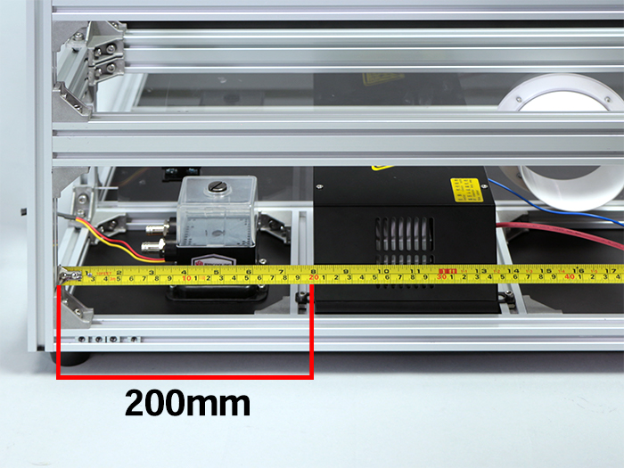

### ラジエーターユニットの取り付け
カバーバックボトムにラジエーターユニットをM5x6低頭ボルト4個で取り付けます。
ラジエーターユニットには取り付ける向きがあるので注意して下さい。
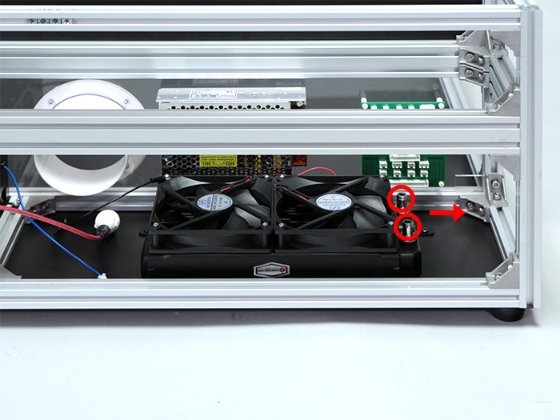
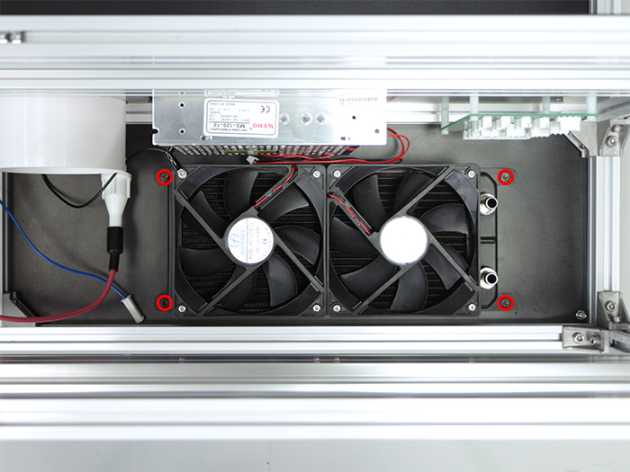

ラジエーターユニットに取り付いているアース線を写真を参考に本体フレームに取り付けます。取付順番はM5後入ナット・歯付きワッシャー・M5ワッシャー・アース線・M5x8六角穴付ボルトの順で取り付けてください。
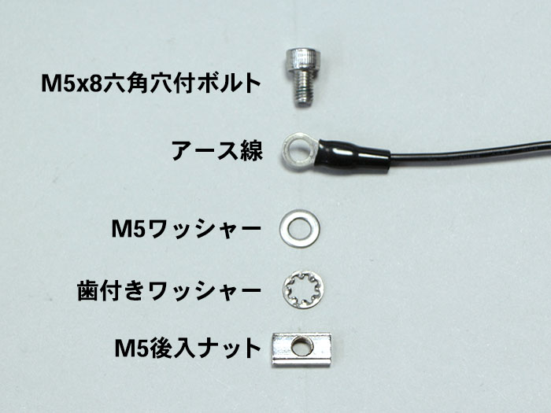
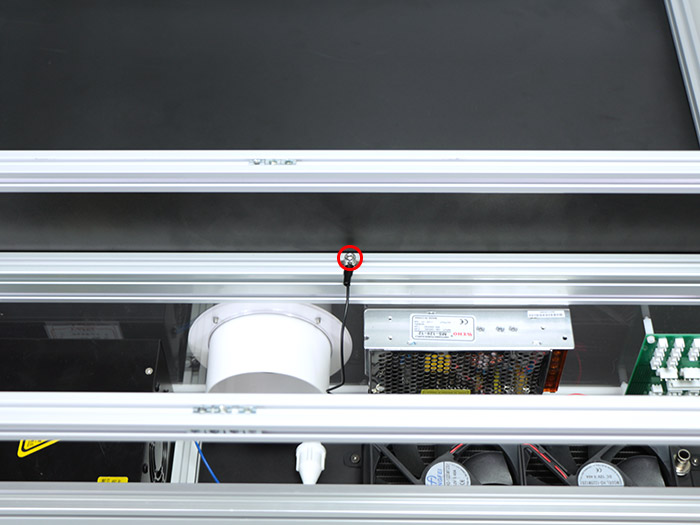
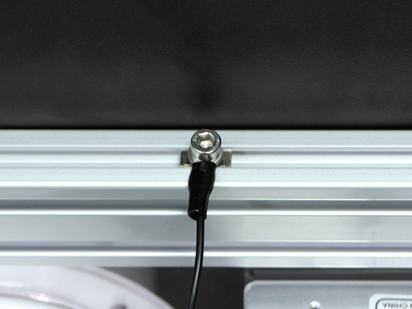