<table class="packing-list">
    <tbody>
        <tr>
            <td>No.</td>
            <td>部品名</td>
            <td>備考</td>
            <td class="packing-img">画像</td>
            <td>個数</td>
        </tr>
        <tr>
            <td>61</td>
            <td>フローセンサー</td>
            <td></td>
            <td>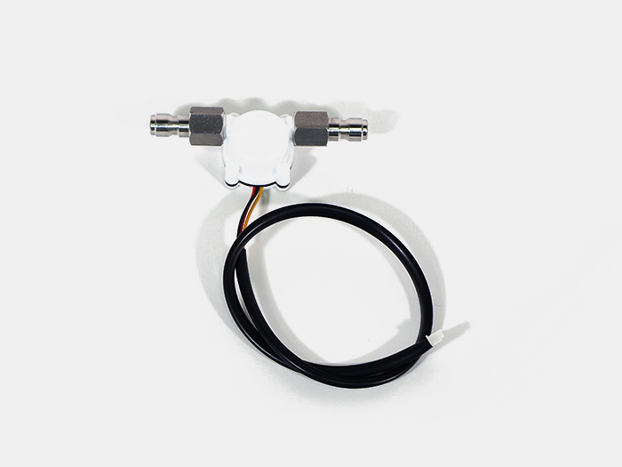</td>
            <td>1</td>
        </tr>
        <tr>
            <td>66</td>
            <td>Powerケーブル</td>
            <td>ケーブル</td>
            <td>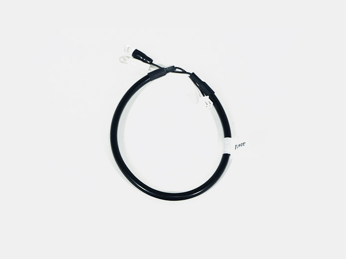</td>
            <td>1</td>
        </tr>
        <tr>
            <td>72</td>
            <td>RELAY DC POWERケーブル</td>
            <td></td>
            <td>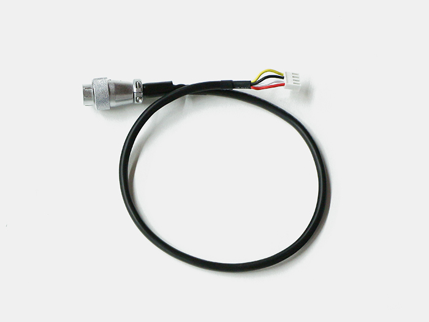</td>
            <td>1</td>
        </tr>
        <tr>
            <td>73</td>
            <td>RELAY MOTORケーブル</td>
            <td></td>
            <td>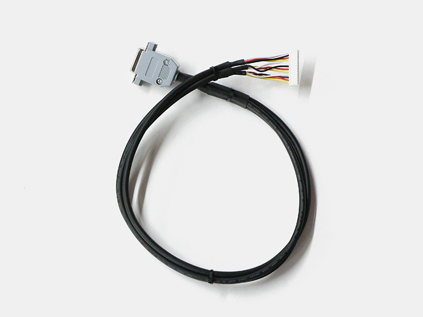</td>
            <td>1</td>
        </tr>
        <tr>
            <td>74</td>
            <td>RELAY SIGNALケーブル</td>
            <td></td>
            <td>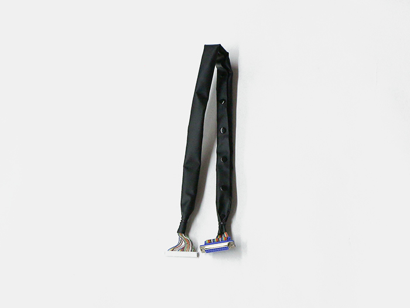</td>
            <td>1</td>
        </tr>
        <tr>
            <td>76</td>
            <td>Laserケーブル</td>
            <td>マグネット付属(22.top cover組み立てで使用)</td>
            <td>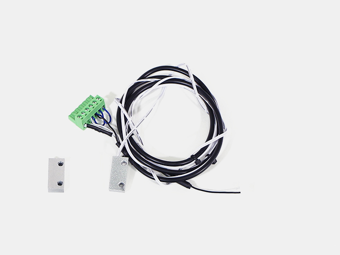</td>
            <td>1</td>
        </tr>
        <tr>
            <td>75</td>
            <td>RELAY SIGNALケーブル</td>
            <td></td>
            <td>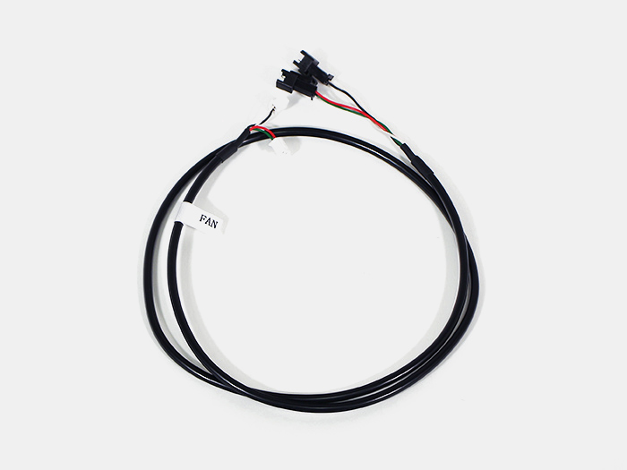</td>
            <td>1</td>
        </tr>
        <tr>
            <td>38</td>
            <td>結束バンド</td>
            <td></td>
            <td></td>
            <td>5</td>
        </tr>
        <tr>
            <td>89</td>
            <td>M3後入ナット</td>
            <td></td>
            <td></td>
            <td>1</td>
        </tr>
        <tr>
            <td>100</td>
            <td>M3x12六角穴付ボルト</td>
            <td></td>
            <td></td>
            <td>1</td>
        </tr>
    </tbody>
</table>

## 工程手順

レーザー電源にLaserケーブルを接続します。
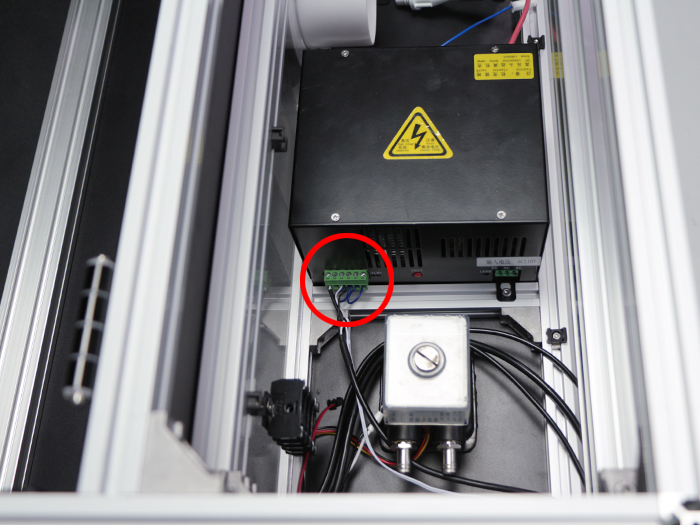

FANケーブルを水冷ポンプとLED DCファンに取り付けます。FANケーブルの線色が、白黒は水冷ポンプ、赤緑はLED DCファンに接続して下さい。
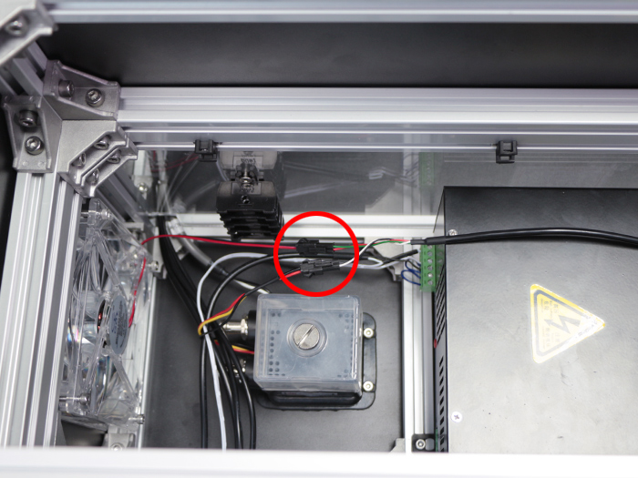

取り付けてある結束バンド固定具に、以下の通りに結束バンドで固定して下さい。

<左側>
- Y1-Limitケーブル
- Y-Motor-Rケーブル
- Switchケーブル
- FANケーブル

<右側>
- Y1-Limitケーブル
- Y-Motor-Rケーブル
- Switchケーブル
- FANケーブル
- Laserケーブル

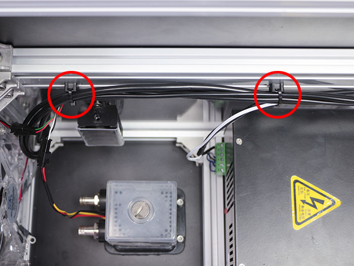

取り付けてある結束バンド固定具に、以下の通りに結束バンドで固定して下さい。
- Y1-Limitケーブル
- Y-Motor-Rケーブル
- Switchケーブル
- FANケーブル
- Laserケーブル
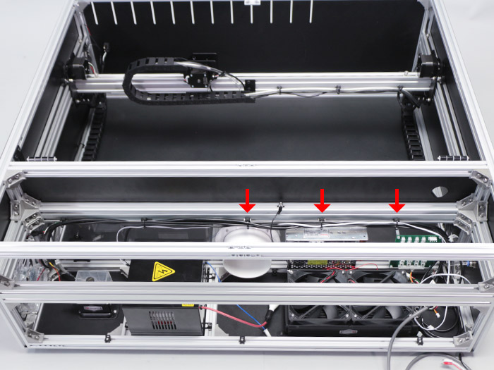

Laserケーブルの赤丸のマグネットスイッチは本体左側背面から左側前面に通します。

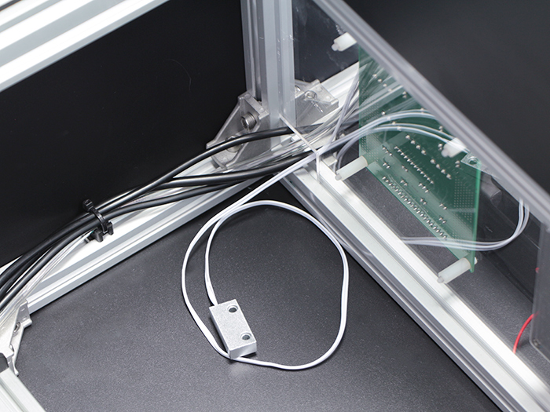

アルミフレーム20mm角 800mmの内側にM3後入ナットと M3x12六角穴付ボルトで取り付けます。
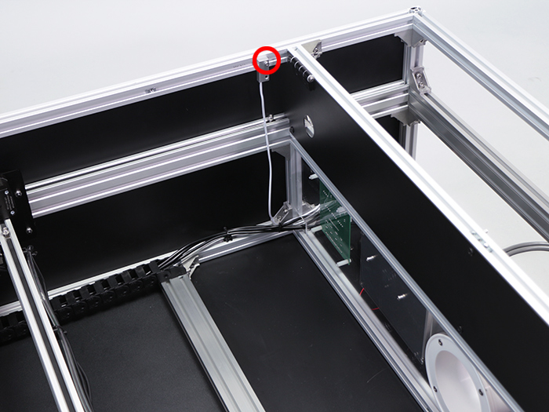

写真を参考に配線を行います。
X-Motorケーブルは、「X MOTOR」へ差し込んでください。
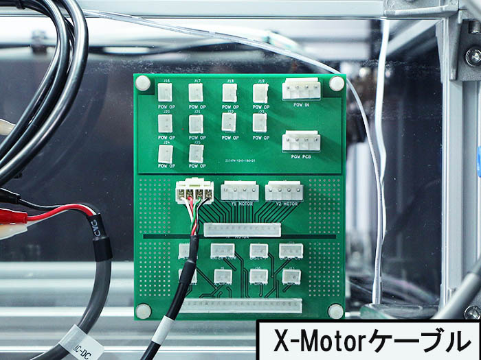

Y-Motor-Rケーブルは、「Y2 MOTOR」へ差し込んでください。

Y-Motor-Lケーブルは、「Y1 MOTOR」へ差し込んでください。
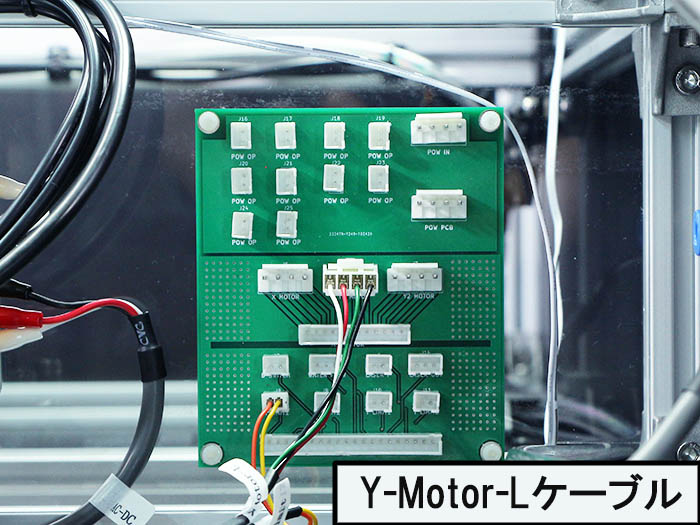

FANケーブルは、「POW OP」（J16 / J17）へ差し込んでください。
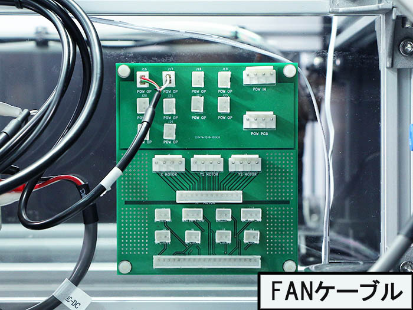

ラジエーターファンは、「POW OP」（J20 / J21）へ差し込んでください。
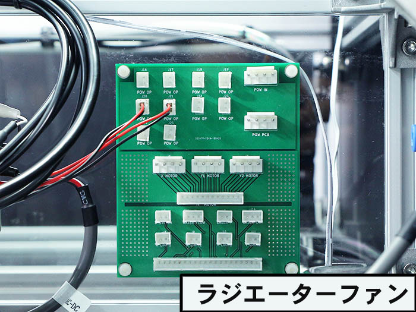

フローセンサーは、「WATER FLOW」へ差し込んでください。
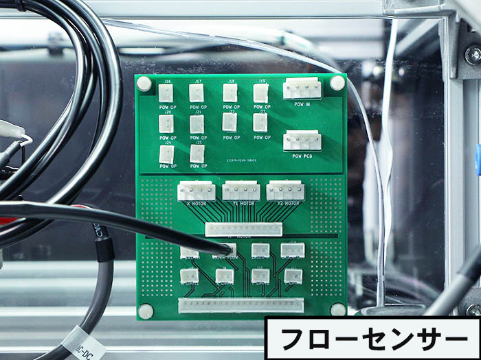

Laserケーブルは、「LASER OUT」へ差し込んでください。

Y1-Limitケーブルは、「Y LIMIT1」へ差し込んでください。
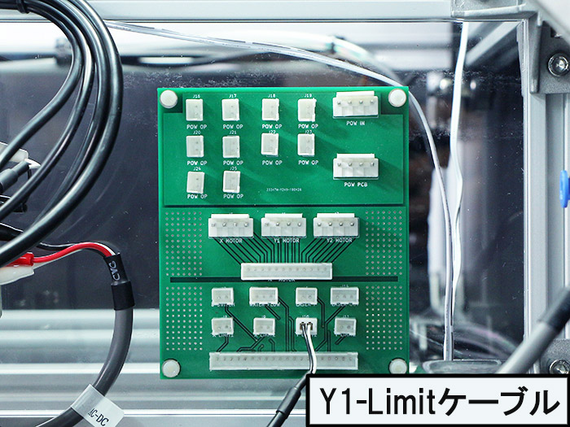

Switchケーブルは、「D SWITCH」「Y LIMIT2」へ差し込んでください。
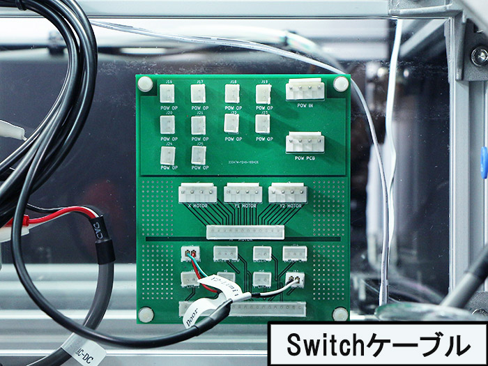

Powerケーブルは、「POW IN」へ差し込んでください。
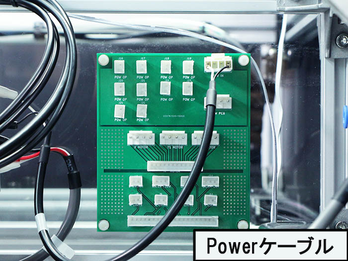

RELAY SIGNALケーブルは、「J3 SIGNAL」へ差し込んでください。
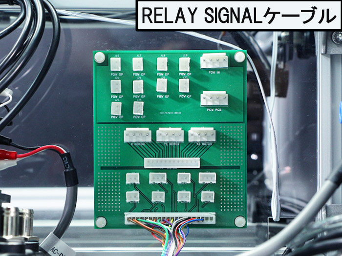

RELAY DC POWERケーブルは、「POW PCB」へ差し込んでください。
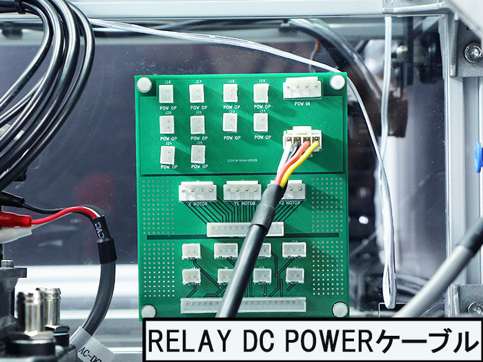

RELAY MOTORケーブルは、「J2 MOTOR」へ差し込んでください。
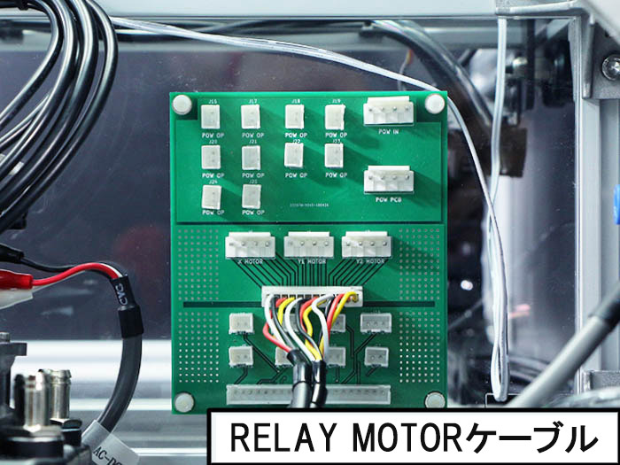

※オプションの「CO2レーザー加工機用位置決めキット」をご購入の方
Pointerケーブルは、「LASER P」へ差し込んでください。
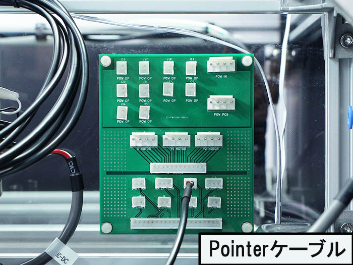
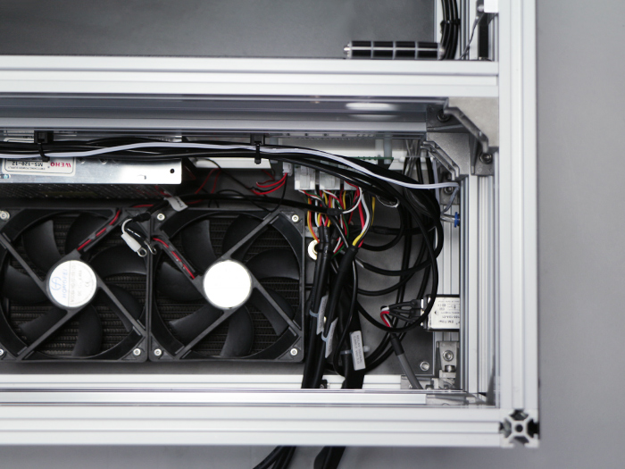