<table class="packing-list">
    <tbody>
        <tr>
            <td>No.</td>
            <td>部品名</td>
            <td>備考</td>
            <td class="packing-img">画像</td>
            <td>個数</td>
        </tr>
        <tr>
            <td>26</td>
            <td>水冷ホース</td>
            <td>2m</td>
            <td></td>
            <td>1</td>
        </tr>
        <tr>
            <td>61</td>
            <td>フローセンサー</td>
            <td></td>
            <td>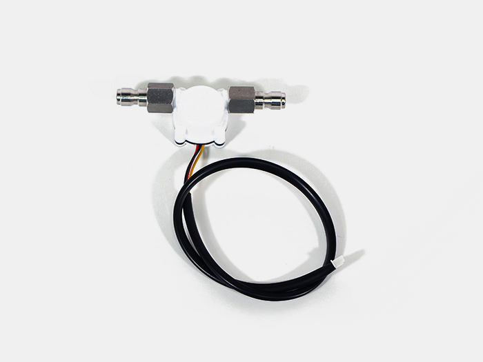</td>
            <td>1</td>
        </tr>
        <tr>
            <td>38</td>
            <td>結束バンド</td>
            <td></td>
            <td>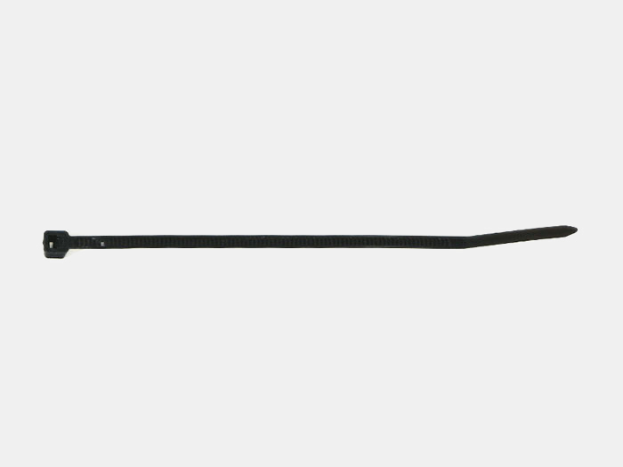</td>
            <td>11</td>
        </tr>
    </tbody>
</table>

## 工程手順

### 水冷ホース取り付け
水冷ポンプの出口側（写真では奥側）にホースを取り付けます。
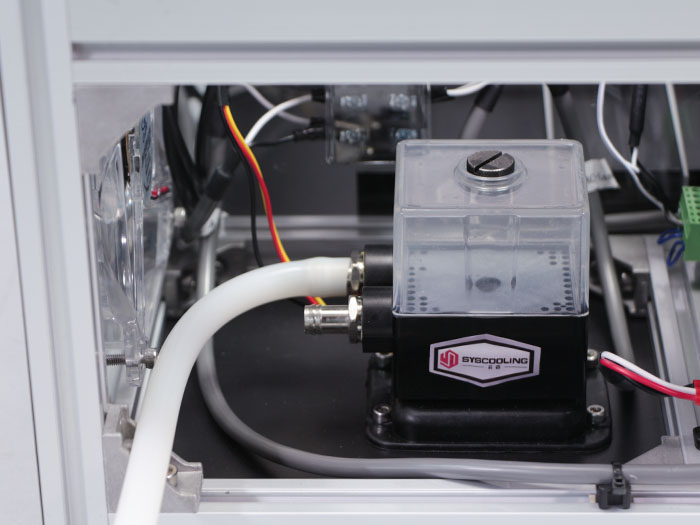

水冷ポンプの出口側からのホースは、レーザー管の照射しない方（LED DCファン側）に取り付けます。適当な長さでカットして取り付けてください。
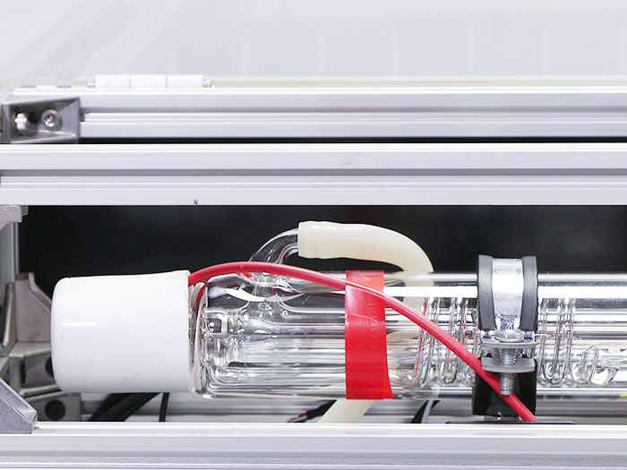

水冷ポンプの入口側（写真では手前側）にホースを取り付けます。
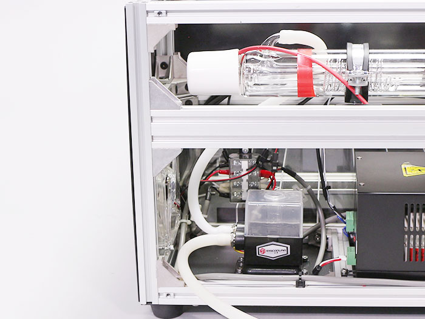

水冷ポンプの入口側からのホースはラジエーターユニットの写真手前側に取り付けます。適当な長さでカットして取り付けてください。
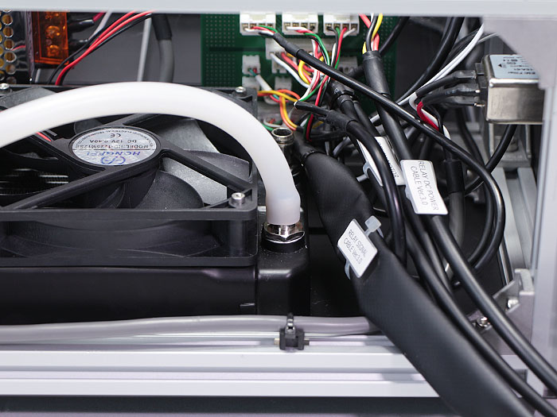

レーザー管の照射する側（第1ミラー側）にホースを取り付けます。
※力を加えすぎるとレーザー管が割れる可能性がありますので注意してください。
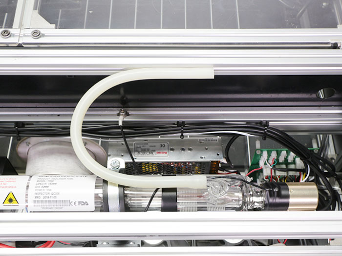

フローセンサーに取り付けます。適当な長さでカットして取り付けてください。
※フローセンサーの記載してある矢印がラジエーター側を向くように取り付けてください。
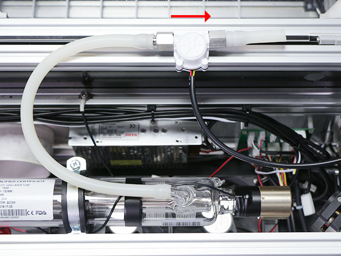
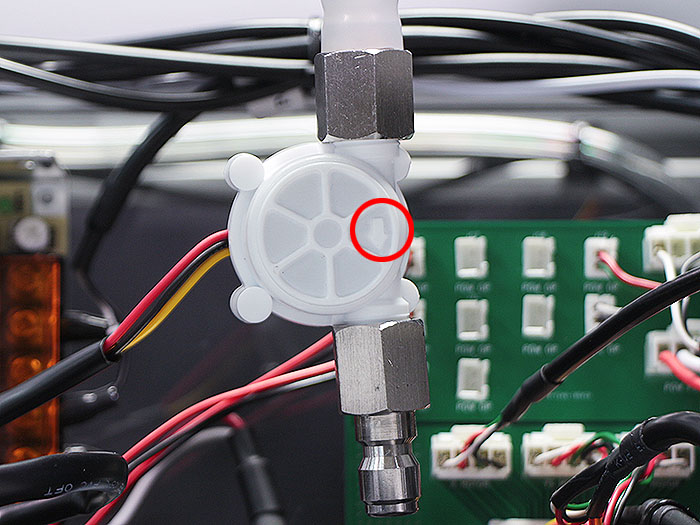

フローセンサーの下側にホースを取り付け、ラジエーターユニットの写真奥側にホースを取り付けます。適当な長さでカットしてください。
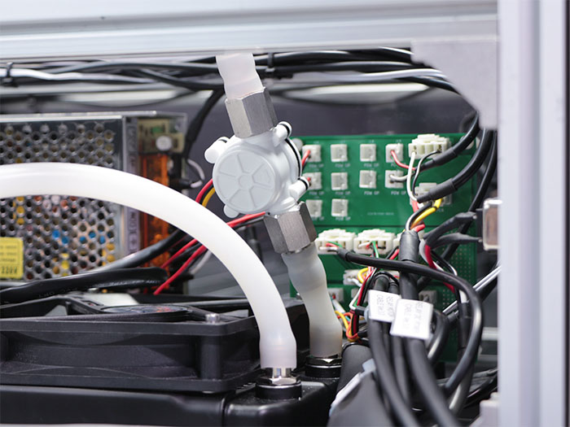

ホースを取り付けた8箇所を結束バンドで固定します。結束バンドの余った部分はカットしてください。
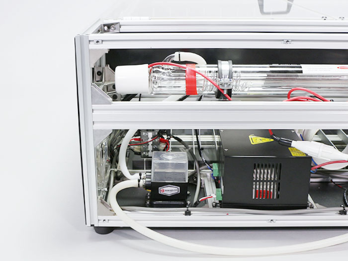
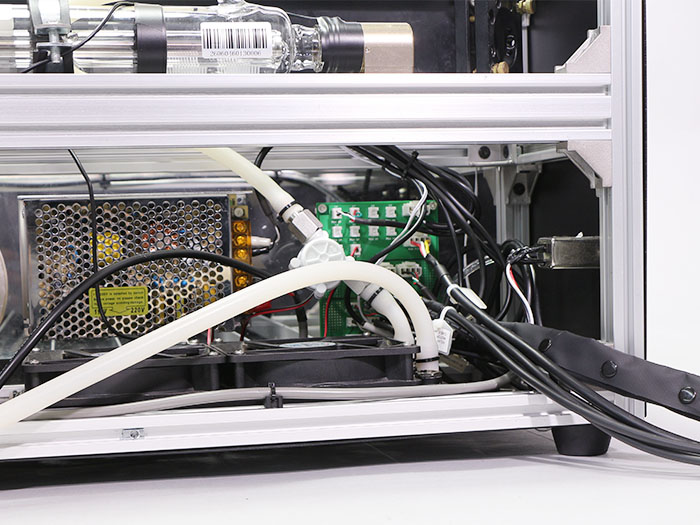
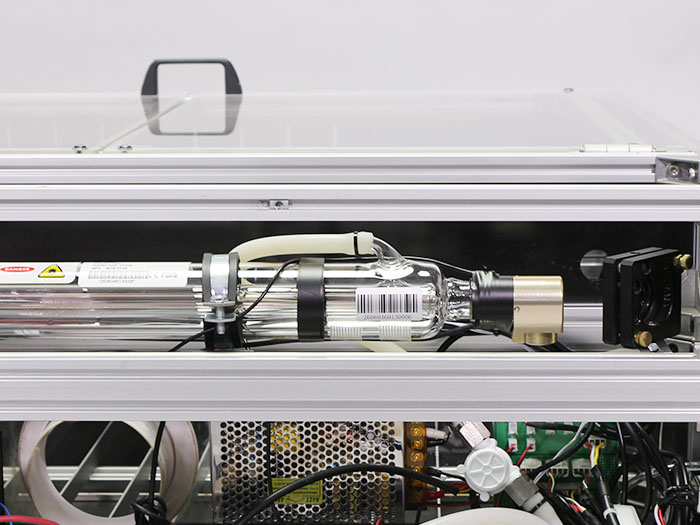

水冷ポンプからラジエーターユニットに取り付けた水冷ホースを、結束バンド3個でAC-Mainケーブルに固定します。
※写真を参考にAC-Mainケーブルを取り付けた結束バンド固定具付近で固定してください。
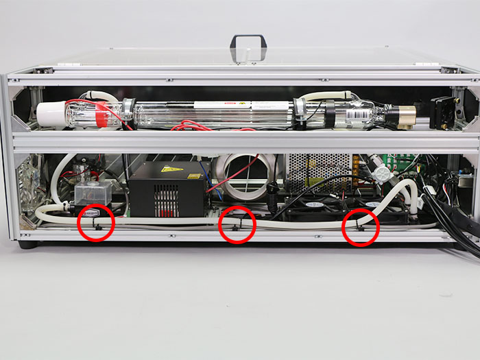
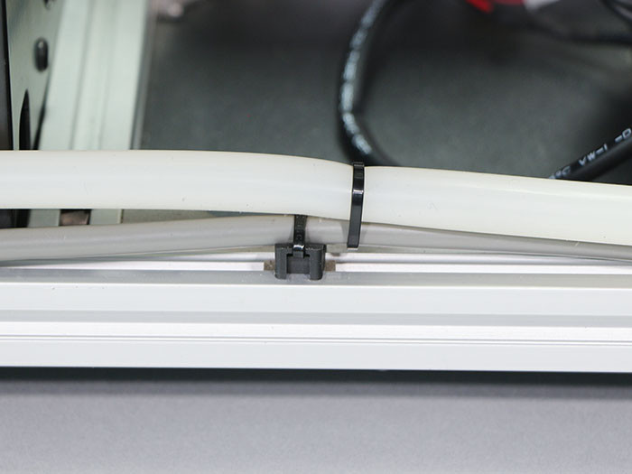