こちらの章は、PCBケース取付プレートの有無によって作業行程が変わります。作業を始める前にPCBケース取り付けプレートの有無をご確認ください。

**確認方法**
メカパーツの梱包箱の中に下記のPCBケース取付プレートが付属しているかご確認ください。
パーツ名: PCB Case Plate
パーツサイズ: 約240×175
PCBケース取り付けプレートが入っている方はこの章を読み進めてください。
PCBケース取り付けプレートが入っていない方は「[26. Cover back取り付け（PCB取付プレート無し）](https://www.smartdiys.com/)」をご覧ください。
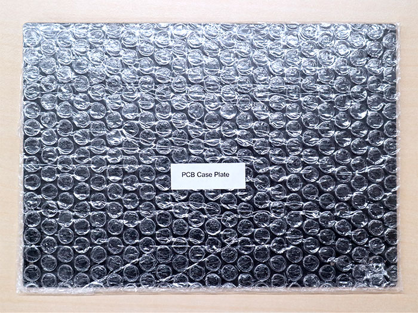

<table class="packing-list">
    <tbody>
        <tr>
            <td>No.</td>
            <td>部品名</td>
            <td>備考</td>
            <td class="packing-img">画像</td>
            <td>個数</td>
        </tr>
        <tr>
            <td>123</td>
            <td>Cover back</td>
            <td></td>
            <td>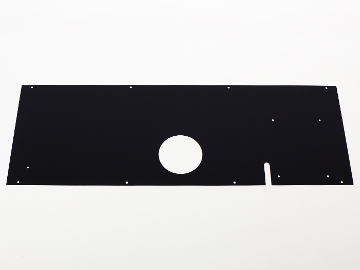</td>
            <td>1</td>
        </tr>
        <tr>
            <td>133</td>
            <td>PCBケース</td>
            <td></td>
            <td>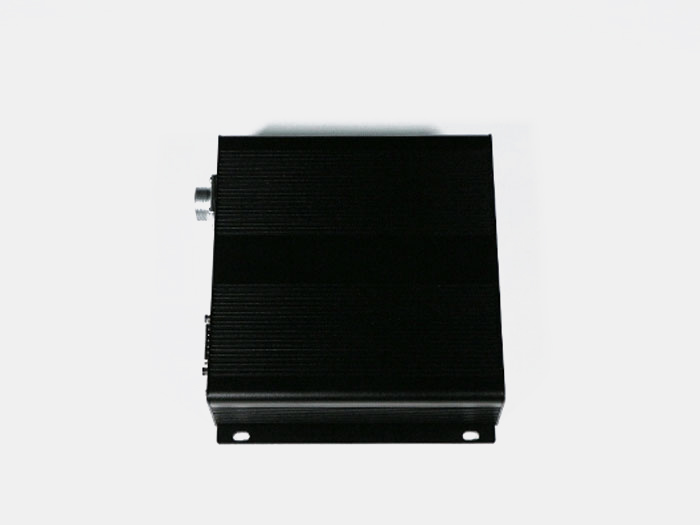</td>
            <td>1</td>
        </tr>
        <tr>
            <td>138</td>
            <td>PCBケース取付プレート</td>
            <td></td>
            <td>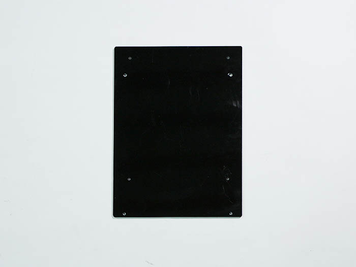</td>
            <td>1</td>
        </tr>
        <tr>
            <td>84</td>
            <td>M5x6低頭ボルト</td>
            <td></td>
            <td>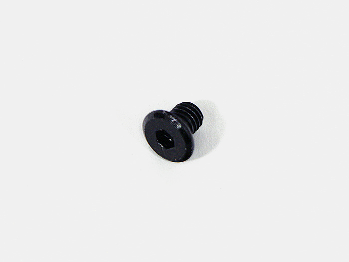</td>
            <td>8</td>
        </tr>
        <tr>
            <td>140</td>
            <td>M3x3低頭ボルト</td>
            <td></td>
            <td>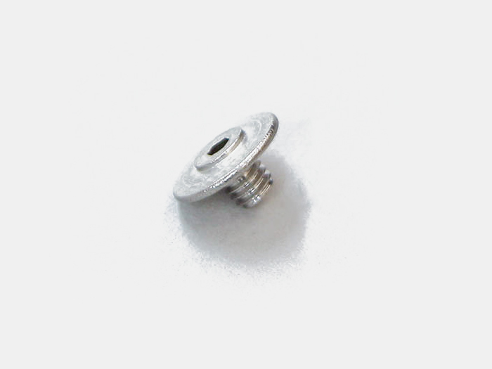</td>
            <td>4</td>
        </tr>
        <tr>
            <td>141</td>
            <td>M4x4六角穴付ボルト</td>
            <td></td>
            <td>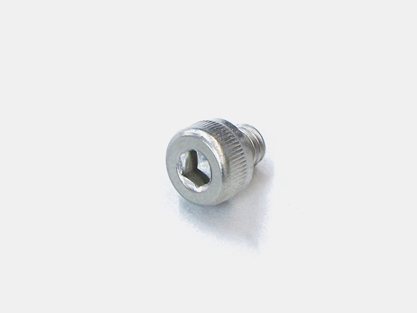</td>
            <td>4</td>
        </tr>
        <tr>
            <td>142</td>
            <td>M2.5×6 六角穴付ボルト</td>
            <td></td>
            <td>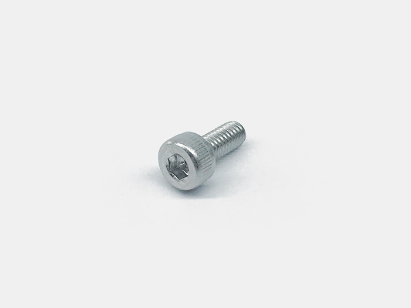</td>
            <td>2</td>
        </tr>
    </tbody>
</table>

## 工程手順

### Cover back取り付け
Cover backにPCBケース取付プレートを、cover backの裏側からM3x3低頭ボルト4個で取り付けます。
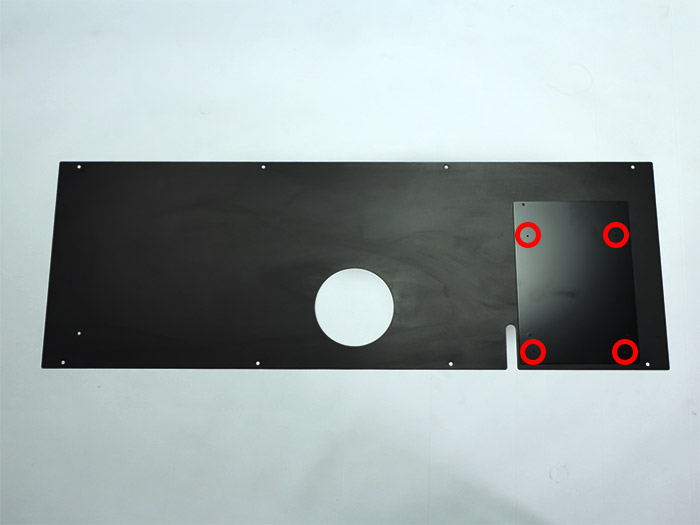

PCBケース取付プレートにPCBケースをM4x4六角穴付ボルト4個で取り付けます。
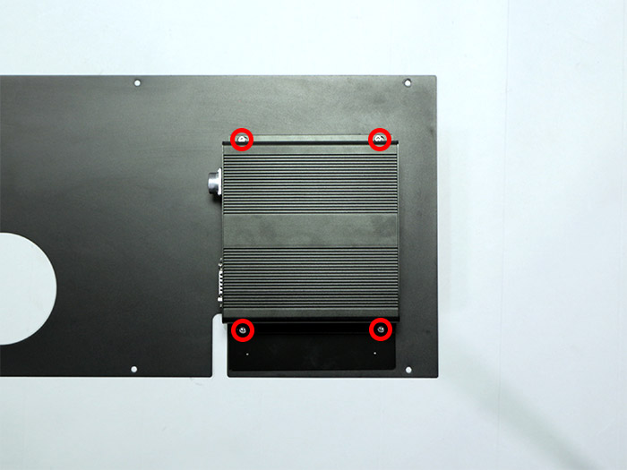

RELAY DC POWERケーブルとRELAY MOTORケーブルとRELAY SIGNALケーブルを、cover backの長穴から外に出します。

Cover backを、あらかじめ入れておいたM5Tナット8個とM5x6低頭ボルト8個で本体に取り付けます。
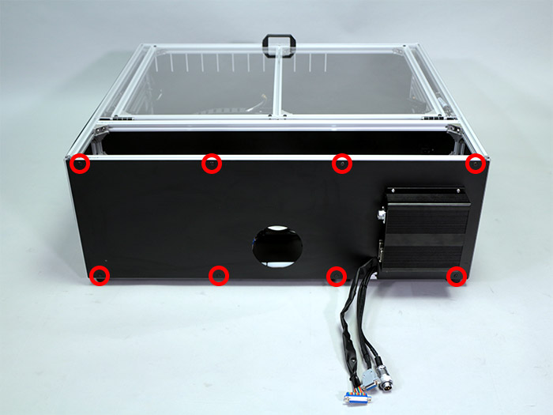

PCBケースにRELAY DC POWERケーブルを取り付けます。コネクタ部分に記載されている番号同士を合わせ、根元のローレットナットを回して固定して下さい。
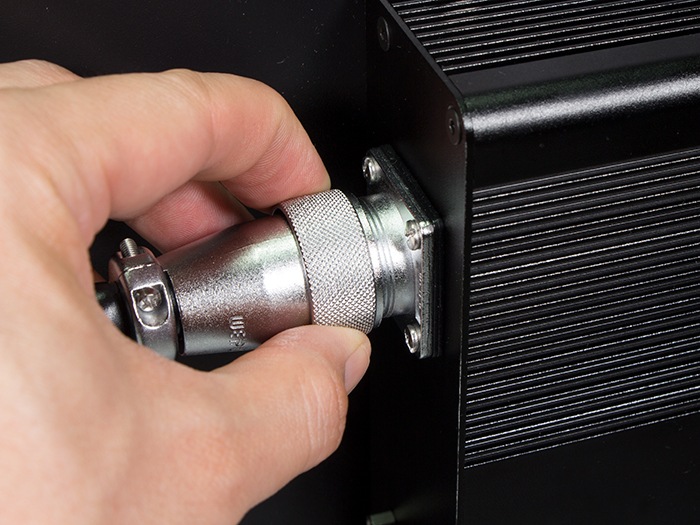

RELAY SIGNALケーブルをM2.5×6六角穴付ボルト2個で取り付けます。

RELAY MOTORケーブルをコネクタに取り付いているネジで取り付けます。
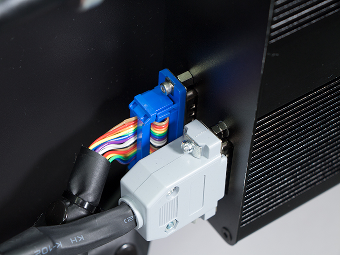
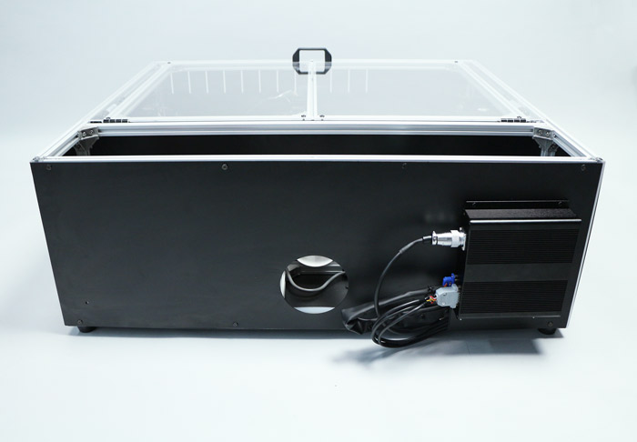