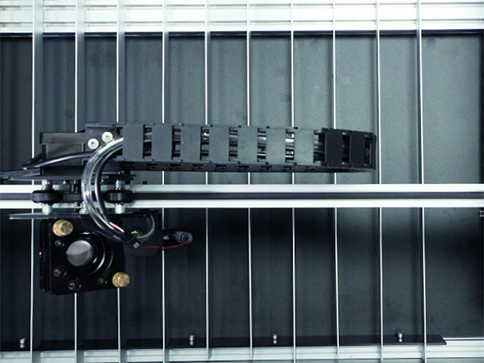
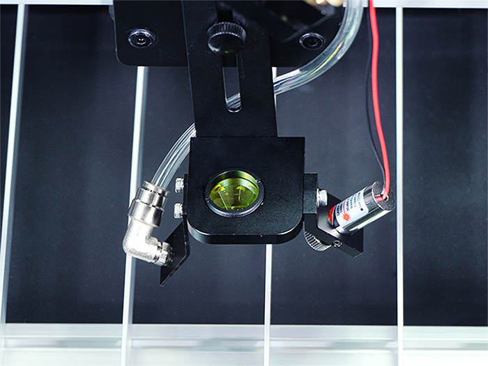
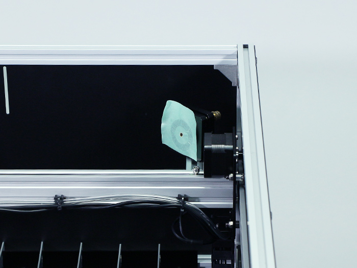

## 使用前点検、メンテナンス
FABOOL Laser CO2を使用する際には、毎回必ず以下の点検、メンテナンスを行ってください。メンテナンスを行う場合は必ず電源ケーブルを抜いてから行ってください。

加工ベッド下にごみや塵が溜まっていないか確認してください。溜まっている場合は、フラットバーを外して清掃してください。

反射ミラー・集光レンズの汚れの有無を確認してください。汚れている場合は、レンズ部分に触れないように柔らかい布などで拭いてください（クリーニング前、クリーニング後はよく手を洗ってください）。

軸（V-slot）の汚れ・ヤニの確認をしてください。必要に応じて、布やペーパーで汚れやごみを拭き取ってください。なお、シリコンスプレーなどを使用するとすべりがよくなります。

## 定期点検、メンテナンス
使用頻度に応じて、2週間から1か月に一度は以下の点検、メンテナンスを行ってください。

タイミングベルトの張りを確認してください。緩んでいる場合は、再度張りなおしてください。

タイミングプーリーの汚れの有無を確認してください。

光軸がずれている場合は、再度マニュアルの「光軸調整」に従って調整を行ってください。
