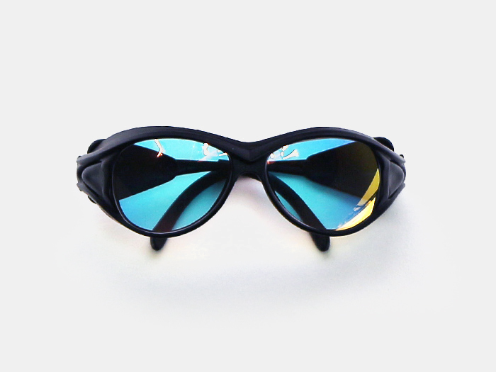
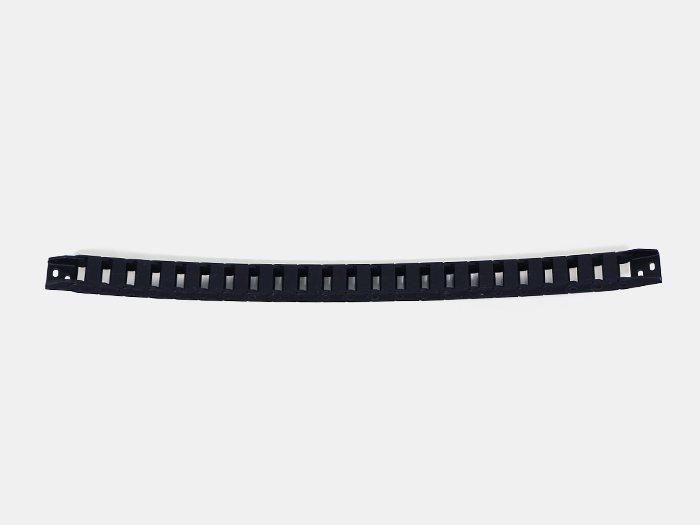
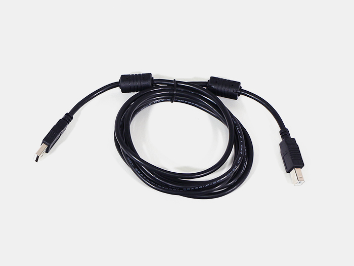
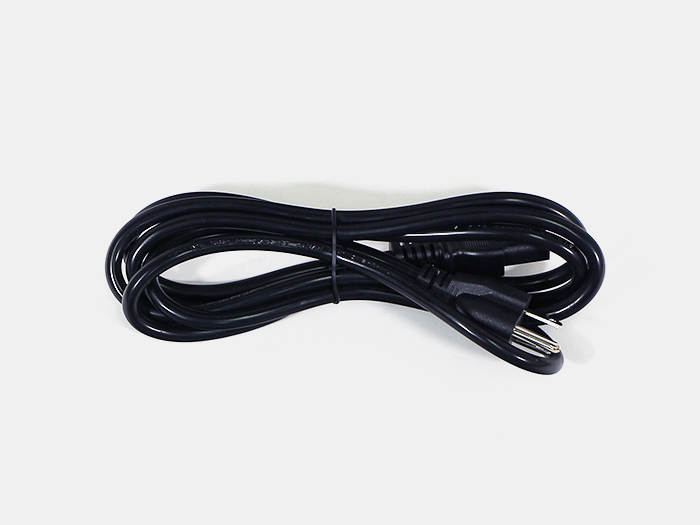
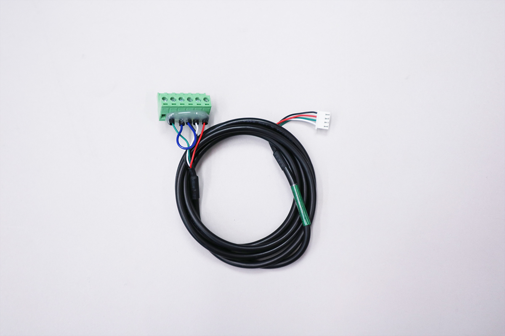
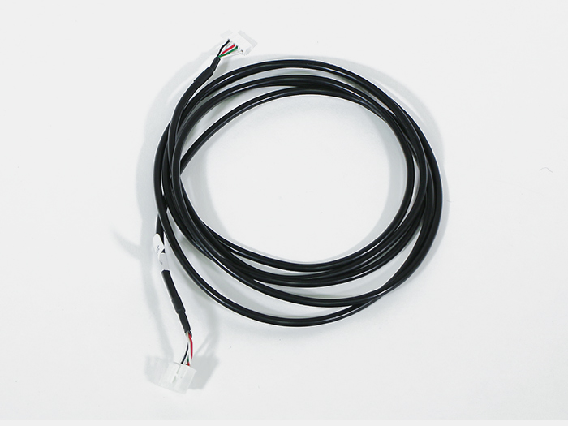
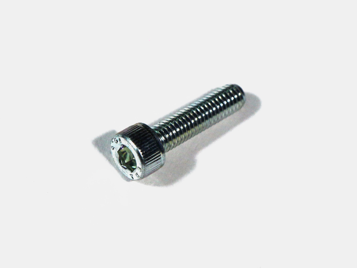
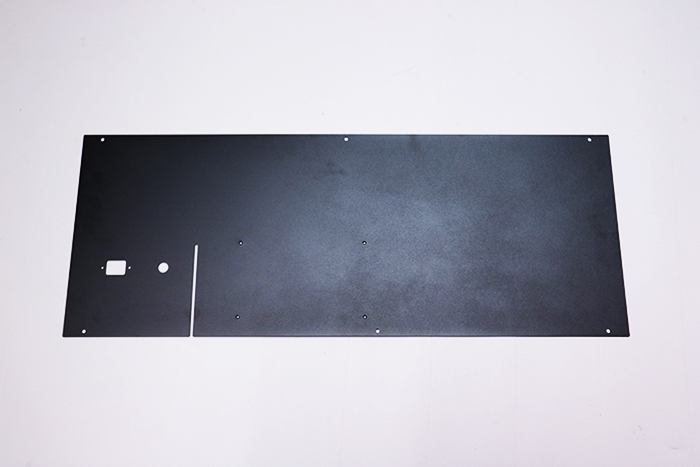

## Aluminum Extrusion/Laser tube

<table class="packing-list">
    <tbody>
        <tr>
            <td>部品名</td>
            <td>備考</td>
            <td class="packing-img">画像</td>
            <td>個数</td>
        </tr>
        <tr>
            <td>V-slot 848mm</td>
            <td></td>
            <td></td>
            <td>1</td>
        </tr>
        <tr>
            <td>V-slot 780mm</td>
            <td></td>
            <td></td>
            <td>2</td>
        </tr>
        <tr>
            <td>アルミフレーム 20*40mm 860mm</td>
            <td></td>
            <td></td>
            <td>3</td>
        </tr>
        <tr>
            <td>アルミフレーム 20mm角 860mm</td>
            <td></td>
            <td></td>
            <td>6</td>
        </tr>
        <tr>
            <td>アルミフレーム 20mm角 810mm</td>
            <td></td>
            <td></td>
            <td>2</td>
        </tr>
        <tr>
            <td>アルミフレーム 20mm角 800mm</td>
            <td></td>
            <td></td>
            <td>2</td>
        </tr>
        <tr>
            <td>アルミフレーム 20mm角 780mm</td>
            <td></td>
            <td></td>
            <td>2</td>
        </tr>
        <tr>
            <td>アルミフレーム 20mm角 529mm</td>
            <td></td>
            <td></td>
            <td>3</td>
        </tr>
        <tr>
            <td>アルミフレーム 20mm角 315mm</td>
            <td></td>
            <td></td>
            <td>2</td>
        </tr>
        <tr>
            <td>アルミフレーム 20mm角 295mm</td>
            <td></td>
            <td></td>
            <td>2</td>
        </tr>
        <tr>
            <td>アルミフレーム 20mm角 170mm</td>
            <td></td>
            <td></td>
            <td>2</td>
        </tr>
        <tr>
            <td>アルミフレーム 20mm角 145mm</td>
            <td></td>
            <td></td>
            <td>2</td>
        </tr>
        <tr>
            <td>アルミフレーム 20mm角 90mm</td>
            <td></td>
            <td></td>
            <td>2</td>
        </tr>
        <tr>
            <td>フラットバー</td>
            <td>長さ: 610mm</td>
            <td></td>
            <td>14</td>
        </tr>
        <tr>
            <td>第1ミラー用アルミフレーム</td>
            <td>45°カット 長さ: 70mm</td>
            <td></td>
            <td>1</td>
        </tr>
        <tr>
            <td>第2ミラー用アルミフレーム</td>
            <td>45°カット 長さ: 66mm</td>
            <td></td>
            <td>1</td>
        </tr>
        <tr>
            <td>レーザー管</td>
            <td></td>
            <td></td>
            <td>1</td>
        </tr>
    </tbody>
</table>

## Mechanical parts

<table class="packing-list">
    <tbody>
        <tr>
            <td>部品名</td>
            <td>備考</td>
            <td class="packing-img">画像</td>
            <td>個数</td>
        </tr>
        <tr>
            <td>レーザー電源</td>
            <td></td>
            <td></td>
            <td>1</td>
        </tr>
        <tr>
            <td>座付ソケット</td>
            <td></td>
            <td></td>
            <td>1</td>
        </tr>
        <tr>
            <td>ラジエーターユニット</td>
            <td>ファン2個とマウントとアース線取付済み</td>
            <td></td>
            <td>1</td>
        </tr>
        <tr>
            <td>保護メガネ</td>
            <td></td>
            <td></td>
            <td>1</td>
        </tr>
        <tr>
            <td>ケーブルキャリアx軸</td>
            <td>取付ブラケット含む</td>
            <td></td>
            <td>1</td>
        </tr>
        <tr>
            <td>ケーブルキャリアy軸</td>
            <td>取付ブラケット含む</td>
            <td></td>
            <td>2</td>
        </tr>
        <tr>
            <td>水冷ポンプ</td>
            <td>ホース接続継手取付済み・付属品あり</td>
            <td></td>
            <td>1</td>
        </tr>
        <tr>
            <td>水冷ホース</td>
            <td>2m</td>
            <td></td>
            <td>1</td>
        </tr>
        <tr>
            <td>ポリウレタンチューブ</td>
            <td>3m</td>
            <td></td>
            <td>1</td>
        </tr>
        <tr>
            <td>レーザー管マウント</td>
            <td></td>
            <td></td>
            <td>2</td>
        </tr>
        <tr>
            <td>直角ブラケット</td>
            <td></td>
            <td></td>
            <td>62</td>
        </tr>
        <tr>
            <td>M5 Tナット</td>
            <td></td>
            <td></td>
            <td>227</td>
        </tr>
        <tr>
            <td>M5x8 六角穴付ボルト</td>
            <td></td>
            <td></td>
            <td>146</td>
        </tr>
        <tr>
            <td>ミラーマウント</td>
            <td></td>
            <td></td>
            <td>3</td>
        </tr>
        <tr>
            <td>ステッピングモーター</td>
            <td></td>
            <td></td>
            <td>3</td>
        </tr>
        <tr>
            <td>ホイールプレートX軸</td>
            <td></td>
            <td></td>
            <td>1</td>
        </tr>
        <tr>
            <td>ホイールプレートY軸</td>
            <td></td>
            <td></td>
            <td>2</td>
        </tr>
        <tr>
            <td>ガススプリング</td>
            <td></td>
            <td></td>
            <td>2</td>
        </tr>
        <tr>
            <td>結束バンド</td>
            <td></td>
            <td></td>
            <td>33</td>
        </tr>
        <tr>
            <td>結束バンド固定具</td>
            <td></td>
            <td></td>
            <td>19</td>
        </tr>
        <tr>
            <td>中継基板</td>
            <td></td>
            <td></td>
            <td>1</td>
        </tr>
        <tr>
            <td>取手</td>
            <td></td>
            <td></td>
            <td>1</td>
        </tr>
        <tr>
            <td>反射ミラー</td>
            <td>素材: Mo Φ25mm</td>
            <td></td>
            <td>3</td>
        </tr>
        <tr>
            <td>端子台</td>
            <td></td>
            <td></td>
            <td>1</td>
        </tr>
        <tr>
            <td>タイミングプーリー</td>
            <td>型式: 2GT</td>
            <td></td>
            <td>3</td>
        </tr>
        <tr>
            <td>タイミングベルト</td>
            <td>1500mm</td>
            <td></td>
            <td>2</td>
        </tr>
        <tr>
            <td>集光レンズ</td>
            <td>素材: ZnSe Φ20m</td>
            <td></td>
            <td>1</td>
        </tr>
        <tr>
            <td>薄型ブラケット</td>
            <td>素材: ZnSe Φ20m</td>
            <td></td>
            <td>1</td>
        </tr>
        <tr>
            <td>蝶番</td>
            <td></td>
            <td></td>
            <td>2</td>
        </tr>
        <tr>
            <td>ホイールプレートモーターマウント</td>
            <td></td>
            <td></td>
            <td>1</td>
        </tr>
        <tr>
            <td>レンズマウントガイド</td>
            <td></td>
            <td></td>
            <td>1</td>
        </tr>
        <tr>
            <td>リミットマウントy1</td>
            <td></td>
            <td></td>
            <td>1</td>
        </tr>
        <tr>
            <td>リミットマウント</td>
            <td></td>
            <td></td>
            <td>3</td>
        </tr>
        <tr>
            <td>キャリアマウントX軸</td>
            <td></td>
            <td></td>
            <td>2</td>
        </tr>
        <tr>
            <td>キャリアマウントY軸</td>
            <td></td>
            <td></td>
            <td>2</td>
        </tr>
        <tr>
            <td>チューブマウント</td>
            <td></td>
            <td></td>
            <td>2</td>
        </tr>
        <tr>
            <td>レンズマウント</td>
            <td></td>
            <td></td>
            <td>1</td>
        </tr>
        <tr>
            <td>レンズナット</td>
            <td></td>
            <td></td>
            <td>1</td>
        </tr>
        <tr>
            <td>エアーアシストホルダー</td>
            <td></td>
            <td></td>
            <td>1</td>
        </tr>
        <tr>
            <td>ゴム足</td>
            <td></td>
            <td></td>
            <td>4</td>
        </tr>
        <tr>
            <td>フローセンサー</td>
            <td></td>
            <td></td>
            <td>1</td>
        </tr>
        <tr>
            <td>AC-Laserケーブル</td>
            <td></td>
            <td></td>
            <td>1</td>
        </tr>
        <tr>
            <td>AC-Mainケーブル</td>
            <td></td>
            <td></td>
            <td>1</td>
        </tr>
        <tr>
            <td>AC-Switchケーブル</td>
            <td></td>
            <td></td>
            <td>1</td>
        </tr>
        <tr>
            <td>USBケーブル</td>
            <td></td>
            <td></td>
            <td>1</td>
        </tr>
        <tr>
            <td>ACケーブル</td>
            <td></td>
            <td></td>
            <td>1</td>
        </tr>
        <tr>
            <td>AC-Cable</td>
            <td></td>
            <td></td>
            <td>1</td>
        </tr>
        <tr>
            <td>Laserケーブル</td>
            <td>ケーブル マグネット付属</td>
            <td></td>
            <td>1</td>
        </tr>
        <tr>
            <td>X-Motorケーブル</td>
            <td></td>
            <td></td>
            <td>1</td>
        </tr>
        <tr>
            <td>Y-Motor-Lケーブル</td>
            <td></td>
            <td></td>
            <td>1</td>
        </tr>
        <tr>
            <td>Y-Motor-Rケーブル</td>
            <td></td>
            <td></td>
            <td>1</td>
        </tr>
        <tr>
            <td>Switchケーブル</td>
            <td>ケーブル マグネット付属</td>
            <td></td>
            <td>1</td>
        </tr>
        <tr>
            <td>Y1-Limitケーブル</td>
            <td></td>
            <td></td>
            <td>1</td>
        </tr>
        <tr>
            <td>Ground(S)ケーブル</td>
            <td></td>
            <td></td>
            <td>1</td>
        </tr>
        <tr>
            <td>Pumpケーブル</td>
            <td></td>
            <td></td>
            <td>1</td>
        </tr>
        <tr>
            <td>Relayケーブル</td>
            <td></td>
            <td></td>
            <td>1</td>
        </tr>
        <tr>
            <td>ACアダプタ</td>
            <td></td>
            <td></td>
            <td>1</td>
        </tr>
        <tr>
            <td>アダプタマウント</td>
            <td></td>
            <td></td>
            <td>1</td>
        </tr>
        <tr>
            <td>ポジション ブラケット</td>
            <td></td>
            <td></td>
            <td>1</td>
        </tr>
        <tr>
            <td>PCBケース</td>
            <td></td>
            <td></td>
            <td>1</td>
        </tr>
        <tr>
            <td>テスター</td>
            <td>取り付け部品ではありません。9V角型電池をご用意ください</td>
            <td></td>
            <td>1</td>
        </tr>
    </tbody>
</table>

## ネジケース

<table class="packing-list">
    <tbody>
        <tr>
            <td>部品名</td>
            <td>備考</td>
            <td class="packing-img">画像</td>
            <td>個数</td>
        </tr>
        <tr>
            <td>M2x8六角穴付ボルト</td>
            <td></td>
            <td></td>
            <td>8</td>
        </tr>
        <tr>
            <td>M3x3六角穴付ボルト</td>
            <td></td>
            <td></td>
            <td>2</td>
        </tr>
        <tr>
            <td>M3x4六角穴付ボルト</td>
            <td></td>
            <td></td>
            <td>2</td>
        </tr>
        <tr>
            <td>M3x6六角穴付ボルト</td>
            <td></td>
            <td></td>
            <td>32</td>
        </tr>
        <tr>
            <td>M3x12六角穴付ボルト</td>
            <td></td>
            <td></td>
            <td>2</td>
        </tr>
        <tr>
            <td>M4x6六角穴付ボルト</td>
            <td></td>
            <td></td>
            <td>7</td>
        </tr>
        <tr>
            <td>M5x12六角穴付ボルト</td>
            <td></td>
            <td></td>
            <td>2</td>
        </tr>
        <tr>
            <td>M5x20六角穴付ボルト</td>
            <td></td>
            <td></td>
            <td>4</td>
        </tr>
        <tr>
            <td>M10x10六角穴付ボルト</td>
            <td></td>
            <td></td>
            <td>2</td>
        </tr>
        <tr>
            <td>M3x10六角穴付皿ボルト</td>
            <td></td>
            <td></td>
            <td>2</td>
        </tr>
        <tr>
            <td>M4x10六角穴付皿ボルト</td>
            <td></td>
            <td></td>
            <td>18</td>
        </tr>
        <tr>
            <td>M5x8六角穴付皿ボルト</td>
            <td></td>
            <td></td>
            <td>8</td>
        </tr>
        <tr>
            <td>M5x18六角穴付皿ボルト</td>
            <td></td>
            <td></td>
            <td>2</td>
        </tr>
        <tr>
            <td>M5x25六角穴付皿ボルト</td>
            <td></td>
            <td></td>
            <td>1</td>
        </tr>
        <tr>
            <td>M4x6低頭ボルト</td>
            <td></td>
            <td></td>
            <td>4</td>
        </tr>
        <tr>
            <td>M5x6低頭ボルト</td>
            <td></td>
            <td></td>
            <td>75</td>
        </tr>
        <tr>
            <td>M5x8低頭ボルト</td>
            <td></td>
            <td></td>
            <td>8</td>
        </tr>
        <tr>
            <td>M5x10低頭ボルト</td>
            <td></td>
            <td></td>
            <td>4</td>
        </tr>
        <tr>
            <td>M5x25低頭ボルト</td>
            <td></td>
            <td></td>
            <td>4</td>
        </tr>
        <tr>
            <td>M4先入れナット</td>
            <td></td>
            <td></td>
            <td>4</td>
        </tr>
        <tr>
            <td>M3後入ナット</td>
            <td></td>
            <td></td>
            <td>21</td>
        </tr>
        <tr>
            <td>M4後入ナット</td>
            <td></td>
            <td></td>
            <td>3</td>
        </tr>
        <tr>
            <td>M5後入ナット</td>
            <td></td>
            <td></td>
            <td>8</td>
        </tr>
        <tr>
            <td>M3ナット</td>
            <td></td>
            <td></td>
            <td>2</td>
        </tr>
        <tr>
            <td>M4ナット</td>
            <td></td>
            <td></td>
            <td>4</td>
        </tr>
        <tr>
            <td>M5ナイロンナット</td>
            <td></td>
            <td></td>
            <td>1</td>
        </tr>
        <tr>
            <td>M5ナット</td>
            <td></td>
            <td></td>
            <td>4</td>
        </tr>
        <tr>
            <td>M3x5ナイロンネジ</td>
            <td></td>
            <td></td>
            <td>4</td>
        </tr>
        <tr>
            <td>耐熱ワンタッチ継手</td>
            <td></td>
            <td></td>
            <td>1</td>
        </tr>

        <tr>
            <td>パネルタッチコネクタ</td>
            <td>色違いの場合あり</td>
            <td></td>
            <td>1</td>
        </tr>
        <tr>
            <td>つまみねじ</td>
            <td></td>
            <td></td>
            <td>1</td>
        </tr>
        <tr>
            <td>六角スペーサー（ネジ）</td>
            <td></td>
            <td></td>
            <td>4</td>
        </tr>
        <tr>
            <td>M10ワッシャー</td>
            <td></td>
            <td></td>
            <td>2</td>
        </tr>
        <tr>
            <td>歯付きワッシャー</td>
            <td></td>
            <td></td>
            <td>2</td>
        </tr>

        <tr>
            <td>M5ワッシャー</td>
            <td></td>
            <td></td>
            <td>6</td>
        </tr>
        <tr>
            <td>M3イモネジ</td>
            <td></td>
            <td></td>
            <td>6</td>
        </tr>
        <tr>
            <td>タッピングネジ</td>
            <td></td>
            <td></td>
            <td>4</td>
        </tr>
    </tbody>
</table>

## Sheet metal

<table class="packing-list">
    <tbody>
        <tr>
            <td>部品名</td>
            <td>備考</td>
            <td class="packing-img">画像</td>
            <td>個数</td>
        </tr>
        <tr>
            <td>Cover bottom</td>
            <td></td>
            <td></td>
            <td>1</td>
        </tr>
        <tr>
            <td>Cover bottom back</td>
            <td></td>
            <td></td>
            <td>1</td>
        </tr>
        <tr>
            <td>Inner cover</td>
            <td></td>
            <td></td>
            <td>1</td>
        </tr>
        <tr>
            <td>Cover left</td>
            <td></td>
            <td></td>
            <td>1</td>
        </tr>
        <tr>
            <td>Cover right</td>
            <td></td>
            <td></td>
            <td>1</td>
        </tr>
        <tr>
            <td>Cover back</td>
            <td></td>
            <td></td>
            <td>1</td>
        </tr>
        <tr>
            <td>Cover top back</td>
            <td></td>
            <td></td>
            <td>1</td>
        </tr>
        <tr>
            <td>Cover front</td>
            <td></td>
            <td></td>
            <td>1</td>
        </tr>
        <tr>
            <td>Inner acrylic</td>
            <td>Sheet Metal梱包箱に同梱</td>
            <td></td>
            <td>1</td>
        </tr>
    </tbody>
</table>

## Acrylic

<table class="packing-list">
    <tbody>
        <tr>
            <td>部品名</td>
            <td>備考</td>
            <td class="packing-img">画像</td>
            <td>個数</td>
        </tr>
        <tr>
            <td>top cover</td>
            <td></td>
            <td></td>
            <td>2</td>
        </tr>
        <tr>
            <td>bed long</td>
            <td></td>
            <td></td>
            <td>2</td>
        </tr>
        <tr>
            <td>bed short</td>
            <td></td>
            <td></td>
            <td>2</td>
        </tr>
        <tr>
            <td>高さ調整冶具1,2</td>
            <td></td>
            <td></td>
            <td>各1</td>
        </tr>
    </tbody>
</table>
