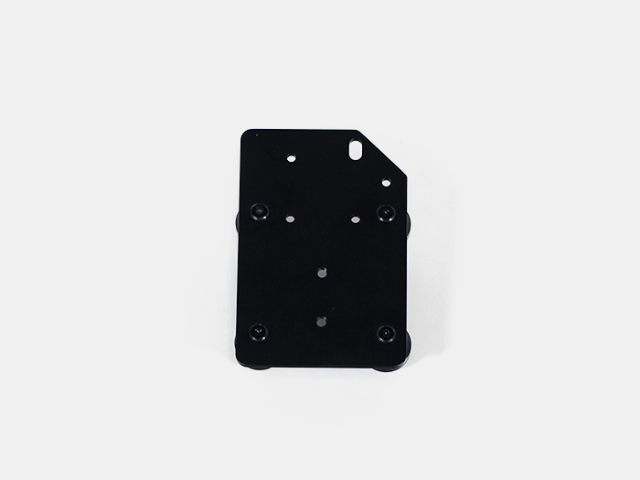
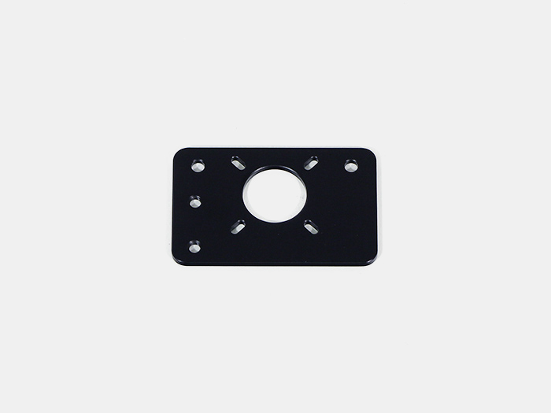
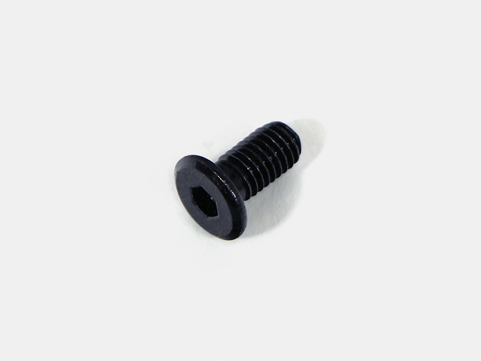

<table class="packing-list">
    <tbody>
        <tr>
            <td>部品名</td>
            <td>備考</td>
            <td class="packing-img">画像</td>
            <td>個数</td>
        </tr>
        <tr>
            <td>V-slot 848mm</td>
            <td></td>
            <td></td>
            <td>1</td>
        </tr>
        <tr>
            <td>ホイールプレートX軸</td>
            <td></td>
            <td></td>
            <td>1</td>
        </tr>
        <tr>
            <td>ホイールプレートY軸</td>
            <td></td>
            <td></td>
            <td>2</td>
        </tr>
        <tr>
            <td>ホイールプレートモーターマウント</td>
            <td></td>
            <td></td>
            <td>1</td>
        </tr>
        <tr>
            <td>タイミングプーリー</td>
            <td></td>
            <td></td>
            <td>1</td>
        </tr>
        <tr>
            <td>ステッピングモーター</td>
            <td></td>
            <td></td>
            <td>3</td>
        </tr>
        <tr>
            <td>M5Tナット</td>
            <td></td>
            <td></td>
            <td>7</td>
        </tr>
        <tr>
            <td>M5x10低頭ボルト</td>
            <td></td>
            <td></td>
            <td>4</td>
        </tr>
        <tr>
            <td>M3x6六角穴付ボルト</td>
            <td></td>
            <td></td>
            <td>12</td>
        </tr>
        <tr>
            <td>M3イモネジ</td>
            <td></td>
            <td></td>
            <td>2</td>
        </tr>
    </tbody>
</table>

## 工程手順

### ホイールプレートモーターマウント取り付け
ホイールプレートモーターマウントには取り付ける向きがあるので注意して下さい。

ステッピングモーターに、ホイールプレートモーターマウントをM3x6六角穴付ボルト4個で取り付けます。

タイミングプーリーをM3イモネジ2個で取り付けます。どちらか片方のネジ穴を、ステッピングモーターのシャフト切りかけ部分に合わせて取り付けて下さい。

タイミングプーリーで取り付けたイモネジは、後で高さを調整するので仮止めして下さい。

ホイールプレートX軸の上部2か所のM5ナイロンナットを外します。

ホイールプレートX軸にホイールプレートモーターマウントを通します。
ホイールプレートモーターマウントには、取り付ける向きがあるので注意して下さい。

取り外したM5ナイロンナットを取り付けます。

ホイールプレートY軸にステッピングモーターを写真の向きで載せます。
ステッピングモーターのコネクタの向きで、ホイールプレートY軸LとY軸Rに分かれます。

M3x6六角穴付ボルト8個で取り付けます。

### XY軸ユニット組み立て

V-slot 848mmの溝にホイールプレートX軸を通します。

slot 848mmの両端にホイールプレートY軸L/RをM5x10低頭ボルト4個で取り付けます。

V-slot 848mmの写真の位置に、M5Tナットを上3個、下2個入れます。

V-slot 848mmを反対向きにして、写真の位置にM5Tナットを上下1個ずつ入れます。

