<table class="packing-list">
    <tbody>
        <tr>
            <td>部品名</td>
            <td>備考</td>
            <td class="packing-img">画像</td>
            <td>個数</td>
        </tr>
        <tr>
            <td>アルミフレーム20*40mm 860mm</td>
            <td></td>
            <td></td>
            <td>1</td>
        </tr>
        <tr>
            <td>アルミフレーム20mm角 860mm</td>
            <td></td>
            <td></td>
            <td>2</td>
        </tr>
        <tr>
            <td>アルミフレーム20mm角 780mm</td>
            <td></td>
            <td></td>
            <td>2</td>
        </tr>
        <tr>
            <td>アルミフレーム20mm角 315mm</td>
            <td></td>
            <td></td>
            <td>2</td>
        </tr>
        <tr>
            <td>アルミフレーム20mm角 170mm</td>
            <td></td>
            <td></td>
            <td>2</td>
        </tr>
        <tr>
            <td>直角ブラケット</td>
            <td></td>
            <td></td>
            <td>12</td>
        </tr>
        <tr>
            <td>M5Tナット</td>
            <td></td>
            <td></td>
            <td>43</td>
        </tr>
        <tr>
            <td>M5x8六角穴付ボルト</td>
            <td></td>
            <td></td>
            <td>24</td>
        </tr>
        <tr>
            <td>M4先入れナット</td>
            <td></td>
            <td></td>
            <td>4</td>
        </tr>
    </tbody>
</table>

## 工程手順

### 下段部分組み立て
アルミフレーム20mm角 860mmとアルミフレーム20mm角 780mmとアルミフレーム20mm角 315mmを、M5Tナット4個とM5x8六角穴付ボルト4個と直角ブラケット2個で取り付けます。
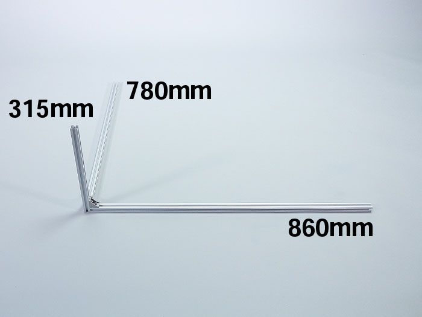
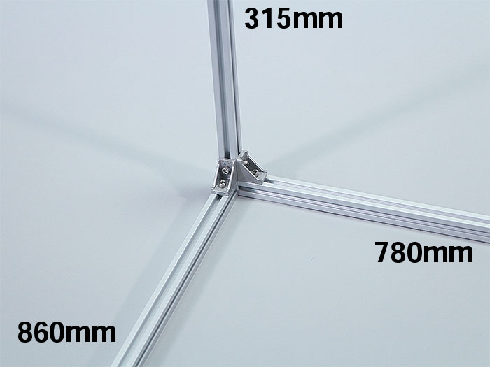

写真のように本体フレームを立てます。
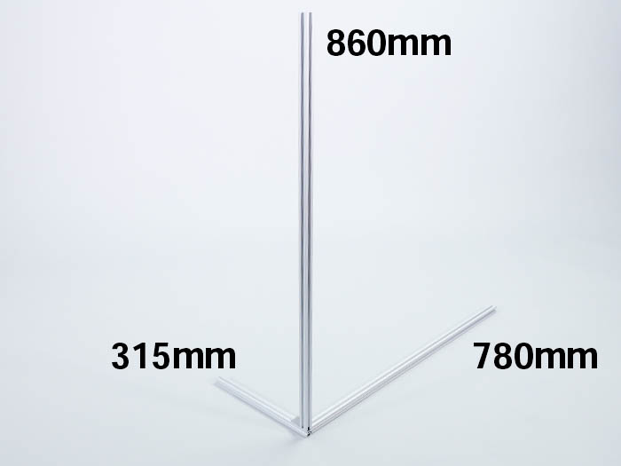

アルミフレーム20mm角 860mmにM5Tナットを左側4個、右側3個、合計7個挿入します。
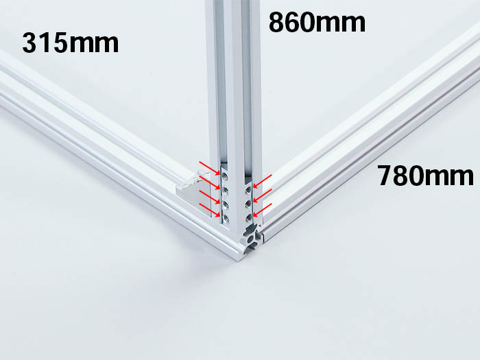

本体フレームを戻します。
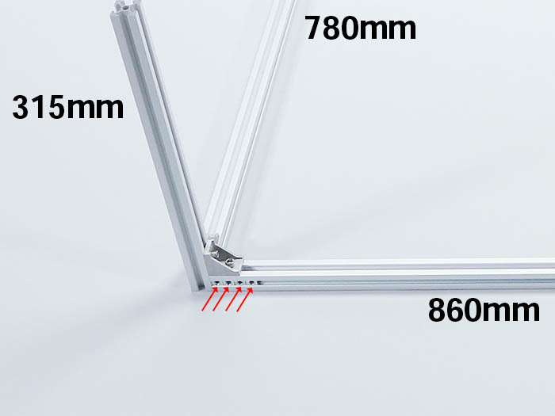

アルミフレーム20mm角 170mm2本を、M5Tナット4個とM5x8六角穴付ボルト4個と直角ブラケット2個で取り付けます。
後工程で位置を調整するので、写真の位置に仮止めして下さい。
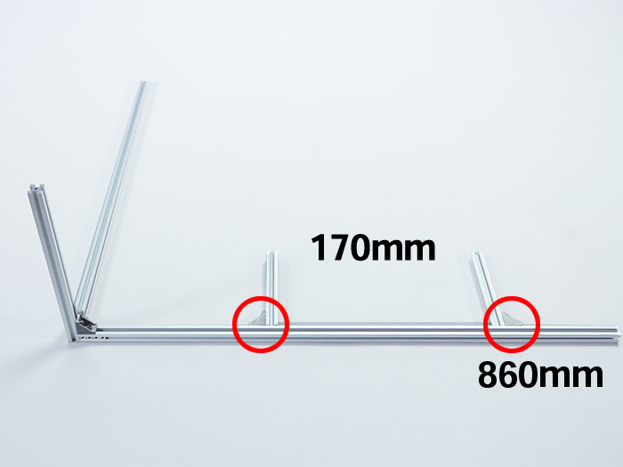

アルミフレーム20mm角 315mmを、M5Tナット2個とM5x8六角穴付ボルト2個と直角ブラケット1個で取り付けます。
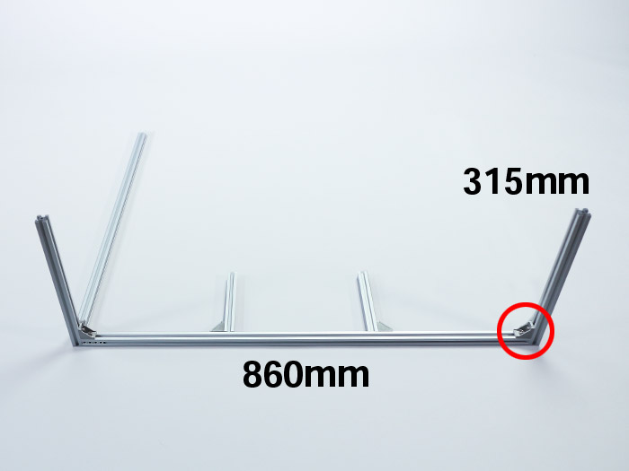

アルミフレーム20mm角 780mmを、M5Tナット2個とM5x8六角穴付ボルト2個と直角ブラケット1個で取り付けます。
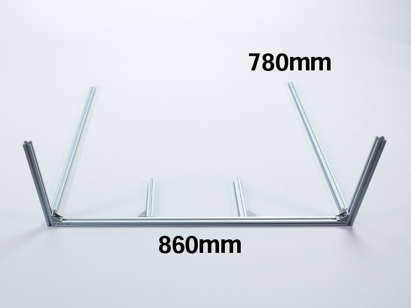
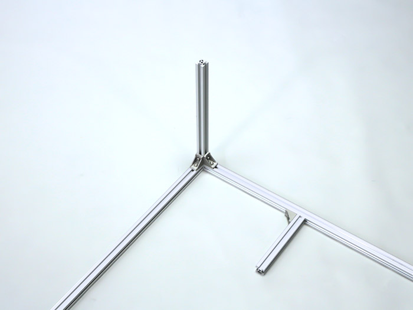

両側のアルミフレーム20mm角 780mmの内側にM5Tナットを1個ずつ挿入します。
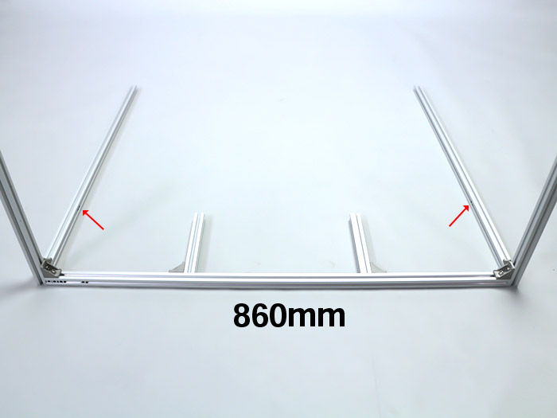

アルミフレーム20mm角 170mmの写真の位置にM5Tナットを1個ずつ挿入します。
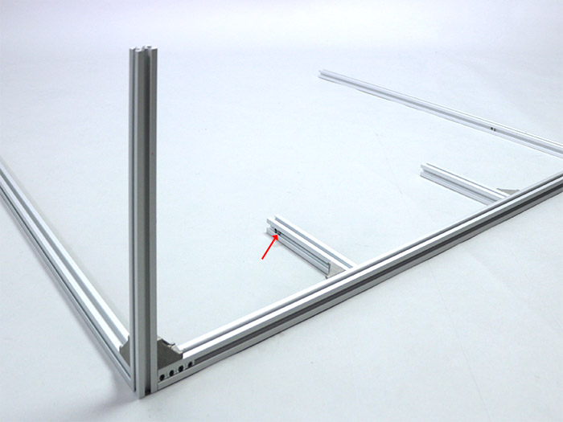
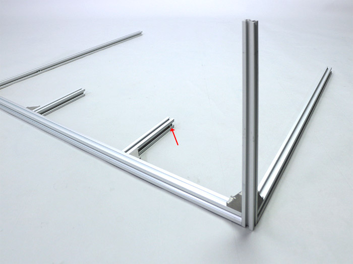

アルミフレーム20mm角 860mmにM5Tナット2個を挿入し、両端にM5Tナット2個とM5x8六角穴付ボルト2個で直角ブラケット2個を取り付けます。
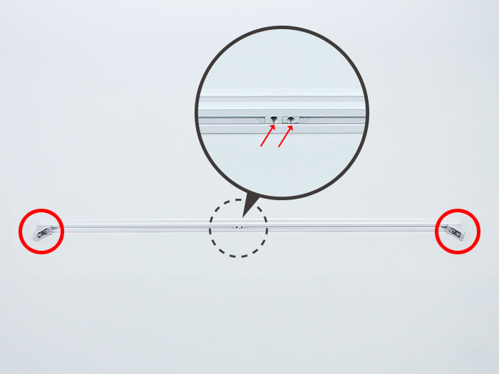

直角ブラケット2個を取り付けた裏側面に5個、上側面に1個M5Tナットを挿入します。
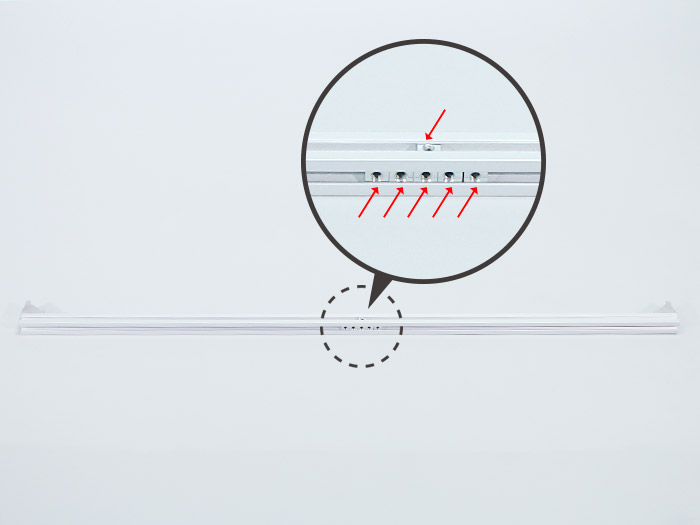

取り付けてある赤枠の直角ブラケット2個の面を手前、M5Tナット1個を入れた面を底面にして、アルミフレーム20mm角 860mmを取り付けます。
入れておいたM5Tナット6個と、M5x8六角穴付ボルト6個と直角ブラケット2個で取り付けて下さい。青丸の直角ブラケット2個は仮止めして下さい。
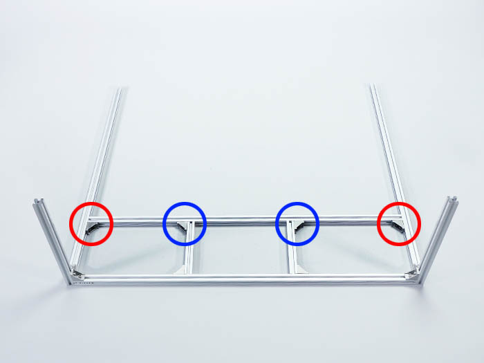

両側のアルミフレーム20mm角 780mmの内側にM5Tナットを1個ずつ挿入します。
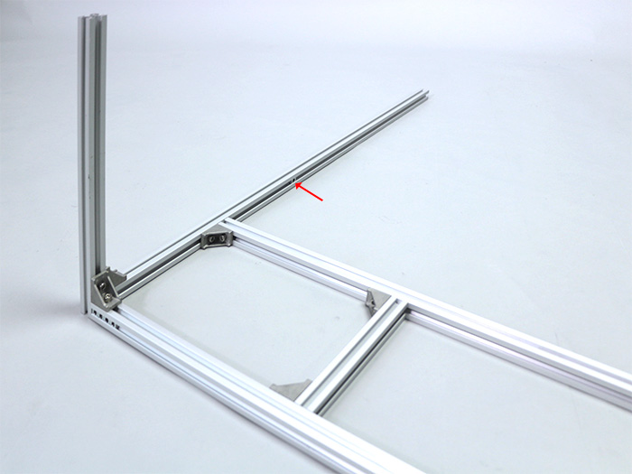
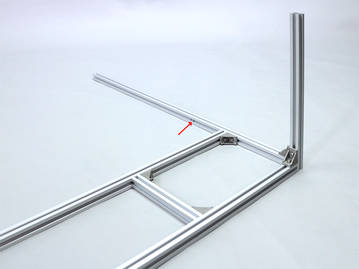

アルミフレーム20*40mm 860mmにM5Tナットを上3個、下3個の計6個挿入します。
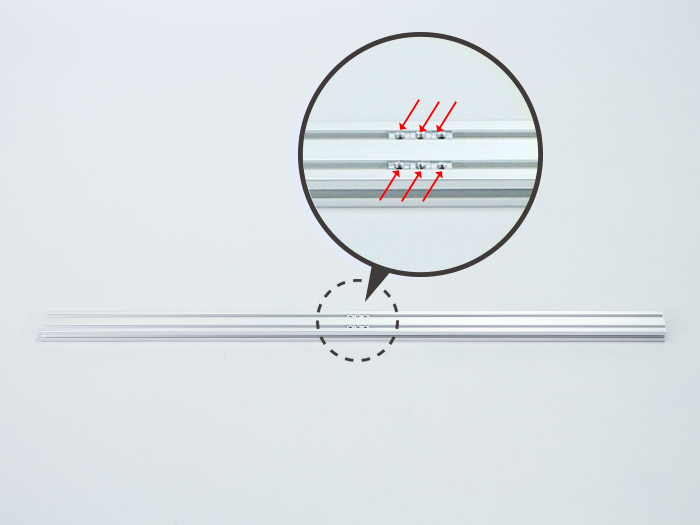

M5Tナットを挿入した裏側面に、M4先入れナットを4個（青色矢印）とM5Tナットを2個（赤色矢印）挿入します。
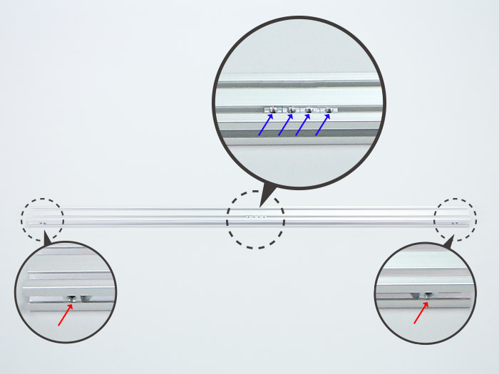

アルミフレーム20*40mm 860mmを、入れておいたM5Tナット4個とM5x8六角穴付ボルト4個と直角ブラケット2個で取り付けます。
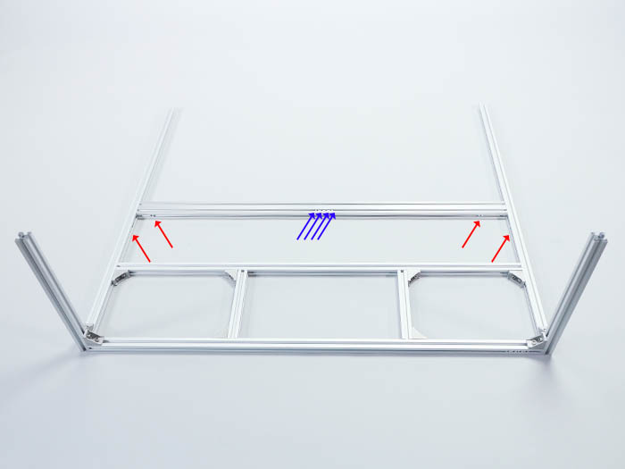
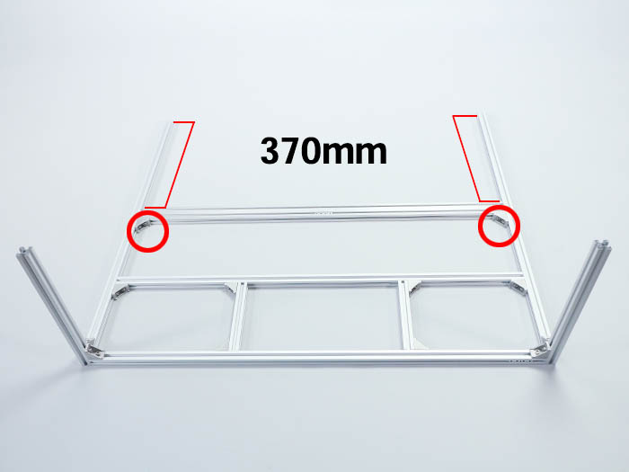

両側面のアルミフレーム20mm角 780mmの先端から370mmの位置に取り付けます。
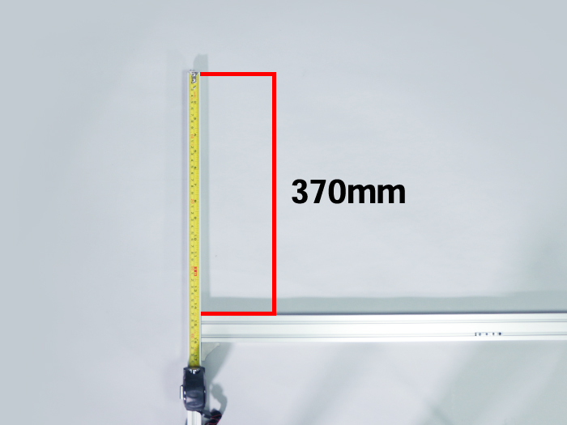
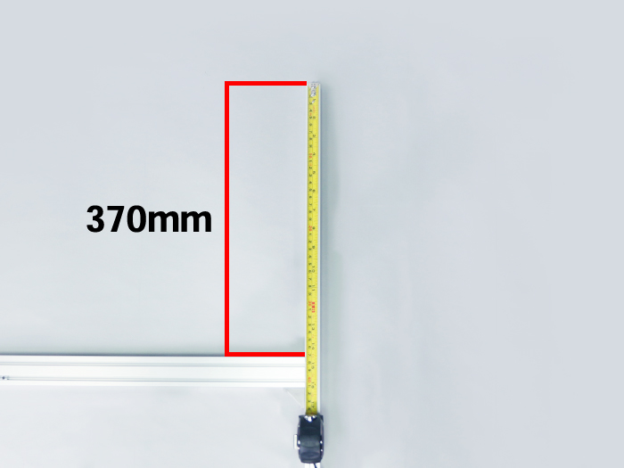