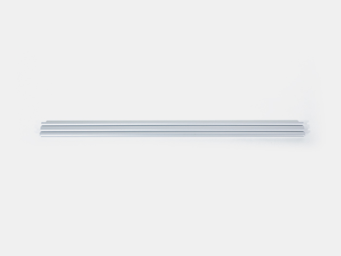
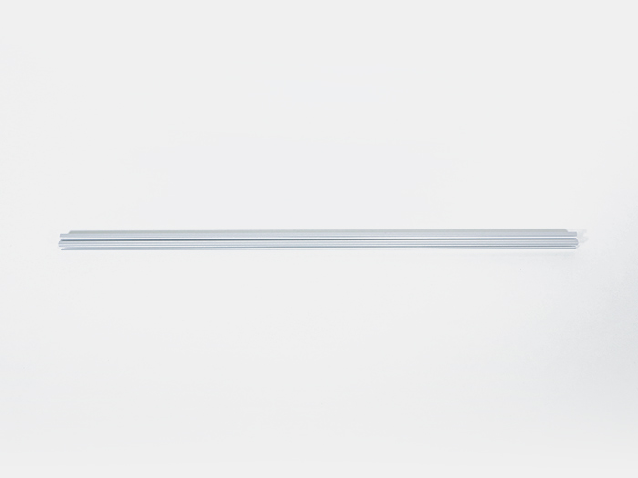
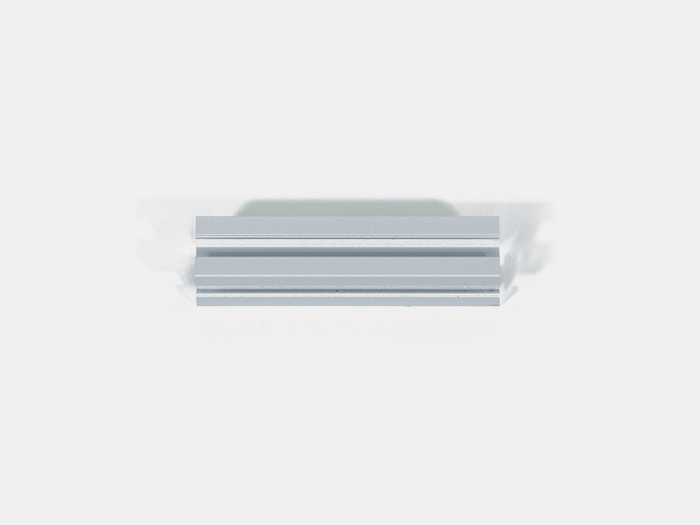
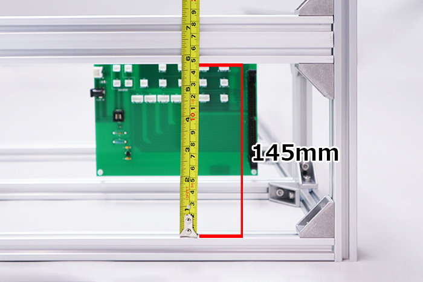
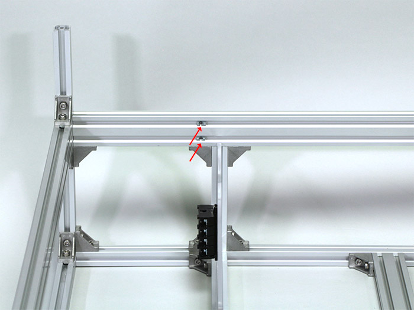
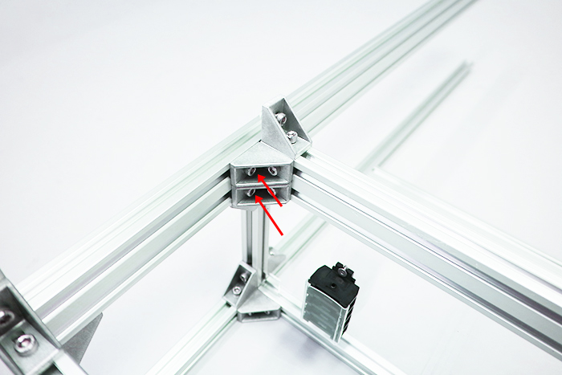
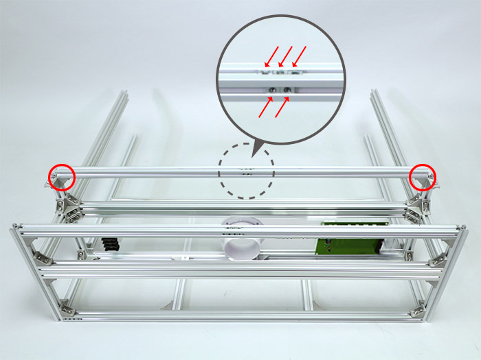

<table class="packing-list">
    <tbody>
        <tr>
            <td>No.</td>
            <td>部品名</td>
            <td>備考</td>
            <td class="packing-img">画像</td>
            <td>個数</td>
        </tr>
        <tr>
            <td>126</td>
            <td>Inner acrylic</td>
            <td>機器取付済み</td>
            <td></td>
            <td>1</td>
        </tr>
        <tr>
            <td>2</td>
            <td>V-slot 780mm</td>
            <td></td>
            <td></td>
            <td>2</td>
        </tr>
        <tr>
            <td>3</td>
            <td>アルミフレーム20*40mm 860mm</td>
            <td></td>
            <td></td>
            <td>2</td>
        </tr>
        <tr>
            <td>4</td>
            <td>アルミフレーム20mm角 860mm</td>
            <td></td>
            <td></td>
            <td>2</td>
        </tr>
        <tr>
            <td>6</td>
            <td>アルミフレーム20mm角 800mm</td>
            <td></td>
            <td></td>
            <td>2</td>
        </tr>
        <tr>
            <td>12</td>
            <td>アルミフレーム20mm角 145mm</td>
            <td></td>
            <td></td>
            <td>2</td>
        </tr>
        <tr>
            <td>13</td>
            <td>アルミフレーム20mm角 90mm</td>
            <td></td>
            <td></td>
            <td>2</td>
        </tr>
        <tr>
            <td>29</td>
            <td>直角ブラケット</td>
            <td></td>
            <td></td>
            <td>32</td>
        </tr>
        <tr>
            <td>30</td>
            <td>M5Tナット</td>
            <td></td>
            <td></td>
            <td>89</td>
        </tr>
        <tr>
            <td>31</td>
            <td>M5x8六角穴付ボルト</td>
            <td></td>
            <td></td>
            <td>64</td>
        </tr>
    </tbody>
</table>

## 工程手順

### Inner acrylic挿入

アルミフレーム20mm角 780mmに、アルミフレーム20mm角 145mmをM5Tナット4個とM5x8六角穴付ボルト4個と直角ブラケット2個で取り付けます。

アルミフレーム20mm角 145mmに写真の向きで、直角ブラケット2個をM5Tナット2個とM5x8六角穴付ボルト2個で取り付けます。後の工程で使用します。
取り付けた直角ブラケットに、M5Tナット2個とM5x8六角穴付ボルト2個を取り付けて下さい。

反対側も同様に、アルミフレーム20mm角 145mmをM5Tナット4個とM5x8六角穴付ボルト4個と直角ブラケット2個で取り付けます。

アルミフレーム20mm角 145mmに写真の向きで、直角ブラケット2個をM5Tナット2個とM5x8六角穴付ボルト2個で取り付けます。後の工程で使用します。
取り付けた直角ブラケットにM5Tナット2個とM5x8六角穴付ボルト2個を取り付けて下さい。

アルミフレーム20mm角 315mmに写真の向きで、直角ブラケット1個をM5Tナット1個とM5x8六角穴付ボルト1個で取り付けます。後の工程で使用します。
取り付けた直角ブラケットにM5Tナット1個とM5x8六角穴付ボルト1個を取り付けて下さい。

反対側も同様に、アルミフレーム20mm角 315mmに写真の向きで、直角ブラケット1個をM5Tナット1個とM5x8六角穴付ボルト1個で取り付けます。後の工程で使用します。
取り付けた直角ブラケットにM5Tナット1個とM5x8六角穴付ボルト1個を取り付けて下さい。

「[Inner acrylic機器取り付け](/manual/fabool-laser-co2-ver4-inner-acrylic-assembly/)」で組み立てたInner acrylicを、アルミフレーム20mm角 145mmの溝にはめ込みます。取り付ける向きに注意してください。

V-slot 780mmを取り付けます。取り付けておいた直角ブラケットのM5Tナットに通して取り付けて下さい。

V-slot 780mmの底面から本体フレーム下段天面までの距離が145mmになるように、直角ブラケットの位置を調整して水平にして下さい。

反対側も同様に、V-slot 780mmを取り付けておいた直角ブラケットのM5Tナットに通して取り付けて下さい。

V-slot 780mmの底面から本体フレーム下段天面までの距離が145mmになるように、直角ブラケットの位置を調整して水平にして下さい。

### 背面部分組み立て
写真を参考にアルミフレーム 20*40mm 860mmにM5 Tナットを手前側の溝に5個入れます。
アルミフレーム 20*40mm 860mm両端の上下に直角ブラケット4個をM5Tナット4個とM5x8六角穴付ボルト4個で取り付けます。
取り付けた直角ブラケットにM5Tナット4個とM5x8六角穴付ボルト4個を取り付けて下さい。

写真を参考に本体フレームに取り付けます。取り付け向きは、前工程で入れたM5Tナットは写真裏側上部の溝に入っているように取り付けて下さい。

アルミフレーム 20*40mm 860mmの底面から本体フレーム下段天面までの距離が145mmになるように、直角ブラケットの位置を調整して水平にして下さい。

アルミフレーム 20*40mm 860mmの両端に、合計6個の直角ブラケットをM5Tナット6個とM5x8六角穴付ボルト6個で取り付けます。

アルミフレーム20*40mm 860mmの向きを変えて、下側の溝にM5Tナットを3個入れます。

V-slot 780mmの写真の位置にM5 Tナットを1個ずつ（合計4個）入れて下さい。

前工程にて6個のブラケットを取り付けたアルミフレーム20mm*40mm 860mmを、Inner acrylicの上部に取り付けます。写真の向きで取り付けて下さい。
※Inner acrylicがアルミフレーム20mm*40mm 860mmの溝にはまるように差し込んでください。

前工程で入れたM5Tナットを使用して、M5x8六角穴付ボルト4個で取り付けます。

写真を参考に、アルミフレーム20mm*40mm 860mm同士の距離が170mmに調整して下さい。
※ずれている場合はM5x8六角穴付ボルトを緩めて調整して再度固定して下さい。

V-slot 780mmに直角ブラケット1個をM5Tナット1個とM5x8六角穴付ボルト1個で取り付けます。

反対側にも同じく、V-slot 780mmに直角ブラケット1個をM5Tナット1個とM5x8六角穴付ボルト1個で取り付けます。

取り付けた直角ブラケットに、アルミフレーム20mm角 90mmをM5Tナット2個とM5x8六角穴付ボルト2個で取り付けます。

アルミフレーム20mm角 90mmに直角ブラケット2個をM5Tナット2個とM5x8六角穴付ボルト2個で取り付けます。

反対側も同様に、アルミフレーム20mm角 90mmをM5Tナット2個とM5x8六角穴付ボルト2個で取り付けます。

アルミフレーム20mm角 90mmに直角ブラケット2個をM5Tナット2個とM5x8六角穴付ボルト2個で取り付けます。

写真を参考にアルミフレーム20mm角 860mmにM5Tナットを合計7個入れます。両端底面に直角ブラケット2個をM5Tナット2個とM5x8六角穴付ボルト2個で取り付けてください。

写真の位置にM5Tナット2個とM5x8六角穴付ボルト2個で取り付けます。

アルミフレーム20mm角 860mmにM5Tナットを入れます。正面に2個・背面に7個・天面に3個・底面に2個入れます。合計14個入ります。

前工程で合計14個のM5Tナットを入れたアルミフレーム20mm角 860mmを写真を参考に取り付けます。取付向きは写真のM5Tナットの個数を参考にして下さい。
底面に入れているM5Tナット2個を使ってM5x8六角穴付ボルト2個で取り付けます。

アルミフレーム20mm角 800mmを取り付けておいた直角ブラケットを使用して、直角ブラケット1個とM5Tナット3個M5x8六角穴付ボルト3個で取り付けます。

写真の位置に、入れておいたM5Tナットと、アルミフレーム20mm角 800mmの内側面にM5Tナット1個を入れて、直角ブラケット1個とM5x8六角穴付ボルト2個で取り付けます。

反対側も同様に、アルミフレーム20mm角 800mmを取り付けておいた直角ブラケットを使用して、直角ブラケット1個とM5Tナット3個M5x8六角穴付ボルト3個で取り付けます。

写真の位置に入れておいたM5Tナットと、アルミフレーム20mm角 800mmの内側面にM5Tナット1個を入れて、直角ブラケット1個とM5x8六角穴付ボルト2個で取り付けます。

アルミフレーム20mm角 860mm同士の距離が170mmに調整して下さい。
※ずれている場合はM5x8六角穴付ボルトを緩めて調整して再度固定して下さい。

反対側も同様に、アルミフレーム20mm角 860mm同士の距離が170mmに調整して下さい。
※ずれている場合はM5x8六角穴付ボルトを緩めて調整して再度固定して下さい。

