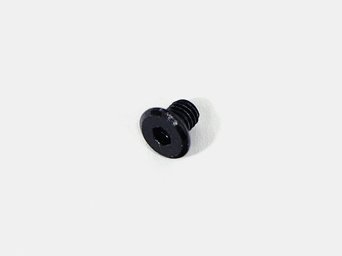
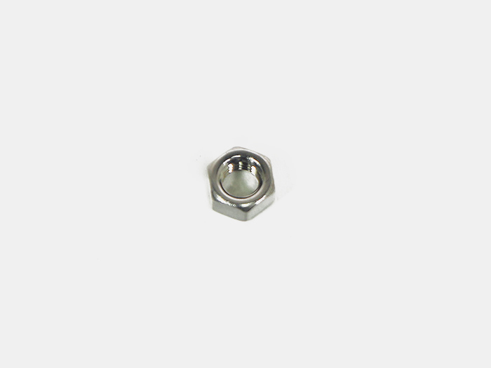

<table class="packing-list">
    <tbody>
        <tr>
            <td>No.</td>
            <td>部品名</td>
            <td>備考</td>
            <td class="packing-img">画像</td>
            <td>個数</td>
        </tr>
        <tr>
            <td>118</td>
            <td>Cover bottom</td>
            <td></td>
            <td></td>
            <td>1</td>
        </tr>
        <tr>
            <td>119</td>
            <td>Cover bottom back</td>
            <td></td>
            <td></td>
            <td>1</td>
        </tr>
        <tr>
            <td>60</td>
            <td>ゴム足</td>
            <td></td>
            <td></td>
            <td>4</td>
        </tr>
        <tr>
            <td>84</td>
            <td>M5x6低頭ボルト</td>
            <td></td>
            <td></td>
            <td>13</td>
        </tr>
        <tr>
            <td>107</td>
            <td>M5x20六角穴付ボルト</td>
            <td></td>
            <td></td>
            <td>4</td>
        </tr>
        <tr>
            <td>116</td>
            <td>M5ナット</td>
            <td></td>
            <td></td>
            <td>4</td>
        </tr>
    </tbody>
</table>

## 工程手順

### ゴム足取り付け
Cover bottomとCover bottom backに各2個ずつゴム足を取り付けます。

M5×20六角穴付ボルト4個を通して反対側にM5ナット4個を取り付けます。

### Cover bottom取り付け
本体を裏返します。

Cover bottomとCover bottom backを載せて、あらかじめ挿入しておいたM5Tナットの位置を調整後、M5x6低頭ボルト13個で取り付けます。

