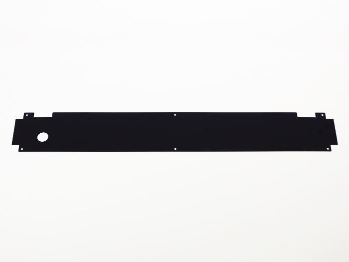
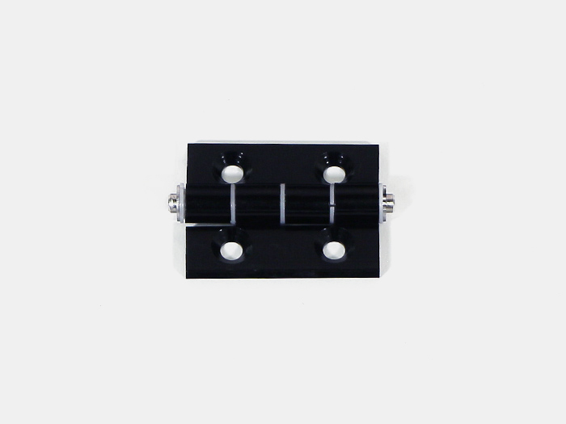
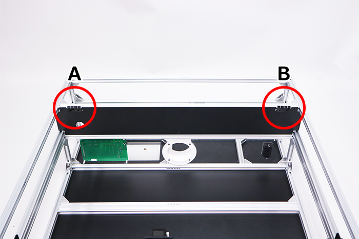

<table class="packing-list">
    <tbody>
        <tr>
            <td>No.</td>
            <td>部品名</td>
            <td>備考</td>
            <td class="packing-img">画像</td>
            <td>個数</td>
        </tr>
        <tr>
            <td>120</td>
            <td>Inner cover</td>
            <td></td>
            <td></td>
            <td>1</td>
        </tr>
        <tr>
            <td>49</td>
            <td>蝶番</td>
            <td></td>
            <td></td>
            <td>2</td>
        </tr>
        <tr>
            <td>84</td>
            <td>M5x6低頭ボルト</td>
            <td></td>
            <td></td>
            <td>6</td>
        </tr>
        <tr>
            <td>104</td>
            <td>M5x8六角穴付皿ボルト</td>
            <td></td>
            <td></td>
            <td>4</td>
        </tr>
    </tbody>
</table>

## 工程手順

### Inner cover取り付け
Inner coverを取り付け位置に合わせます。

あらかじめ入れておいたM5Tナットを、左右2個ずつInner coverの切りかけ部分から見えるように位置を調整して下さい。

あらかじめ入れておいたM5TナットとM5×6低頭ボルト6個で取り付けます。

### 蝶番取り付け
左右に蝶番2個をM5x8六角穴付皿ボルト4個で取り付けます。

