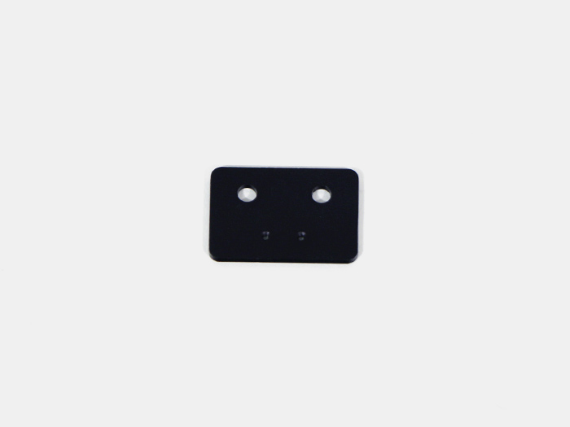
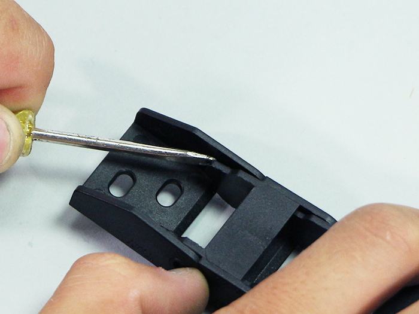
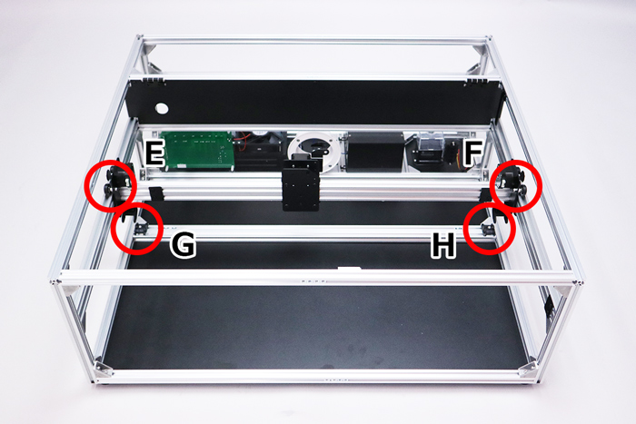

<table class="packing-list">
    <tbody>
        <tr>
            <td>No.</td>
            <td>部品名</td>
            <td>備考</td>
            <td class="packing-img">画像</td>
            <td>個数</td>
        </tr>
        <tr>
            <td>54</td>
            <td>キャリアマウントX軸</td>
            <td>アルミ加工部品</td>
            <td></td>
            <td>2</td>
        </tr>
        <tr>
            <td>55</td>
            <td>キャリアマウントY軸</td>
            <td>アルミ加工部品</td>
            <td></td>
            <td>2</td>
        </tr>
        <tr>
            <td>53</td>
            <td>リミットマウント</td>
            <td>アルミ加工部品</td>
            <td></td>
            <td>3</td>
        </tr>
        <tr>
            <td>52</td>
            <td>リミットマウントy1</td>
            <td>アルミ加工部品</td>
            <td></td>
            <td>1</td>
        </tr>
        <tr>
            <td>23</td>
            <td>ケーブルキャリアx軸</td>
            <td></td>
            <td></td>
            <td>1</td>
        </tr>
        <tr>
            <td>24</td>
            <td>ケーブルキャリアy軸</td>
            <td></td>
            <td></td>
            <td>2</td>
        </tr>
        <tr>
            <td>84</td>
            <td>M5x6低頭ボルト</td>
            <td></td>
            <td></td>
            <td>16</td>
        </tr>
        <tr>
            <td>102</td>
            <td>M4x10六角穴付皿ボルト</td>
            <td></td>
            <td></td>
            <td>12</td>
        </tr>
        <tr>
            <td>114</td>
            <td>M4ナット</td>
            <td></td>
            <td></td>
            <td>4</td>
        </tr>
    </tbody>
</table>

## 工程手順

### リミットマウント 取り付け

V-slot 848mm正面側に、リミットマウント2個をM5x6低頭ボルト4個と、あらかじめ挿入しておいたM5Tナット4個で取り付けます。M5Tナット1個を左側に残しておきます。

リミットマウントには取り付ける向きがあるので注意して下さい。リミットマウントの位置は後ほど調整しますので写真で示した付近に取り付けて下さい。

本体左側中段のV-slot 780mmに、リミットマウントをM5x6低頭ボルト2個とあらかじめ挿入しておいたM5Tナット2個で取り付けます。リミットマウントには取り付ける向きがあるので注意して下さい。

本体左側上段のアルミフレーム20mm角 800mm左側に、リミットマウント y1をM5x6低頭ボルト2個と、あらかじめ挿入しておいたM5Tナット2個で取り付けます。

### ケーブルキャリア取り付けブラケット 取り外し
ケーブルキャリア x軸とケーブルキャリアy軸の両端についているケーブルキャリア取り付けブラケットを取り外します。マイナスドライバーを使用すると簡単に取り外せます。

マイナスドライバーを使用する際は怪我に十分注意して作業を行なって下さい。

ケーブルキャリア取り付けブラケットにはオス、メスがありますので注意して下さい。

### キャリアーマウントX軸 取り付け
ホイールプレートX軸にキャリア-マウントX軸をM5x6低頭ボルト2個で取り付けます。

V-slot 848mm背面側に、キャリア-マウントX軸をM5x6低頭ボルト2個とあらかじめ挿入しておいたM5Tナット2個で取り付けます。キャリア―マウントX軸は本体中央に取り付けて下さい。

ケーブルキャリア x軸取り付けブラケットのメスを、M4x10六角穴付皿ボルト2個とM4ナット2個で取り付けます。

ケーブルキャリア x軸取り付けブラケットのオスを、M4x10六角穴付皿ボルト2個とM4ナット2個で取り付けます。

### キャリアーマウントY軸 取り付け
キャリア-マウントY軸に、ケーブルキャリア y軸取り付けブラケットのメスをM4x10六角穴付皿ボルト2個で取り付けます。

左右対称になるように2セット組み立てます。

ホイールプレートY軸にキャリア―マウントY軸をM5x6低頭ボルト2個で取り付けます。取付向きは写真を参考にしてください。

反対側も同様に、キャリア―マウントY軸をM5x6低頭ボルト2個で取り付けます。取付向きは写真を参考にしてください。

ケーブルキャリア y軸取り付けブラケットのオスをアルミフレーム20*40mm 860mmにあらかじめ挿入しておいたM4先入れナット2個とM4x10六角穴付皿ボルト2個で取り付けます。

上下のケーブルキャリア取付ブラケットが上から見て直線状になるように位置を調整して取り付けてください。

ケーブルキャリア y軸取り付けブラケットのオスをアルミフレーム20*40mm 860mmにあらかじめ挿入しておいたM4先入れナット2個とM4x10六角穴付皿ボルト2個で取り付けます。

上下のケーブルキャリア取付ブラケットが上から見て直線状になるように位置を調整して取り付けてください。

