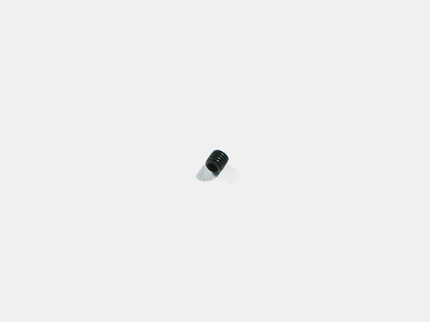

<table class="packing-list">
    <tbody>
        <tr>
            <td>部品名</td>
            <td>備考</td>
            <td class="packing-img">画像</td>
            <td>個数</td>
        </tr>
        <tr>
            <td>タイミングプーリー</td>
            <td></td>
            <td></td>
            <td>2</td>
        </tr>
        <tr>
            <td>M3イモネジ</td>
            <td></td>
            <td></td>
            <td>4</td>
        </tr>
        <tr>
            <td>タイミングベルト</td>
            <td>1500mm</td>
            <td></td>
            <td>2</td>
        </tr>
        <tr>
            <td>M5後入ナット</td>
            <td></td>
            <td></td>
            <td>6</td>
        </tr>
        <tr>
            <td>M5x8 六角穴付ボルト</td>
            <td></td>
            <td></td>
            <td>6</td>
        </tr>
    </tbody>
</table>

## 工程手順

### タイミングプーリー 取り付け
ホイールプレートY軸に、タイミングプーリー2個をイモネジ4個で取り付けます。どちらか片方のネジ穴を、ステッピングモーターのシャフト切りかけ部分に合わせて取り付けて下さい。

### タイミングベルト取り付け

    <iframe width="560" height="315" src="https://www.youtube.com/embed/O227nCrA0uE" frameborder="0" allow="accelerometer; autoplay; encrypted-media; gyroscope; picture-in-picture" allowfullscreen></iframe>

タイミングベルトを900mmに切ります。
V-slot にタイミングベルト900mmを、M5後入ナット2個とM5x8六角穴付ボルト2個で取り付けます。タイミングベルトは凹凸がある面をタイミングプーリーの歯に合うように取り付けて下さい。

タイミングベルトを1500mmから650mm2本を切り出してください。
V-slot にY軸タイミングベルト650mmを、M5後入ナット2個とM5x8六角穴付ボルト2個で取り付けます。タイミングベルトは凹凸がある面をタイミングプーリーの歯に合うように取り付けて下さい。

反対側も同様にタイミングベルトを取り付けます。
NG写真のように緩んでいる場合は、正常に動作しない場合があります。
イモネジを緩め、タイミングプーリーの位置を調整してください。

