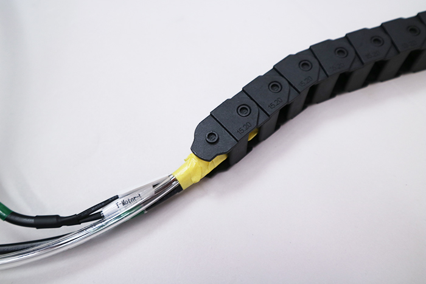
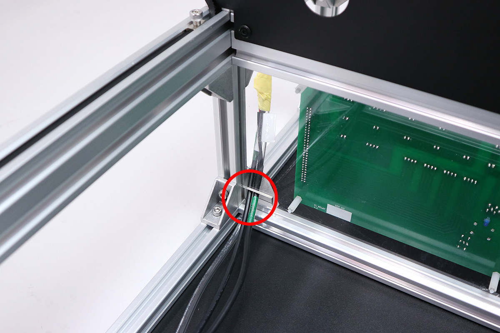
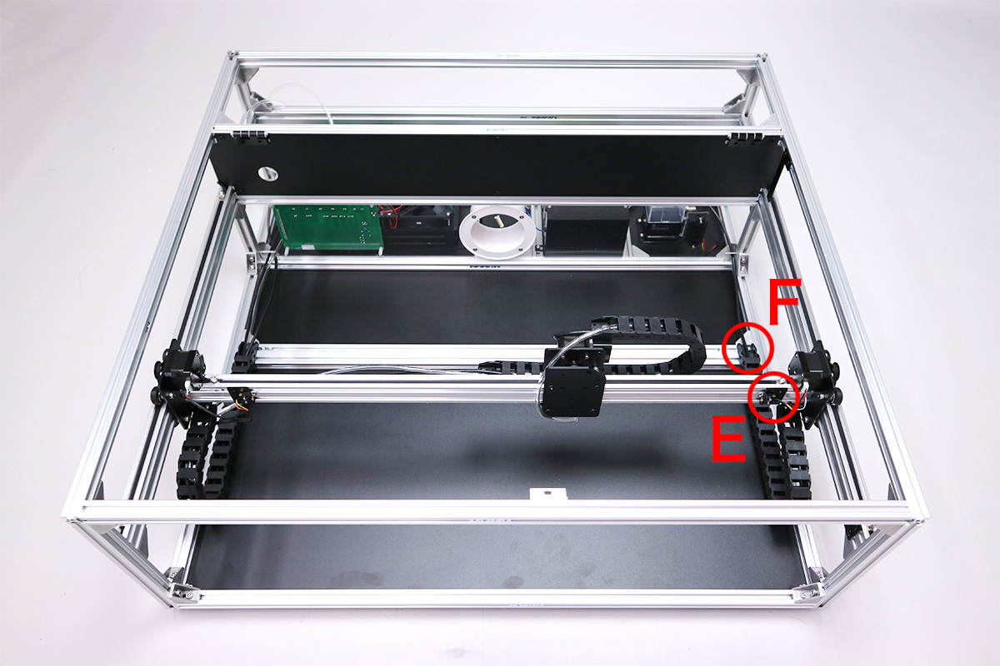

<table class="packing-list">
    <tbody>
        <tr>
            <td>部品名</td>
            <td>備考</td>
            <td class="packing-img">画像</td>
            <td>個数</td>
        </tr>
        <tr>
            <td>ケーブルキャリアx軸</td>
            <td></td>
            <td></td>
            <td>1</td>
        </tr>
        <tr>
            <td>ケーブルキャリアy軸</td>
            <td>取付ブラケット含む</td>
            <td></td>
            <td>2</td>
        </tr>
        <tr>
            <td>ポリウレタンチューブ</td>
            <td></td>
            <td></td>
            <td>1</td>
        </tr>
        <tr>
            <td>X-Motorケーブル</td>
            <td></td>
            <td></td>
            <td>1</td>
        </tr>
        <tr>
            <td>Y-Motor-Lケーブル</td>
            <td></td>
            <td></td>
            <td>1</td>
        </tr>
        <tr>
            <td>Y-Motor-Rケーブル</td>
            <td></td>
            <td></td>
            <td>1</td>
        </tr>
        <tr>
            <td>M2x8六角穴付ボルト</td>
            <td></td>
            <td></td>
            <td>4</td>
        </tr>
        <tr>
            <td>pointerケーブル</td>
            <td>[オプション品]位置決めキット</td>
            <td></td>
            <td>1</td>
        </tr>
        </tbody>
        </table>

## 工程手順

### ケーブルキャリア配線
ポリウレタンチューブとX-Motorケーブルを、ケーブルキャリアに通しやすくするためにテープ等でまとめます。
※オプション品の位置決めキットをお持ちの方は、pointerケーブルを一緒にまとめます。
ケーブルには取り付ける向きがあるので注意して下さい。

ケーブルキャリアx軸のオス側から通します。

ポリウレタンチューブとX-Motorケーブルと[オプション品]Pointerケーブルに、Y-Motor-Lケーブルをテープ等でまとめます。Y-Motor-Lケーブルには取り付ける向きがあるので注意して下さい。

ケーブルキャリアy軸のオス側から通します。

A~Dの順にケーブルキャリアを取り付けます。

ポリウレタンチューブと[オプション品]Pointerケーブルは写真のようにケーブルキャリアx軸から約380mm出してください。

X軸のステッピングモーターにX-Motorケーブルのコネクタを取り付けます。

Y軸LのステッピングモーターにY-Motor-Lケーブルのコネクタを取り付けます。 リミットマウントにY-Motor-LケーブルのスイッチをM2x8六角穴付ボルト2個で取り付けます。

Y-Motor-Rケーブルをケーブルキャリアy軸のオス側から通します。

E・Fの順にケーブルキャリアY軸を取り付けます。Y-Motor-Rケーブルには取り付ける向きがあるので注意して下さい。

Y軸RのステッピングモーターにY-Motor-Rケーブルのコネクタを取り付けます。リミットマウントにYーMotor-RケーブルのスイッチをM2x8六角穴付ボルト2個で取り付けます。

