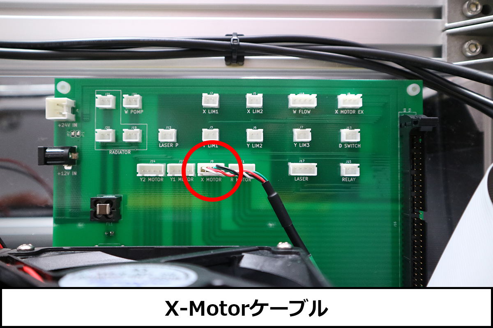
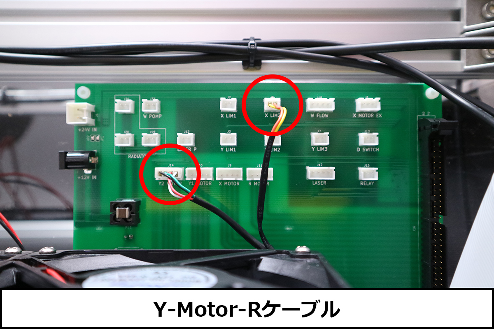
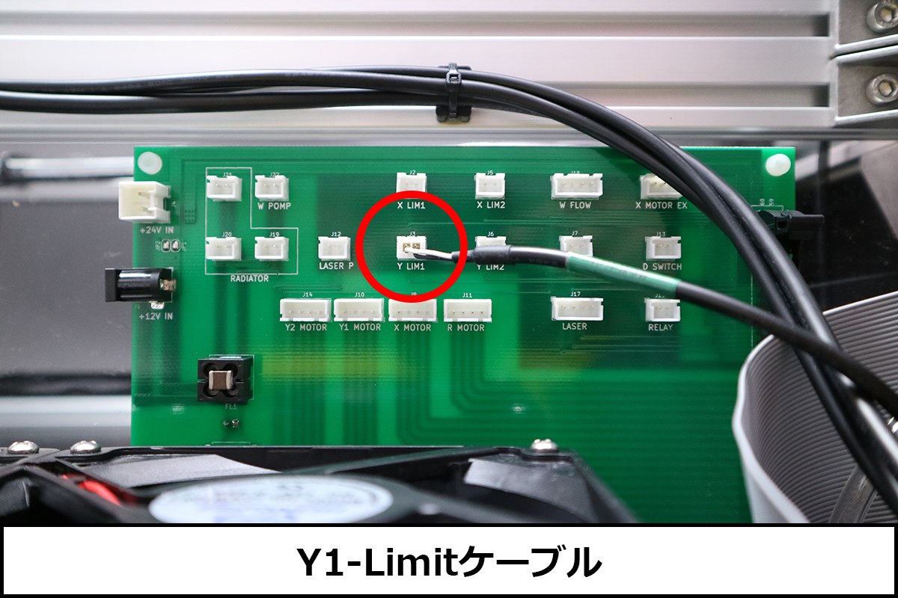
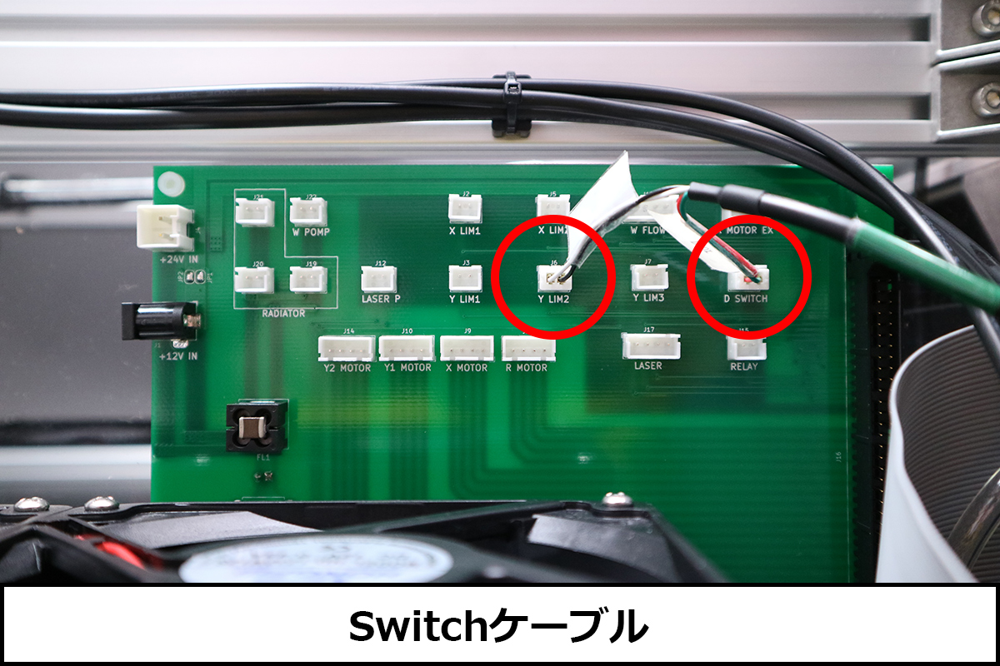
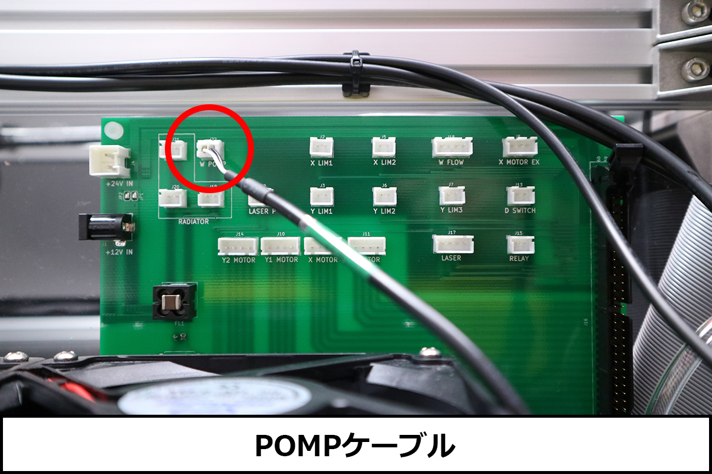
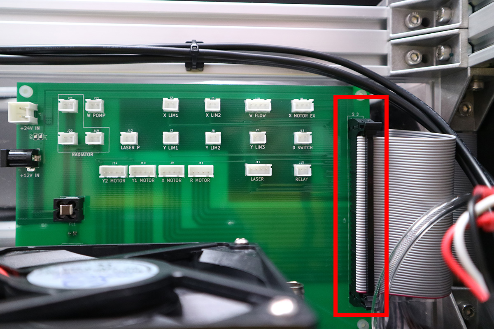

<table class="packing-list">
    <tbody>
        <tr>
            <td>部品名</td>
            <td>備考</td>
            <td class="packing-img">画像</td>
            <td>個数</td>
        </tr>
        <tr>
            <td>フローセンサー</td>
            <td></td>
            <td></td>
            <td>1</td>
        </tr>
        <tr>
            <td>Laserケーブル</td>
            <td></td>
            <td></td>
            <td>1</td>
        </tr>
        <tr>
            <td>Pumpケーブル</td>
            <td></td>
            <td></td>
            <td>1</td>
        </tr>
        <tr>
            <td>結束バンド</td>
            <td></td>
            <td></td>
            <td>5</td>
        </tr>
    </tbody>
</table>

## 工程手順

レーザー電源にLaserケーブルを接続します。

Pumpケーブルを水冷ポンプに取り付けます。

取り付けてある結束バンド固定具に、以下の通りに結束バンドで固定して下さい。

<左側>
- Y-Motor-Rケーブル
- Pumpケーブル

<右側>
- Y-Motor-Rケーブル
- Pumpケーブル
- Laserケーブル

取り付けてある結束バンド固定具に、以下の通りに結束バンドで固定して下さい。
- Y-Motor-Rケーブル
- Pumpケーブル
- Laserケーブル

写真を参考に配線を行います。[ケーブルキャリア取り付け](/manual/fabool-laser-co2-ver4-cable-carrier/)でまとめておいたケーブルをほどいてください。
X-Motorケーブルは、「X MOTOR」へ差し込んでください。

Y-Motor-Rケーブルは、「Y2 MOTOR」と「X LIM2」へ差し込んでください。

Y-Motor-Lケーブルは、「Y1 MOTOR」と「X LIM1」へ差し込んでください。

ラジエーターケーブルは、「RADIATORE」（J20 / J21）へ差し込んでください。ケーブルはどちらに差し込んでも構いません。

フローセンサーは、「W FLOW」へ差し込んでください。

Laserケーブルは、「LASER」へ差し込んでください。

Y1-Limitケーブルは、「Y LIM1」へ差し込んでください。

Switchケーブルは、「D SWITCH」と「Y LIMIT2」へ差し込んでください。

Pumpケーブルは、「W POMP」へ差し込んでください。

RELAYケーブルを差し込んでください。

※オプションの「CO2レーザー加工機用位置決めキット」をご購入の方
Pointerケーブルは、「LASER P」へ差し込んでください。

