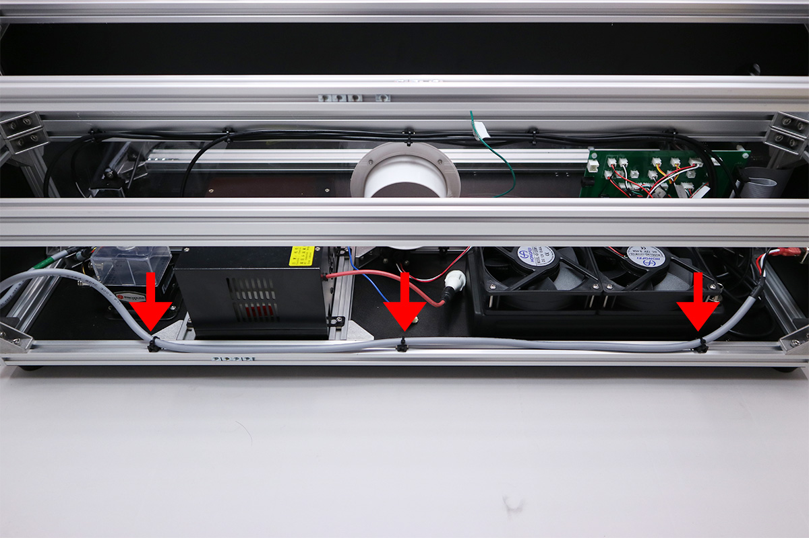
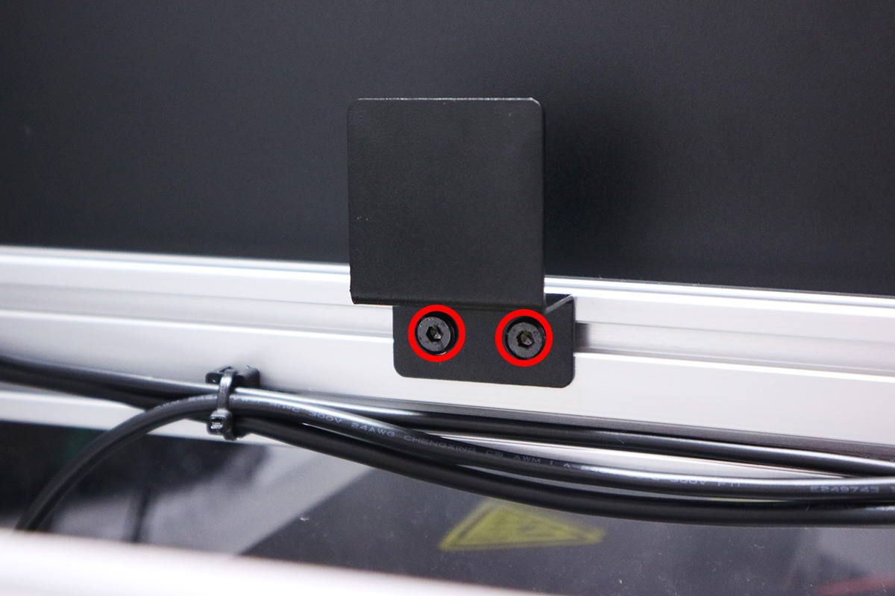

<table class="packing-list">
    <tbody>
        <tr>
            <td>部品名</td>
            <td>備考</td>
            <td class="packing-img">画像</td>
            <td>個数</td>
        </tr>
        <tr>
            <td>AC-Laserケーブル</td>
            <td></td>
            <td></td>
            <td>1</td>
        </tr>
        <tr>
            <td>AC-DCケーブル</td>
            <td></td>
            <td></td>
            <td>1</td>
        </tr>
        <tr>
            <td>Ground(S)ケーブル</td>
            <td></td>
            <td></td>
            <td>1</td>
        </tr>
        <tr>
            <td>ACアダプタ</td>
            <td></td>
            <td></td>
            <td>1</td>
        </tr>
        <tr>
            <td>アダプタマウント</td>
            <td></td>
            <td></td>
            <td>1</td>
        </tr>
        <tr>
            <td>結束バンド</td>
            <td></td>
            <td></td>
            <td>4</td>
        </tr>
        <tr>
            <td>M5後入ナット</td>
            <td></td>
            <td></td>
            <td>1</td>
        </tr>
        <tr>
            <td>M5ワッシャー</td>
            <td></td>
            <td></td>
            <td>1</td>
        </tr>
        <tr>
            <td>歯付きワッシャー</td>
            <td></td>
            <td></td>
            <td>1</td>
        </tr>
        <tr>
            <td>M5x8 六角穴付ボルト</td>
            <td></td>
            <td></td>
            <td>1</td>
        </tr>
    </tbody>
</table>

## 工程手順

写真を参考に、取り付けた結束バンド固定具にAC-Mainケーブルを結束バンドで固定します。

レーザー電源にAC-Laserケーブルを接続します。

写真の通りに端子台に各ケーブルを取り付けます。線の色を参考にして下さい。
※こちらの配線が間違えていた場合、通電時に本体が破損する可能性があります。

Ground-Sケーブルを写真の順番で本体に取り付けます。
- M5x8六角穴付ボルト
- Ground-Sケーブル
- M5ワッシャー
- 歯付ワッシャー
- M5後入ナット

※アルミフレームに傷がつくように取り付けてください。

写真を参考に、アダプタマウントをあらかじめ挿入しておいたM5Tナット2個とM5x6低頭ボルト2個で取り付けます。

ACアダプタを取り付け、AC-CabelをACアダプタに差し込んでください。

ACアダプタの端子を中継基板の「+12V IN」へ差し込んでください。

ACアダプタのケーブルをあらかじめ取り付けておいた結束バンド固定具に結束バンドで固定します。

