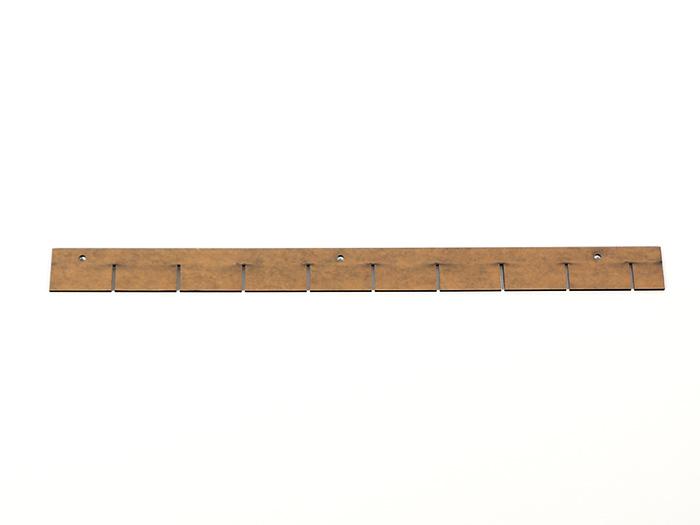
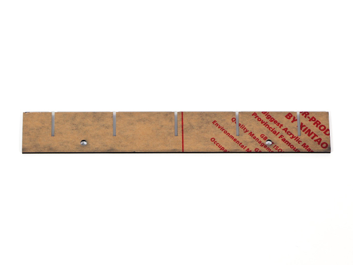
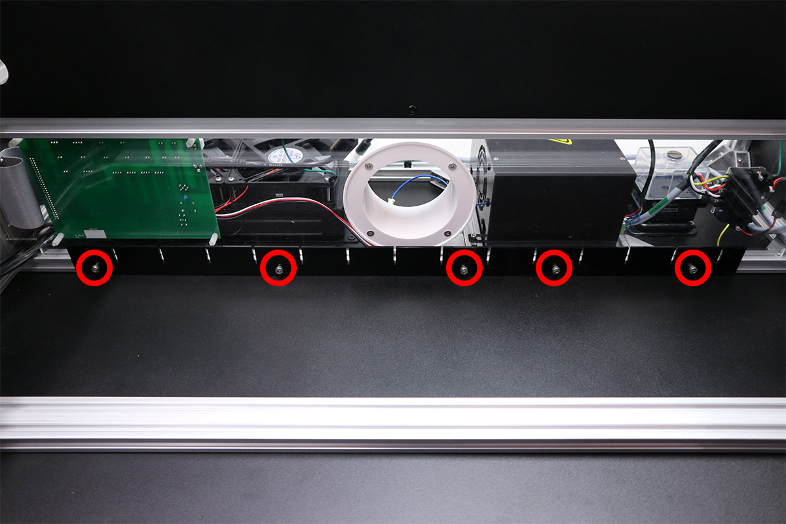
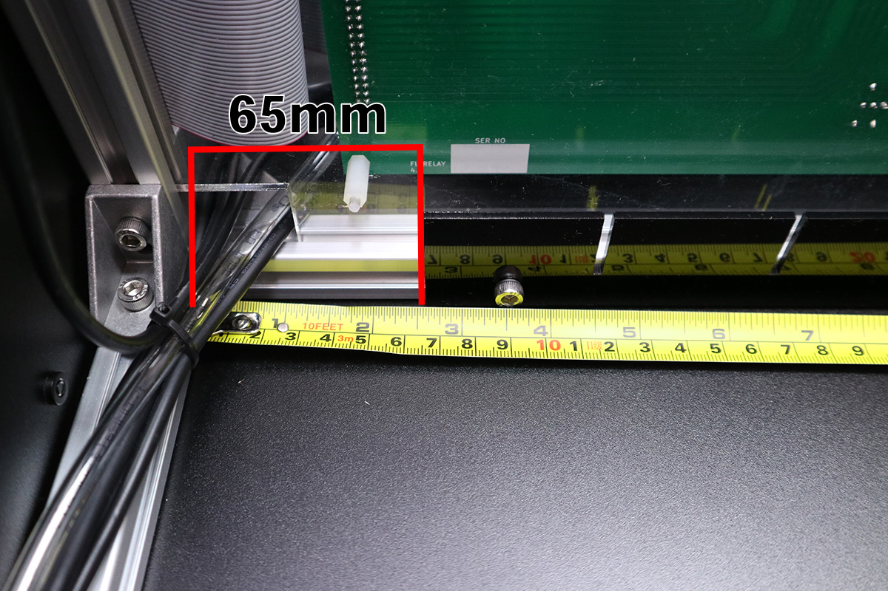
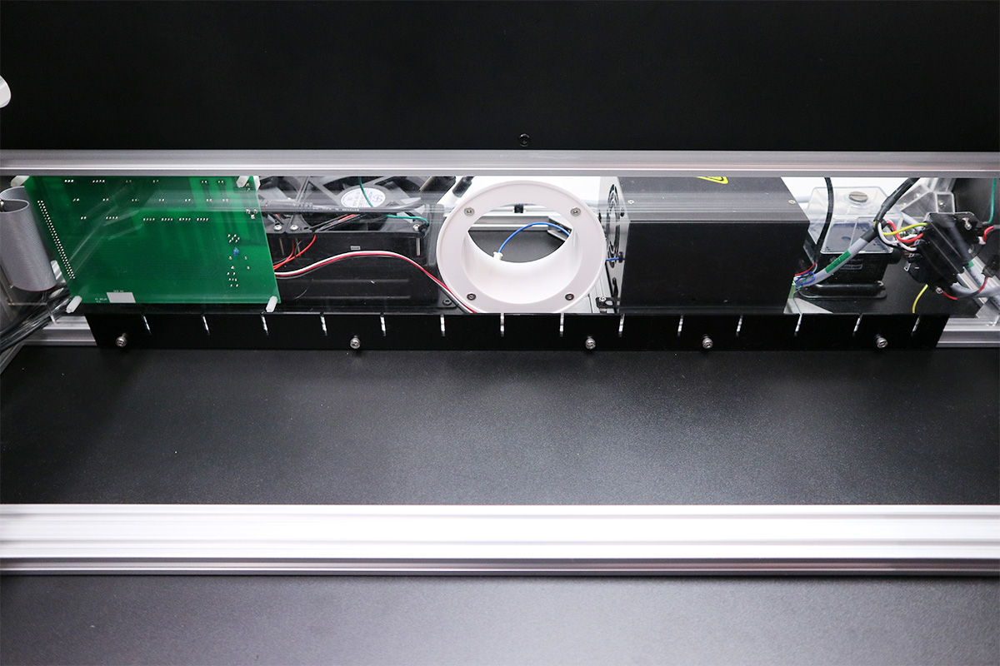
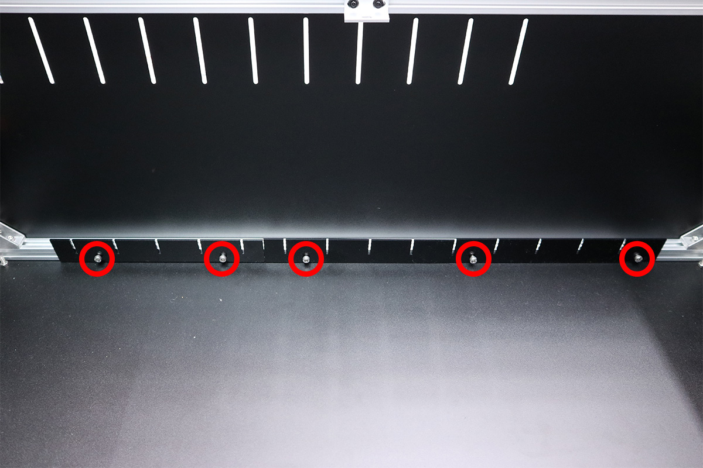
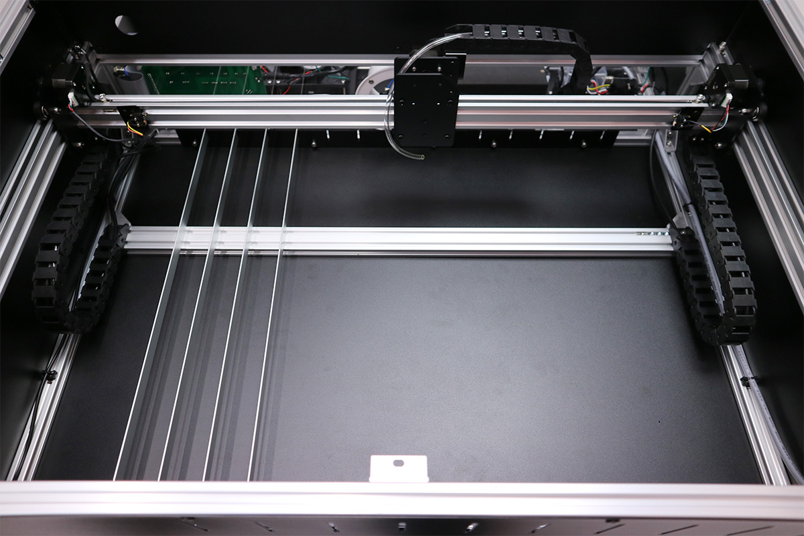
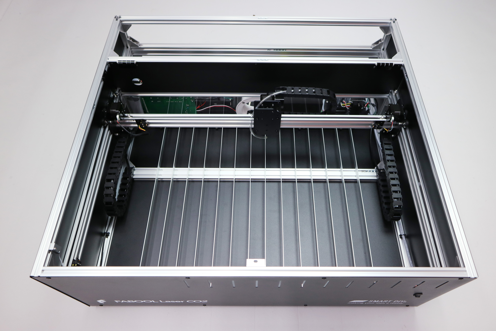

<table class="packing-list">
    <tbody>
        <tr>
            <td>No.</td>
            <td>部品名</td>
            <td>備考</td>
            <td class="packing-img">画像</td>
            <td>個数</td>
        </tr>
        <tr>
            <td>128</td>
            <td>bed long</td>
            <td></td>
            <td></td>
            <td>2</td>
        </tr>
        <tr>
            <td>129</td>
            <td>bed short</td>
            <td></td>
            <td></td>
            <td>2</td>
        </tr>
        <tr>
            <td>31</td>
            <td>M5x8 六角穴付ボルト</td>
            <td></td>
            <td></td>
            <td>10</td>
        </tr>
        <tr>
            <td>14</td>
            <td>フラットバー</td>
            <td></td>
            <td></td>
            <td>14</td>
        </tr>
    </tbody>
</table>

## 工程手順

### 加工ベッド取り付け
bed longとbed shortをM5x8六角穴付ボルト5個で取り付けます。
写真を参考に、bed longを本体左側から65mmの位置に取り付けます。

bed longにくっつけるようにbed shortを取り付けます。写真のように溝の幅が等間隔になる向きで取り付けて下さい。

正面側も同様に、bed longとbed shortをM5x8六角穴付ボルト5個で取り付けます。
位置調整がありますので仮止めして下さい。

フラットバー数本を溝に挿入しながら、斜めにならないように位置を調整し、固定してください。

位置を調整後、すべてのフラットバーを挿入し、ネジを締めます。
