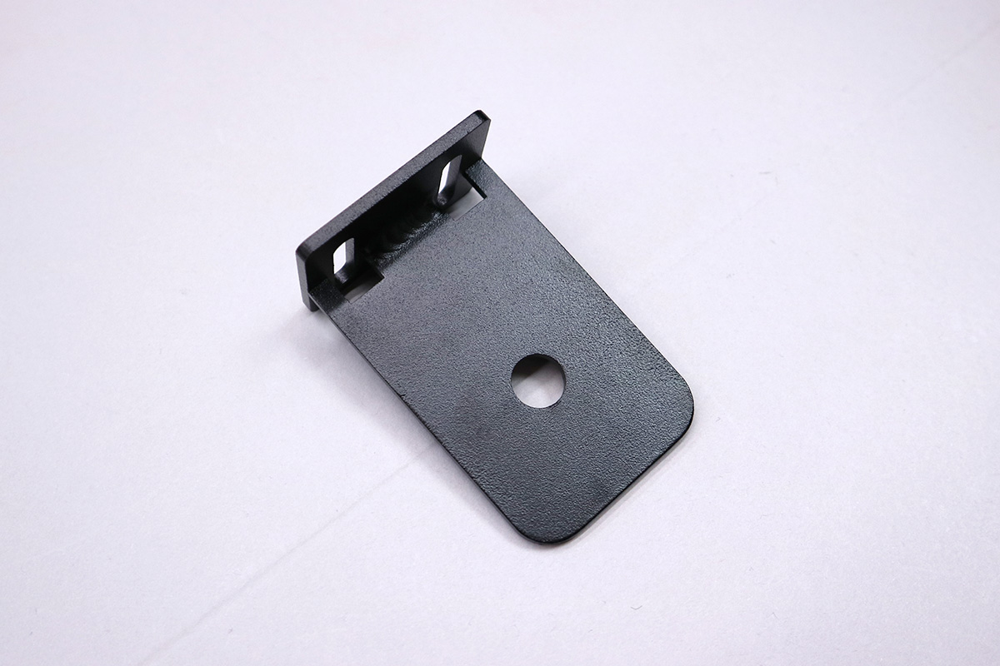
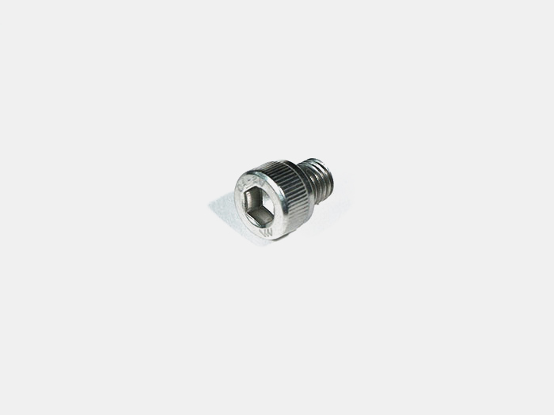
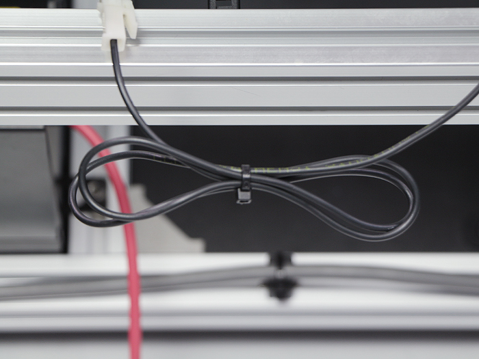

<table class="packing-list">
    <tbody>
        <tr>
            <td>部品名</td>
            <td>備考</td>
            <td class="packing-img">画像</td>
            <td>個数</td>
        </tr>
        <tr>
            <td>レーザー管</td>
            <td></td>
            <td></td>
            <td>1</td>
        </tr>
        <tr>
            <td>レーザー管マウント</td>
            <td></td>
            <td></td>
            <td>2</td>
        </tr>
        <tr>
            <td>チューブマウント</td>
            <td></td>
            <td></td>
            <td>2</td>
        </tr>
        <tr>
            <td>M10ワッシャー</td>
            <td></td>
            <td></td>
            <td>2</td>
        </tr>
        <tr>
            <td>M10x10六角穴付ボルト</td>
            <td></td>
            <td></td>
            <td>2</td>
        </tr>
        <tr>
            <td>M5x8 六角穴付ボルト</td>
            <td></td>
            <td></td>
            <td>4</td>
        </tr>
        <tr>
            <td>M3x6六角穴付ボルト</td>
            <td></td>
            <td></td>
            <td>1</td>
        </tr>
        <tr>
            <td>M3後入ナット</td>
            <td></td>
            <td></td>
            <td>1</td>
        </tr>
        <tr>
            <td>結束バンド</td>
            <td></td>
            <td></td>
            <td>3</td>
        </tr>
        <tr>
            <td>結束バンド固定具</td>
            <td></td>
            <td></td>
            <td>1</td>
        </tr>
    </tbody>
</table>

## 工程手順

### レーザー管マウント組み立て
レーザー管マウントの固定しているネジを外します。

レーザー管マウント下部・チューブマウント・M10ワッシャー・M10x10六角穴付ボルトの順で組み立てます。チューブマウントには取り付ける向きがあるので注意して下さい。

2セット組み立てます。

組み立てたチューブマウントを、本体背面中段のアルミフレーム20*40mm 860mmに、あらかじめ挿入しておいたM5Tナット4個とM5x8六角穴付ボルト4個で取り付けます。M5Tナット1個を左側に残しておきます。
後工程で位置を調整するので、写真の位置に仮止めして下さい。

### レーザー管取り付け
レーザー管マウントにレーザー管先端の金色部分が左側を向くように載せます。

赤枠の金色部分のホース取り付け口が下を向くように取り付けてください。

写真を参考にレーザー管に巻かれているビニールテープの内側付近で固定します。前工程で取り外したレーザー管マウント上部を取り付けます。
※ネジの回し過ぎに注意してください。レーザー管はガラス製ですので割れる恐れがあります。

レーザー管の位置は、なるべく本体右側Cover Leftに寄せて取り付けてください。
※カバーレフト側に寄ってしまうと後工程でミラーマウントが取り付けられない可能性があります。

取付完了後レーザー管が動いてしまわないかを確認してください。動いてしまう場合は、ネジを締めてさらに固定してください。
※ネジの回し過ぎに注意してください。レーザー管はガラス製ですので割れる恐れがあります。

結束バンド固定具をM3後入ナットとM3x6六角穴付ボルトで取り付けます。

レーザー管とレーザー電源のコネクタを接続します。

結束バンド3個でケーブルを束ね、前工程で取り付けた結束バンド固定具と結束バンド1か所を固定します。

