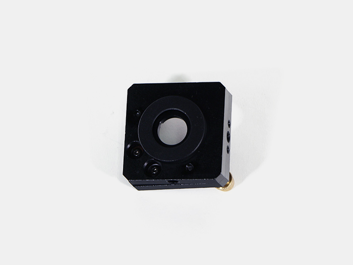
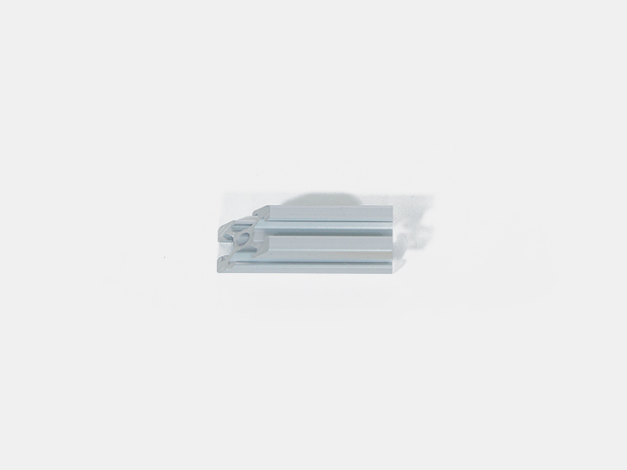
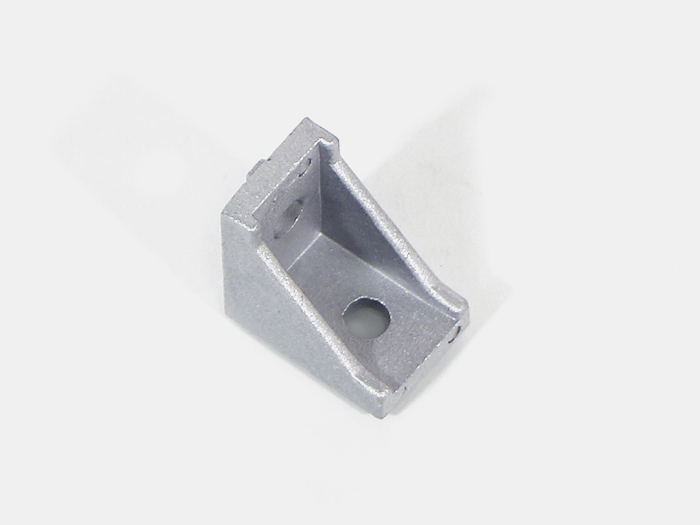
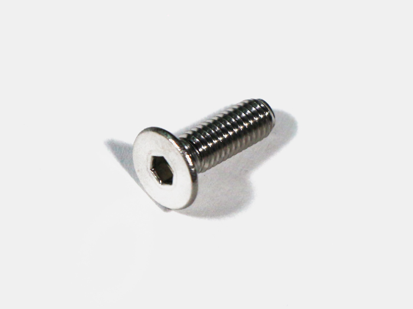
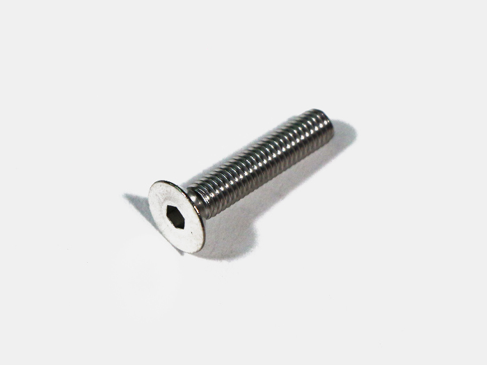
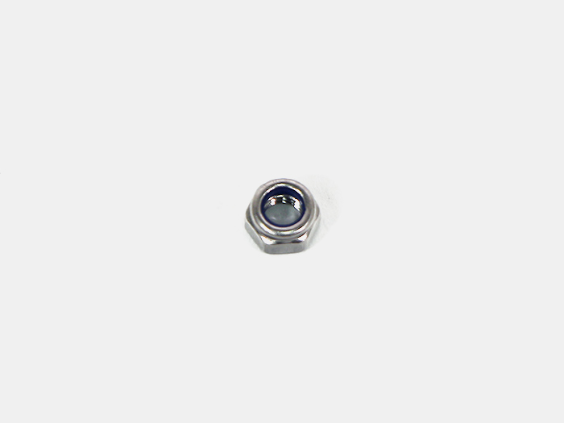
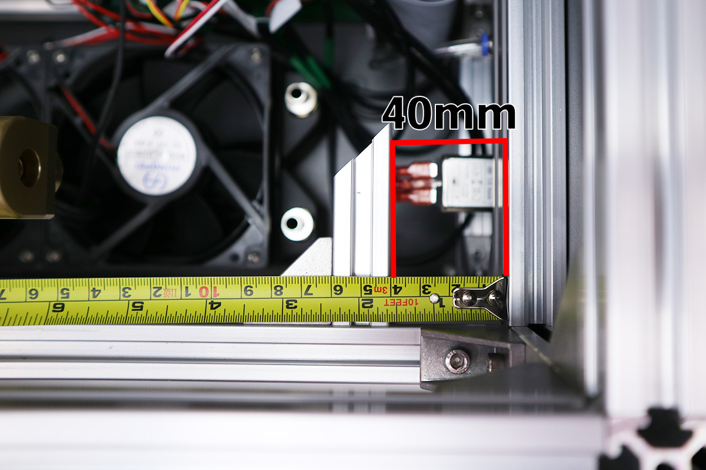
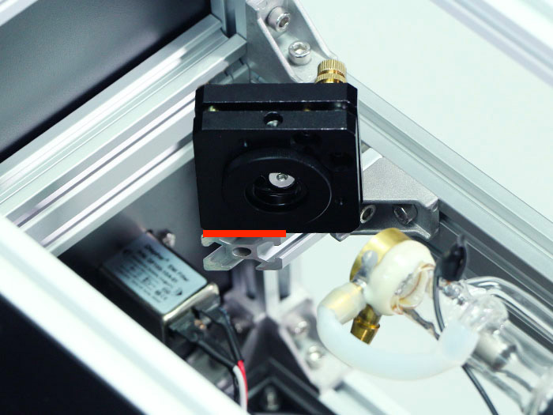
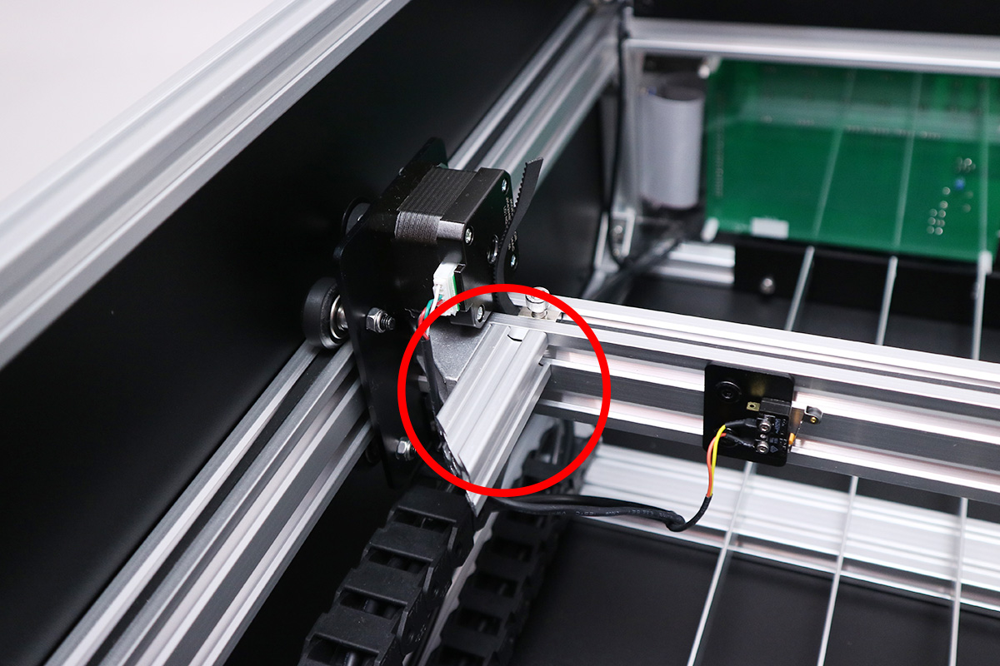

<table class="packing-list">
    <tbody>
        <tr>
            <td>部品名</td>
            <td>備考</td>
            <td class="packing-img">画像</td>
            <td>個数</td>
        </tr>
        <tr>
            <td>ミラーマウント</td>
            <td></td>
            <td></td>
            <td>3</td>
        </tr>
        <tr>
            <td>第1ミラー用アルミフレーム</td>
            <td>45°カット 長さ: 70mm</td>
            <td></td>
            <td>1</td>
        </tr>
        <tr>
            <td>第2ミラー用アルミフレーム</td>
            <td>45°カット 長さ: 66mm</td>
            <td></td>
            <td>1</td>
        </tr>
        <tr>
            <td>直角ブラケット</td>
            <td></td>
            <td></td>
            <td>2</td>
        </tr>
        <tr>
            <td>M5 Tナット</td>
            <td></td>
            <td></td>
            <td>4</td>
        </tr>
        <tr>
            <td>M5x8 六角穴付ボルト</td>
            <td></td>
            <td></td>
            <td>4</td>
        </tr>
        <tr>
            <td>M5x18六角穴付皿ボルト</td>
            <td></td>
            <td></td>
            <td>2</td>
        </tr>
        <tr>
            <td>M5x25六角穴付皿ボルト</td>
            <td></td>
            <td></td>
            <td>1</td>
        </tr>
        <tr>
            <td>M5ナイロンナット</td>
            <td></td>
            <td></td>
            <td>1</td>
        </tr>
    </tbody>
</table>

## 工程手順

### ミラーマウント調整
ミラーマウントがNG写真のように傾いている場合は、ネジを回して調整して下さい。

### ミラーマウント取り付け
第1ミラー用アルミフレームを、直角ブラケット1個とM5Tナット2個(1個はあらかじめ入れておいたもの)とM5x8六角穴付ボルト2個で取り付けます。

本体フレームと面を合わせて、V-slot780mmと第1ミラー用アルミフレームの距離が40mmとなるようにして下さい。

取り付けた第1ミラー用アルミフレームに、ミラーマウントをM5TナットとM5x16六角穴付皿ボルトで取り付けます。

45°カットされている面に合わせて固定します。

第2ミラー用アルミフレームを直角ブラケット1個とM5 Tナット2個(1個はあらかじめ入れておいたもの)とM5x8六角穴付ボルト2個で取り付けます。

本体フレームと面を合わせて、V-slot848mmと第2ミラー用アルミフレームの頂点部分の距離が60mmとなるようにして下さい。

取り付けた第2ミラー用アルミフレームに、ミラーマウントをM5TナットとM5x16六角穴付皿ボルトで取り付けます。

45°カットされている面に合わせて固定します。

ホイールプレートX軸に、残りのミラーマウントをM5x25六角穴付皿ボルトとM5ナイロンナットで取り付けます。

ホイールプレートX軸の斜めの切断面とミラーマウントが合うようにしてください。

