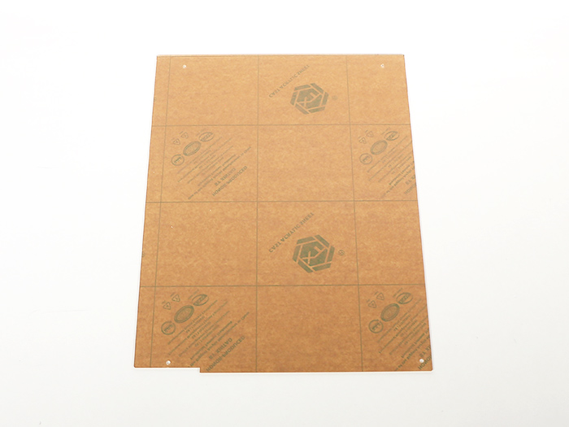
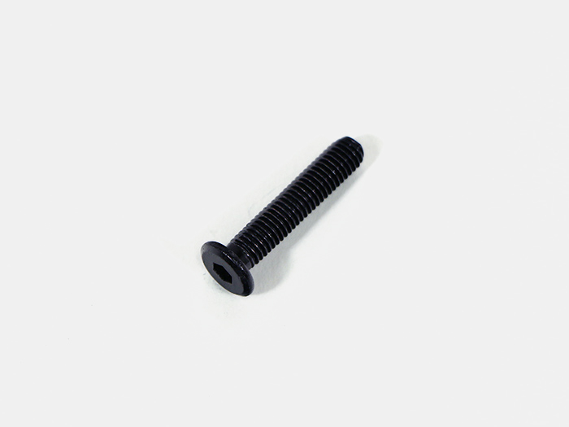
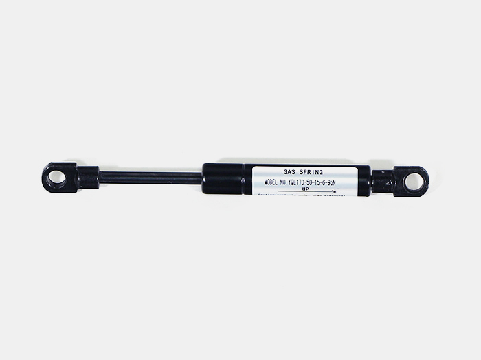
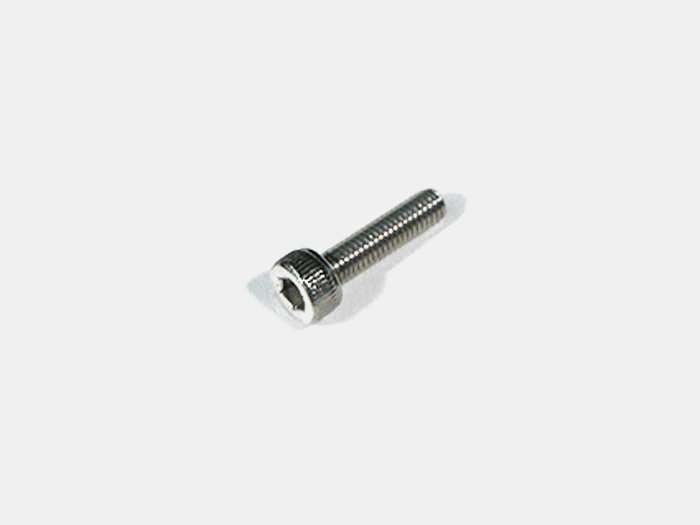

<table class="packing-list">
    <tbody>
        <tr>
            <td>部品名</td>
            <td>備考</td>
            <td class="packing-img">画像</td>
            <td>個数</td>
        </tr>
        <tr>
            <td>top cover</td>
            <td>アクリル</td>
            <td></td>
            <td>2</td>
        </tr>
        <tr>
            <td>アルミフレーム 20mm角 810mm</td>
            <td></td>
            <td></td>
            <td>2</td>
        </tr>
        <tr>
            <td>アルミフレーム 20mm角 529mm</td>
            <td></td>
            <td></td>
            <td>3</td>
        </tr>
        <tr>
            <td>直角ブラケット</td>
            <td></td>
            <td></td>
            <td>6</td>
        </tr>
        <tr>
            <td>M5x8 六角穴付ボルト</td>
            <td></td>
            <td></td>
            <td>12</td>
        </tr>
        <tr>
            <td>M5x8低頭ボルト</td>
            <td></td>
            <td></td>
            <td>6</td>
        </tr>
        <tr>
            <td>M5 Tナット</td>
            <td></td>
            <td></td>
            <td>26</td>
        </tr>
        <tr>
            <td>M5x25低頭ボルト</td>
            <td></td>
            <td></td>
            <td>4</td>
        </tr>
        <tr>
            <td>M5x12六角穴付ボルト</td>
            <td></td>
            <td></td>
            <td>2</td>
        </tr>
        <tr>
            <td>M5x8六角穴付皿ボルト</td>
            <td></td>
            <td></td>
            <td>4</td>
        </tr>
        <tr>
            <td>M5ワッシャー</td>
            <td></td>
            <td></td>
            <td>4</td>
        </tr>
        <tr>
            <td>ガススプリング</td>
            <td></td>
            <td></td>
            <td>2</td>
        </tr>
        <tr>
            <td>取手</td>
            <td></td>
            <td></td>
            <td>1</td>
        </tr>
        <tr>
            <td>M3x12六角穴付ボルト</td>
            <td></td>
            <td></td>
            <td>1</td>
        </tr>
        <tr>
            <td>M3後入ナット</td>
            <td></td>
            <td></td>
            <td>1</td>
        </tr>
        <tr>
            <td>マグネット</td>
            <td>Switchケーブルに同梱</td>
            <td></td>
            <td>1</td>
        </tr>
    </tbody>
</table>

## 工程手順

### top cover組み立て
アルミフレーム20mm角 529mmの両端にM5Tナット4個とM5x8六角穴付ボルト4個と直角ブラケット2個で取り付けます。

残り2本も同じように取り付けます。

アルミフレーム20mm角 810mmに、アルミフレーム20mm角 529mm3本を通して取り付けます。中央のアルミフレーム20mm角 529mmは後工程で位置調整を行うので仮止めします。

アルミフレーム20mm角 529mmの外側面にM5Tナットを1個ずつ挿入します。

アルミフレーム20mm角 810mmを取り付けます。

あらかじめ本体に取り付けておいた蝶番に、M5Tナット4個とM5x8六角穴付皿ボルト4個を仮止めします。

写真を参考に、アルミフレーム20mm角 810mm外側に蝶番部分をスライドして取り付けます。

フレームが本体の中心にくるように調整して、ネジで固定します。

### ガススプリング取り付け
写真を参考に、M5x25低頭ボルト、M5ワッシャー、ガススプリングを通します。

本体フレーム側面（左右両方）上段に、あらかじめ入れておいたM5Tナットでガススプリングを取り付けます。

本体側の取り付け位置の目安は写真を参考に、70mmの位置で固定して下さい。

top coverのフレームにガススプリングの反対側をM5x25低頭ボルトとM5ワッシャーで固定します。

ガススプリングの取り付け位置の目安は写真を参考に、180mmの位置で固定してください。

写真のように扉が閉まらない場合は、ガススプリングの位置を再度調整してください。

### トップカバー取り付け
背面側のtop coverアルミフレーム20mm角 810mmにM5Tナット4個を挿入します。

正面側のtop coverアルミフレーム20mm角 810mmにM5Tナット4個を挿入します。

top cover2枚を載せ、M5Tナット8個を穴位置に移動します。

M5x8低頭ボルト6個で本体手前中央の2か所以外を固定します。
※ネジを強く締めるとtop coverが割れる可能性がありますので注意して下さい。

取手をM5x12六角穴付ボルト2個で取り付けます。

仮止めしておいたtop cover中央のアルミフレームを取手の中心に合わせて固定します。

### マグネット取り付け
写真の位置を参考に、マグネットをM3x12六角穴付ボルトとM3後入ナットで取り付けます。

top coverを閉じたときにマグネットとSwitchiケーブルのDoorスイッチが一番近くなるように調整して下さい。

