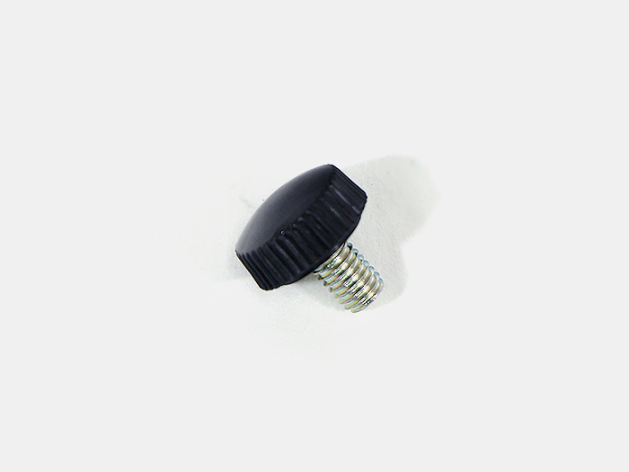
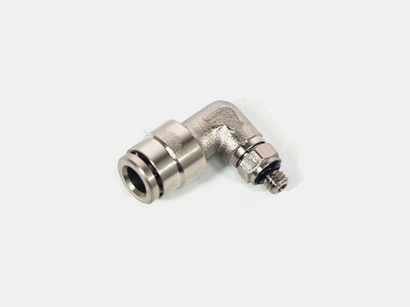

<table class="packing-list">
    <tbody>
        <tr>
            <td>部品名</td>
            <td>備考</td>
            <td class="packing-img">画像</td>
            <td>個数</td>
        </tr>
        <tr>
            <td>レンズマウントガイド</td>
            <td></td>
            <td></td>
            <td>1</td>
        </tr>
        <tr>
            <td>レンズマウント</td>
            <td></td>
            <td></td>
            <td>1</td>
        </tr>
        <tr>
            <td>レンズナット</td>
            <td></td>
            <td></td>
            <td>1</td>
        </tr>
        <tr>
            <td>エアーアシストホルダー</td>
            <td></td>
            <td></td>
            <td>1</td>
        </tr>
        <tr>
            <td>つまみねじ</td>
            <td></td>
            <td></td>
            <td>1</td>
        </tr>
        <tr>
            <td>耐熱ワンタッチ継手</td>
            <td></td>
            <td></td>
            <td>1</td>
        </tr>
        <tr>
            <td>M3x6六角穴付ボルト</td>
            <td></td>
            <td></td>
            <td>1</td>
        </tr>
        <tr>
            <td>M3x4六角穴付ボルト</td>
            <td></td>
            <td></td>
            <td>2</td>
        </tr>
        <tr>
            <td>ポジション ブラケット</td>
            <td>アルミ加工品</td>
            <td></td>
            <td>1</td>
        </tr>
        <tr>
            <td>M3x3六角穴付ボルト</td>
            <td></td>
            <td></td>
            <td>2</td>
        </tr>
    </tbody>
</table>

## 工程手順

### レーザーヘッド組み立て
レンズマウントにレンズナットを取り付けます。

レンズマウントにレンズマウントガイドをM3x6六角穴付ボルト1個で取り付けます。
レンズマウントガイドには取り付ける向きがあるので注意して下さい。

レンズマウントガイドにポジションブラケットをM3x3六角穴付ボルト2個で取り付けます。
ポジションブラケットには取り付ける向きがあるので注意して下さい。

レンズマウントにエアーアシストホルダーをM3x4六角穴付ボルト2個で取り付けます。
エアーアシストホルダーには取り付ける向きがあるので注意して下さい。

エアーアシストホルダーに耐熱ワンタッチ継手を取り付けます。

[オプション品]ポインターホルダーを付属のネジで取り付けます。
※オプション品の位置決めキットをお持ちの方のみの組み立てになります。

[オプション品]レーザーポインターを付属のイモネジ2個で取り付けます。

### レーザーヘッド取り付け
ホイールプレートX軸に、組み立てたレーザーヘッドをつまみねじで取り付けます。

ポリウレタンチューブを耐熱ワンタッチ継手に挿入します。

[オプション品]レーザーポインターをポインターケーブルに接続します。
