<table class="packing-list">
    <tbody>
        <tr>
            <td>部品名</td>
            <td>備考</td>
            <td class="packing-img">画像</td>
            <td>個数</td>
        </tr>
        <tr>
            <td>テスター</td>
            <td></td>
            <td></td>
            <td>1</td>
        </tr>
        <tr>
            <td>電池</td>
            <td>9V角型電池をご用意ください</td>
            <td></td>
            <td>1</td>
        </tr>
    </tbody>
</table>

## 工程手順

### テスター使用準備
テスターを箱から出します。
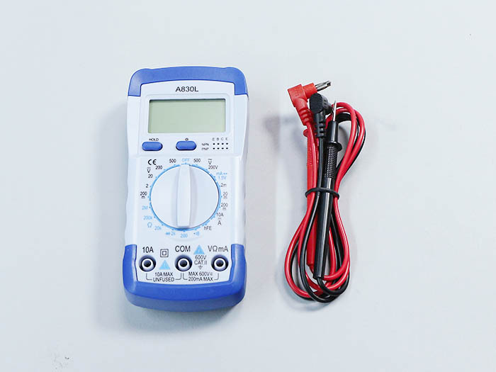

プラスドライバーでネジを外します。
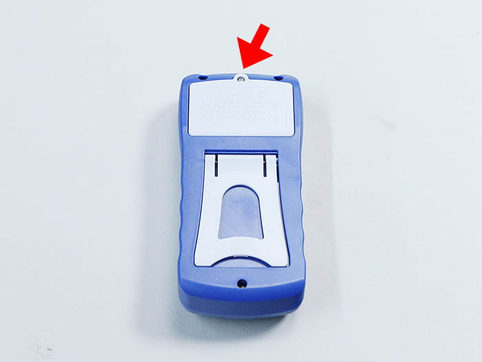

電池の取り付けケーブルを出します。
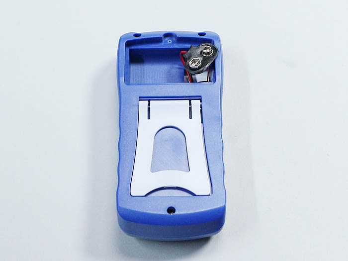

電池を取り付けます。

電池を収納します。
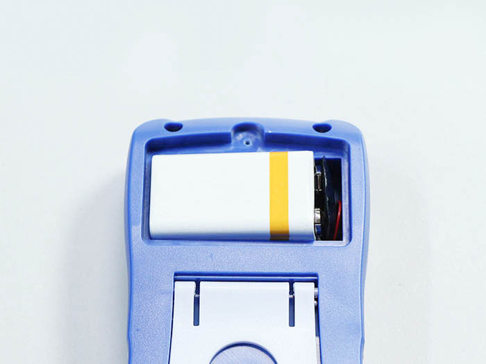

プラスドライバーで蓋を閉めます。
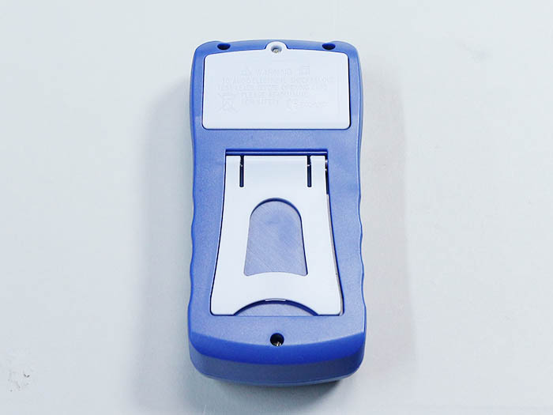

テスターのテスト棒を取り付けます。黒色はCOM、赤色はVΩｍAに取り付けます。
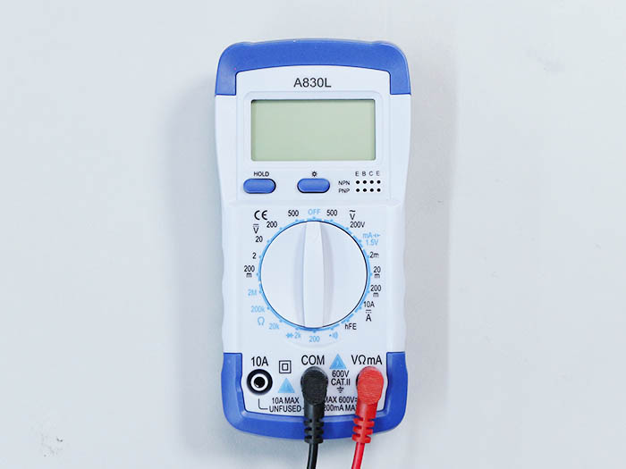

テスター中央のダイヤルを赤丸位置（ブザー）まで回します。
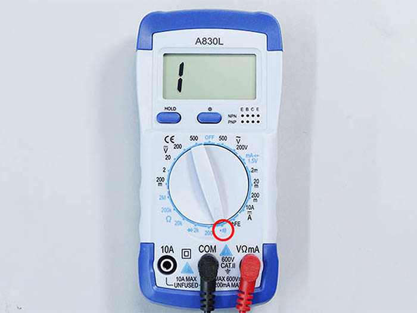

テスト棒先端のテストピン同士を当ててブザー音が鳴るか確認してください。
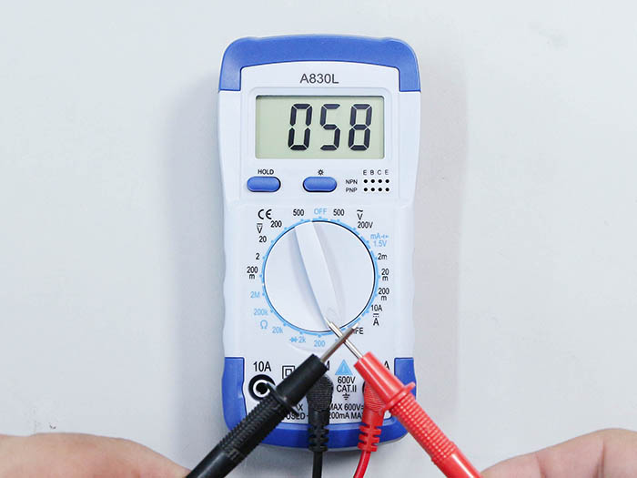

### 導通確認: 端子台・ラジエーターユニット
写真を参考に、端子台のGround-Sケーブルとラジエーターユニットのアース線にテストピンを当てて導通確認を行います。ブザー音が鳴った場合が正常です。
※ブザー音が鳴らなかった場合は、ネジ締めが弱い可能性がありますので、強くネジ締めを行い再度導通確認をして下さい。
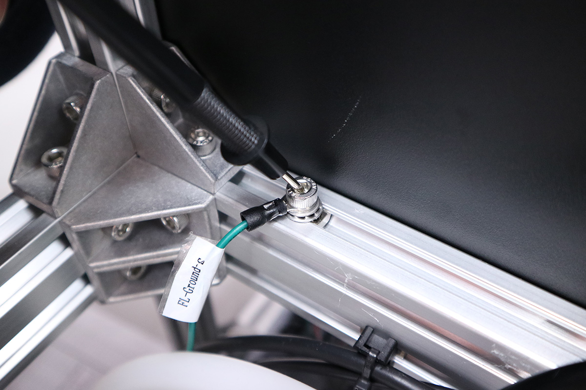
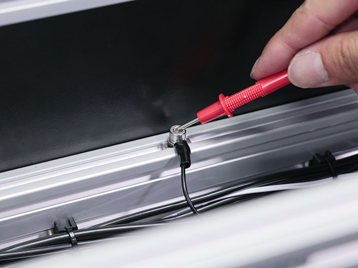

### 導通確認: ラジエーターユニット・AC-Mainケーブル
ラジエーターユニットのアース線とAC-Mainケーブルのアース部分にテストピンを当てて導通を確認して下さい。
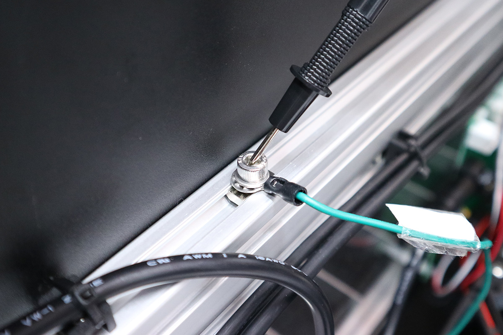
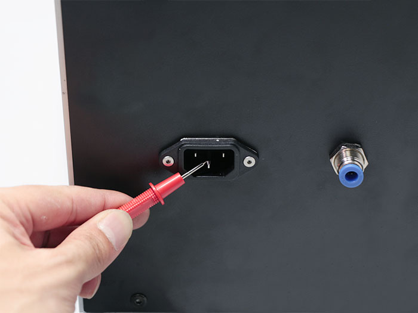

### 導通確認: AC-Laserケーブル・AC-Mainケーブル
AC-Laserケーブルの赤線（FG）とAC-Mainケーブルのアース部分に接触端子を当てて導通を確認して下さい。
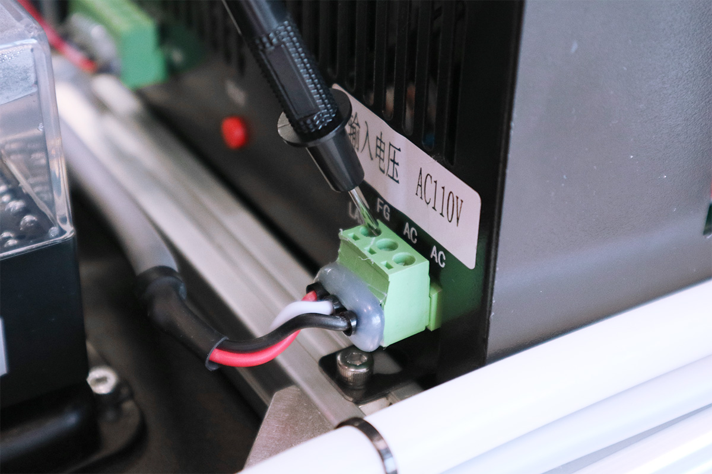

