<table class="packing-list">
    <tbody>
        <tr>
            <td>No.</td>
            <td>部品名</td>
            <td>備考</td>
            <td class="packing-img">画像</td>
            <td>個数</td>
        </tr>
        <tr>
            <td>67</td>
            <td>USBケーブル</td>
            <td></td>
            <td>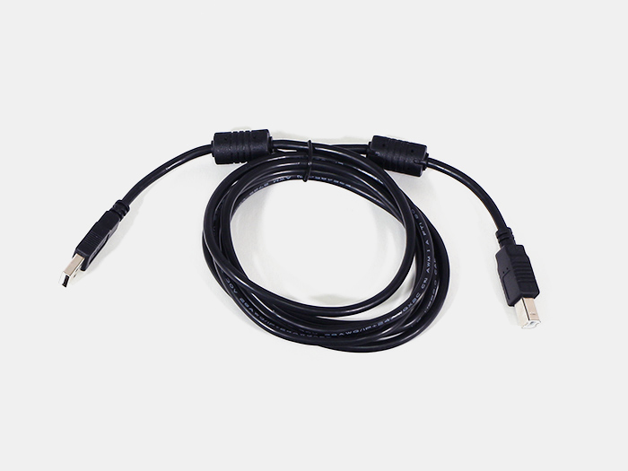</td>
            <td>1</td>
        </tr>
        <tr>
            <td>68</td>
            <td>ACケーブル</td>
            <td></td>
            <td>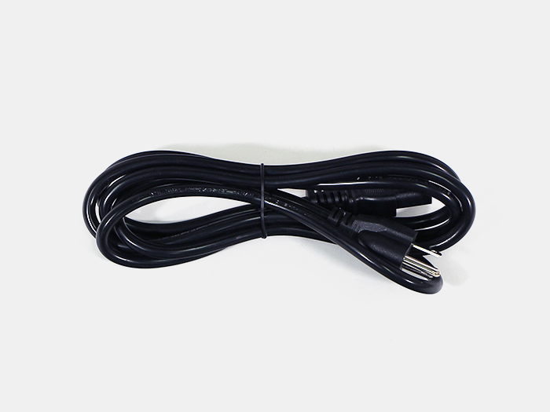</td>
            <td>1</td>
        </tr>
        <tr>
            <td>22</td>
            <td>保護メガネ</td>
            <td></td>
            <td>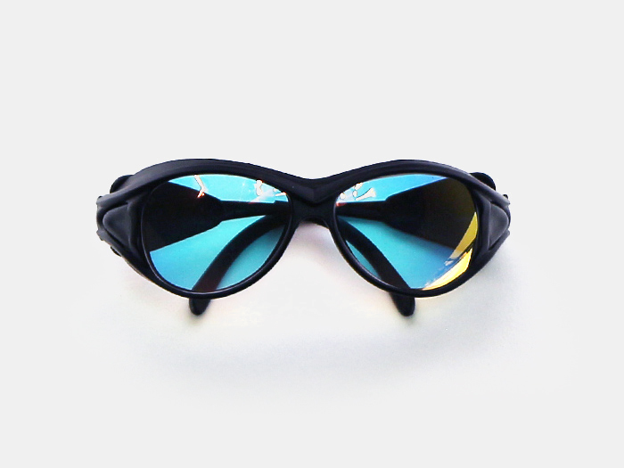</td>
            <td>1</td>
        </tr>
    </tbody>
</table>

## 注意事項
下記事項をよくお読みいただき光軸調整を行ってください。

### レーザーの取り扱いに関して
- レーザーから発せられる光は大変危険です。火災、やけど、目の損傷など十分注意してください。
- 組み立てがすべて完了するまではレーザーの電源をONにしないでください。
- レーザ光が直接あるいは鏡面体に反射して目に入らないようにご使用ください。
- レーザーの取り扱いの際には使用レーザーの波長に対応した保護眼鏡を必ず着用してください。
- 低強度であっても保護眼鏡を着用していても絶対にレーザー光を直接見ることは避けてください。
- 反射率の高い物体はレーザーの周囲に置かないようにしてください。
- 衣服の上からでも身体のどの部分にもレーザー光をさらさないでください。
- レーザー光を加工対象物以外のモノや人に向けての照射は行わないでください。

### 調整中に関して
- マスキングテープなどを焦がして調整を行います。その際レーザーの出力が強すぎると燃え上がる危険が御座いますので、弱めの出力で調整を行ってください。
- 反射ミラーを取り付けた状態でマスキングテープなどを使用して調整を行う場合は、テープの素材が反射ミラーに付着しないように注意して下さい。ミラーのが劣化してまう恐れがあります。

### 運用上の取り扱いに関して
- レーザー加工機は可燃性、爆発性、もしくは揮発性溶剤が存在しない場所で使用してください。
- 有毒なガスを発生する材料の加工は行わないでください。ポリ塩化ビニル、ポリウレタンなど。
- 加工による煙の排気対策を行ってください。
- レーザー加工機は幼児・子供が周りにいないことを確認して運用してください。
- レーザー加工機の加工中は絶対に動かさないでください。

## 工程手順
光軸調整中は保護メガネをかけて目を保護して下さい。
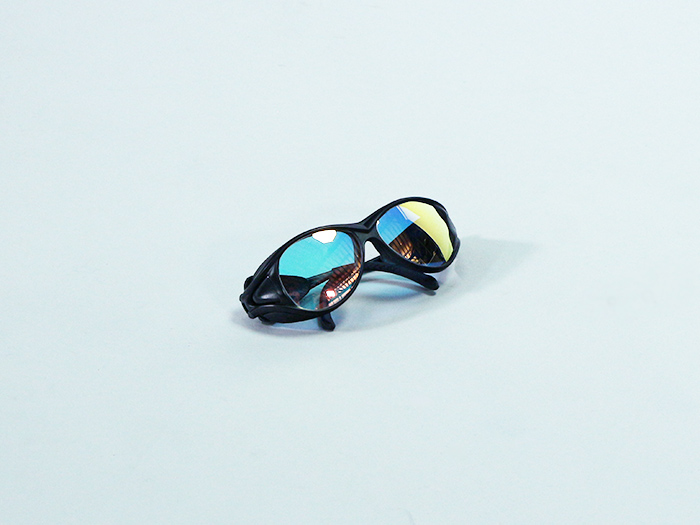

この時点ではまだレーザー加工機の電源は入れないで下さい。レーザー電源についている赤色のボタンを押すことによって、手動でレーザーを照射することが出来ます。「[CO2/DSレーザー加工機用光軸調整用ボタン](https://shop.smartdiys.com/products/detail.php?product_id=756)」をご購入でないお客様はこちらのボタンにて光軸調整を行ってください。

※ボタンを押したままではレーザーが照射され続けます。光軸調整時は長い時間押さないでください。少し押すだけで十分です。
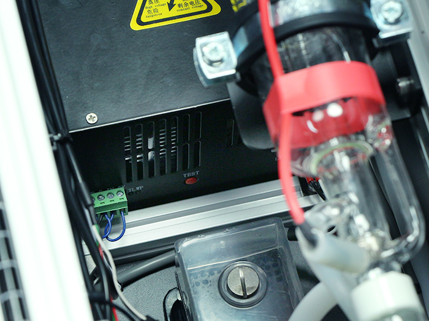

「[CO2/DSレーザー加工機用光軸調整用ボタン](https://shop.smartdiys.com/products/detail.php?product_id=756)」をご購入されたお客様は、レーザー電源に接続したLaserケーブルを抜いて接続して下さい。
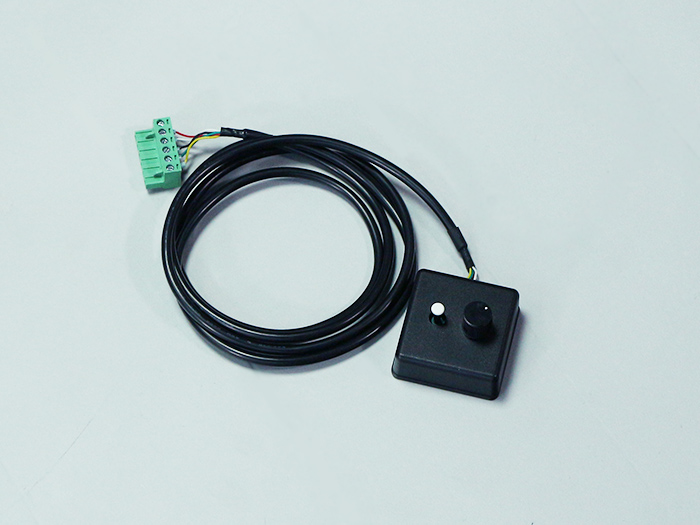
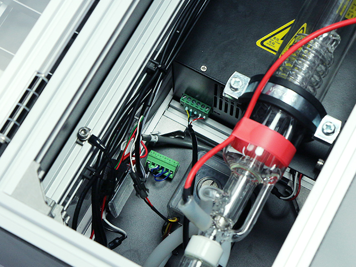

写真右側のボタンがレーザー照射ボタンです。写真左側のつまみはレーザーの出力調整用です。左回り（反時計回り）で出力が大きくなります。なるべく小さい出力で調整を行ってください。
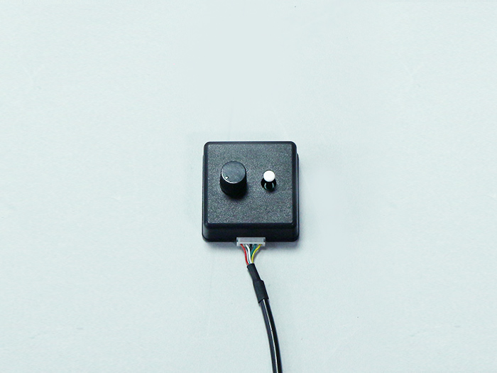

水冷ポンプに冷却水を入れます。通常は水道水で問題ありませんが、寒冷地などは凍ってしまう場合がありますので不凍液のご使用をお勧めします。

**FABOOL Laser CO2用不凍液**
[https://shop.smartdiys.com/products/detail.php?product_id=756](https://shop.smartdiys.com/products/detail.php?product_id=756)

水冷ポンプに8割程度の冷却水を入れください。本体の電源をONにして冷却水を循環させながら、冷却水を継ぎ足しながら8割程度の量にして下さい。

**※水漏れの確認を行ってください。水を回してから数分置いて水が漏れてないか確認してください。確認箇所はフローセンサーとラジエーターユニットと水冷ポンプを注視してください。 水が漏れていた場合は、 シールテープ等で水漏れ対策を行ってください。**
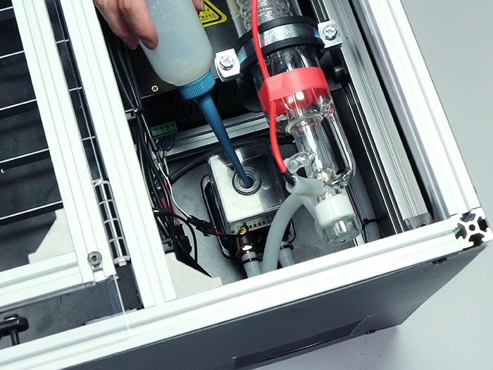

USBケーブルをPCBボックスに接続します。ACケーブルを本体に接続します。
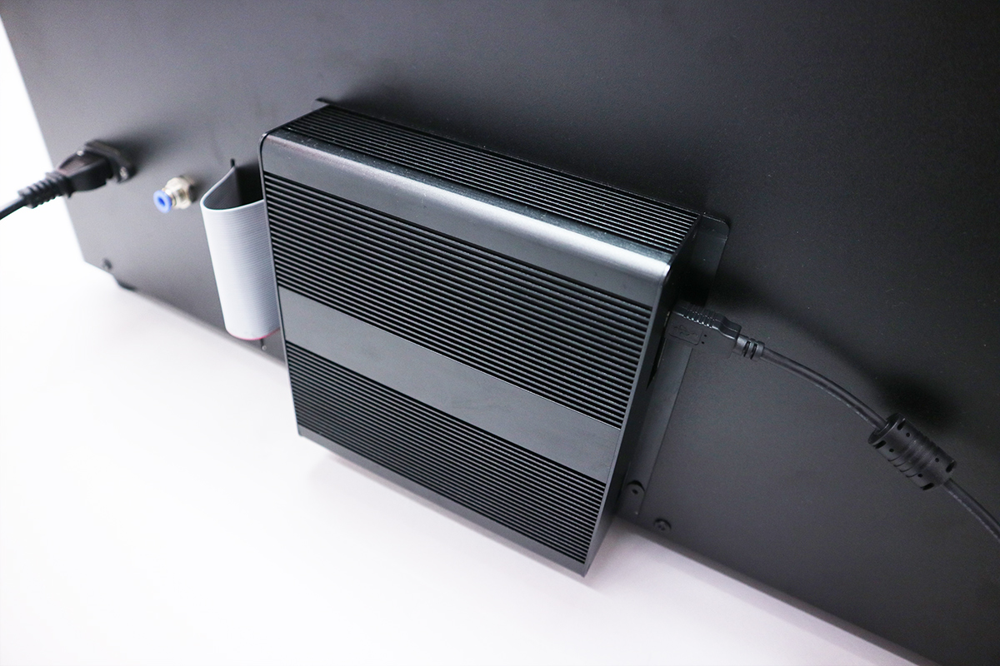

電源スイッチをONにしてください。

市販されているマスキングテープなどを使用して光軸調整を行います。
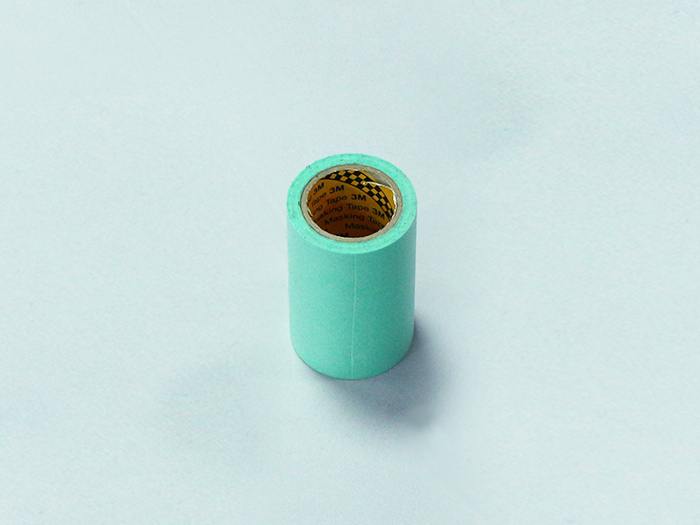

## 光軸調整 レーザー管
電源を入れるとレーザー照射口から位置確認用のレーザーポインターが点灯します。マスキングテープ等を利用して確認してください。
※筐体内に直接人体の一部を入れて確認することは絶対にやめてください。
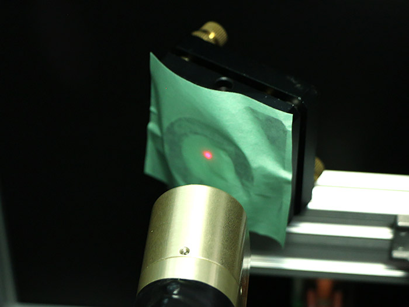

ミラーマウントの中心に位置確認用のレーザーポインターが当たるように調整してください。この時点では反射ミラーは絶対に取り付けないでください。

ミラーマウントの中心より上下方向に光軸がずれている場合はレーザー管の高さ調整を行います。写真の場合は、上方向に光軸がずれています。レーザー管の高さを低くすることで改善されます。
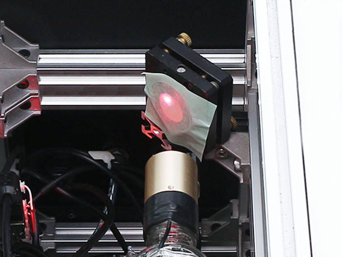

チューブマウントの赤丸のネジ穴が長穴になっておりますのでこちらのネジを緩めて高さ調整を行ってください。
※最も高い位置だとアルミフレームの溝にレーザーマウントがはまって傾いてしまいます。上げ過ぎないように注意して下さい。
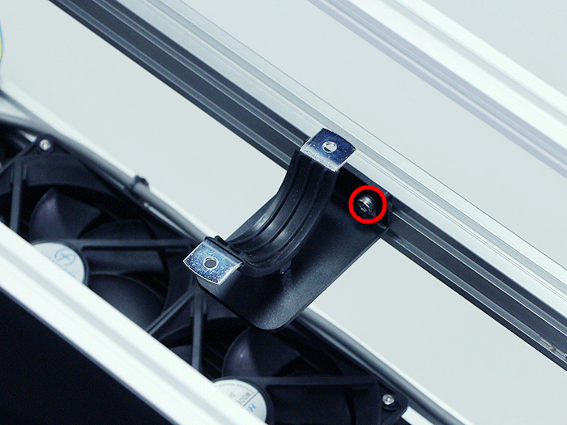

縦軸方向にミラーの中心になるように調整します。
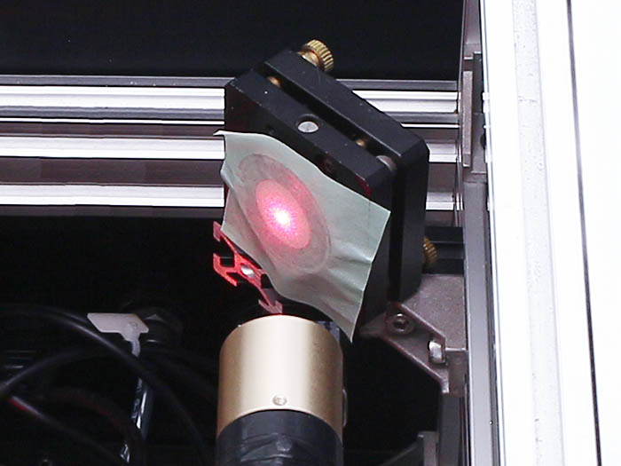

水平器などを使用してレーザー管が傾いていないか確認してください。傾いている場合は再度調整をレーザー管の高さ調整を行ってください。
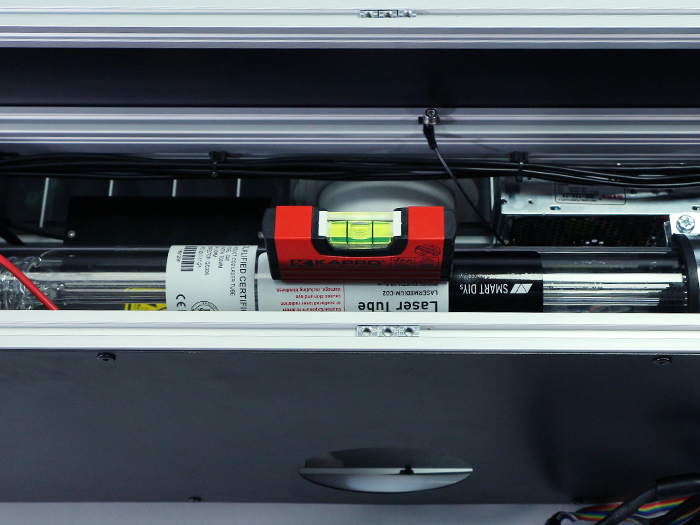

レーザー照射前に再度ミラーマウントの中心にレーザーポインターが来ていることを確認してください。
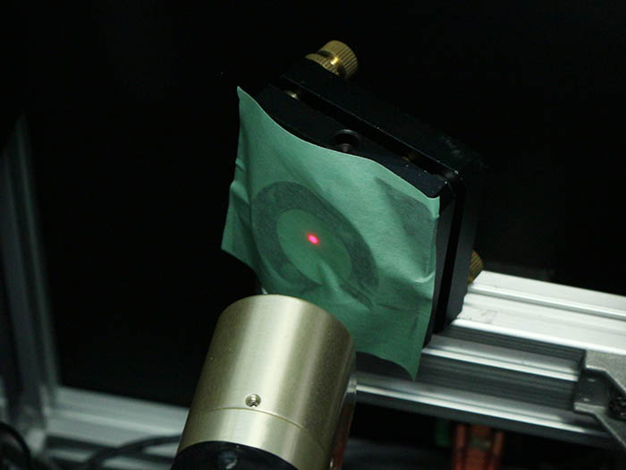

レーザーを照射してレーザー光とレーザーポインターの光路が同じことを確認してください
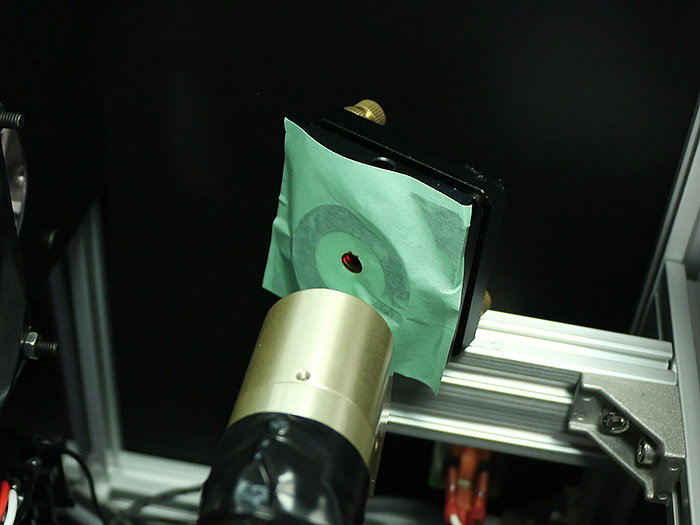
